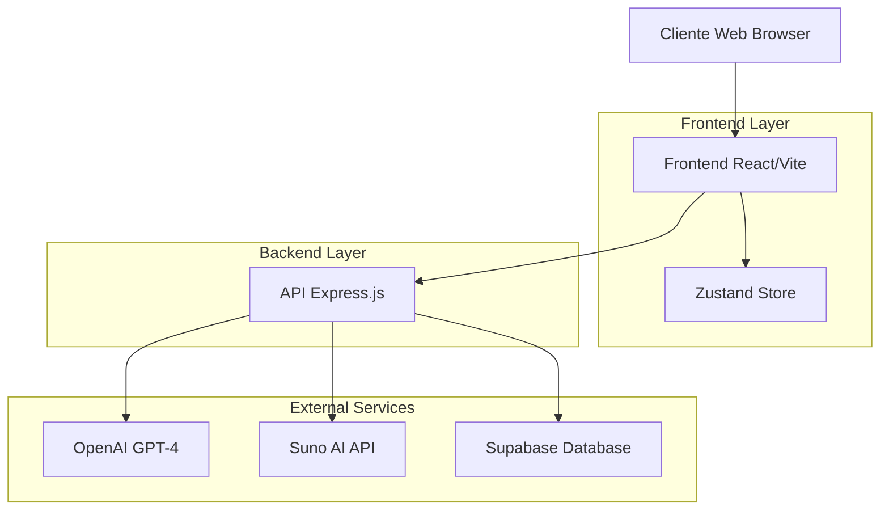
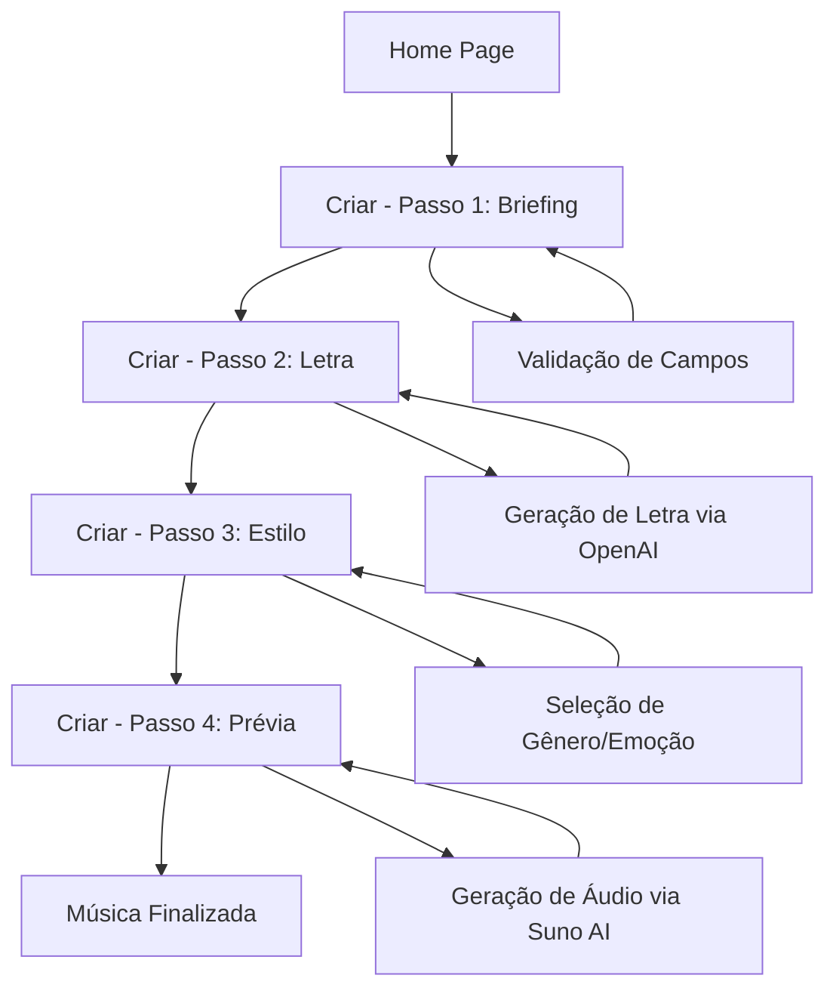
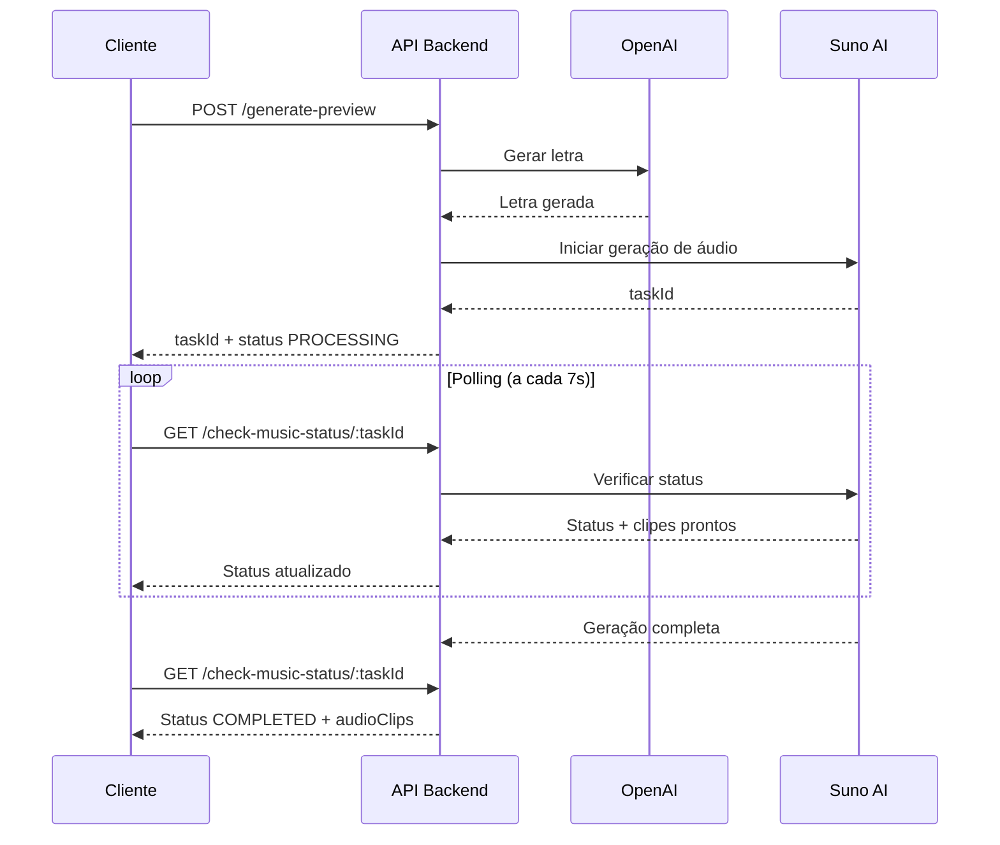

# Documentação Técnica - Memora Music

## 1. Visão Geral da Arquitetura

### 1.1 Arquitetura do Sistema



### 1.2 Stack Tecnológico

#### Frontend
- **React 18**: Biblioteca principal para interface do usuário
- **TypeScript**: Tipagem estática para maior segurança
- **Vite**: Build tool e dev server otimizado
- **Tailwind CSS**: Framework CSS utilitário
- **shadcn/ui + Radix UI**: Componentes de interface acessíveis
- **Zustand**: Gerenciamento de estado global
- **React Hook Form + Zod**: Formulários e validação
- **React Router DOM**: Roteamento client-side

#### Backend
- **Node.js**: Runtime JavaScript
- **Express.js**: Framework web minimalista
- **TypeScript**: Tipagem para o backend
- **CORS**: Middleware para Cross-Origin Resource Sharing

#### Serviços Externos
- **OpenAI GPT-4**: Geração de letras musicais
- **Suno AI**: Geração de áudio musical
- **Supabase**: Banco de dados PostgreSQL e autenticação

#### Ferramentas de Desenvolvimento
- **ESLint**: Linting de código
- **Prettier**: Formatação de código
- **Turbo**: Monorepo e build system
- **Concurrently**: Execução paralela de scripts
- **Nodemon**: Auto-reload do servidor

## 2. Estrutura do Projeto

### 2.1 Organização de Diretórios

```
memora.music/
├── src/                          # Código fonte do frontend
│   ├── components/              # Componentes React reutilizáveis
│   │   ├── ui/                 # Componentes base (shadcn/ui)
│   │   ├── Header.tsx          # Cabeçalho da aplicação
│   │   ├── Footer.tsx          # Rodapé da aplicação
│   │   ├── GenreSelector.tsx   # Seletor de gêneros musicais
│   │   ├── MusicPreview.tsx    # Preview de músicas geradas
│   │   └── StepIndicator.tsx   # Indicador de progresso
│   ├── data/                   # Dados estáticos e configurações
│   │   └── musicGenres.ts      # Definições de gêneros musicais
│   ├── lib/                    # Utilitários e configurações
│   │   └── utils.ts           # Funções utilitárias
│   ├── pages/                  # Páginas da aplicação
│   │   ├── Home.tsx           # Página inicial
│   │   ├── Criar.tsx          # Wizard de criação de música
│   │   └── Sobre.tsx          # Página sobre o projeto
│   ├── store/                  # Gerenciamento de estado
│   │   └── musicStore.ts      # Store principal com Zustand
│   ├── styles/                 # Estilos globais
│   │   └── globals.css        # CSS global e Tailwind
│   ├── App.tsx                # Componente raiz
│   └── main.tsx               # Ponto de entrada da aplicação
├── api/                        # Backend Express.js
│   ├── routes/                # Rotas da API
│   │   ├── auth.ts           # Autenticação (placeholder)
│   │   ├── generate-preview.ts # Geração de música
│   │   ├── check-music-status.ts # Verificação de status
│   │   └── save-feedback.ts   # Salvamento de feedback
│   ├── app.ts                 # Configuração do Express
│   ├── index.ts              # Handler para Vercel
│   └── server.ts             # Servidor de desenvolvimento
├── public/                     # Arquivos estáticos
├── .trae/                     # Documentação do projeto
│   └── documents/            # Documentos gerados
├── package.json              # Dependências e scripts
├── vite.config.ts           # Configuração do Vite
├── tailwind.config.js       # Configuração do Tailwind
├── tsconfig.json           # Configuração do TypeScript
└── README.md               # Documentação básica
```

## 3. Arquitetura Frontend

### 3.1 Gerenciamento de Estado (Zustand)

```typescript
interface MusicStore {
  // Estado do formulário
  formData: FormData;
  currentStep: number;
  
  // Estados de UI
  isLoading: boolean;
  isPreviewLoading: boolean;
  error: string | null;
  
  // Dados gerados
  generatedLyrics: string;
  generatedTitle: string;
  audioUrl: string;
  audioClips: AudioClip[];
  
  // Sistema de polling
  currentTaskId: string | null;
  isPolling: boolean;
  musicGenerationStatus: 'idle' | 'generating' | 'completed' | 'error';
  completedClips: number;
  totalExpected: number;
  
  // Ações
  updateFormData: (data: Partial<FormData>) => void;
  setCurrentStep: (step: number) => void;
  generateLyrics: () => Promise<void>;
  generateMusic: () => Promise<void>;
  checkMusicStatus: () => Promise<void>;
  // ... outras ações
}
```

### 3.2 Fluxo de Navegação



### 3.3 Componentes Principais

#### Header Component
- Navegação principal
- Logo e branding
- Links para páginas

#### StepIndicator Component
- Indicador visual do progresso
- 4 etapas: Briefing → Letra → Estilo → Prévia

#### GenreSelector Component
- Seleção de gênero musical
- Subgêneros dinâmicos
- Suporte a gêneros brasileiros e internacionais

#### MusicPreview Component
- Player de áudio integrado
- Informações da música (título, duração)
- Controles de download

## 4. Arquitetura Backend

### 4.1 Estrutura da API

```mermaid
graph TD
    A[Express App] --> B[CORS Middleware]
    B --> C[JSON Parser]
    C --> D[Routes]
    
    D --> E[/api/auth/*]
    D --> F[/api/generate-preview]
    D --> G[/api/check-music-status/:taskId]
    D --> H[/api/save-feedback]
    
    F --> I[OpenAI Integration]
    F --> J[Suno AI Integration]
    G --> K[Task Status Management]
    H --> L[Supabase Integration]
```

### 4.2 Endpoints da API

#### POST /api/generate-preview
**Funcionalidade**: Gera letra e/ou música completa

**Parâmetros**:
```typescript
interface GeneratePreviewRequest {
  occasion: string;
  recipientName: string;
  relationship: string;
  senderName: string;
  hobbies?: string;
  qualities?: string;
  uniqueTraits?: string;
  memories?: string;
  songTitle?: string;
  genre?: string;
  mood?: string;
  vocalPreference?: string;
  duration?: string;
  lyricsOnly?: boolean;
}
```

**Resposta**:
```typescript
interface GeneratePreviewResponse {
  success: boolean;
  taskId?: string;           // Para geração completa
  songTitle?: string;        // Para lyricsOnly
  lyrics?: string;          // Para lyricsOnly
  status?: string;
  expectedClips?: number;
  error?: string;
}
```

#### GET /api/check-music-status/:taskId
**Funcionalidade**: Verifica status da geração de música

**Resposta**:
```typescript
interface MusicStatusResponse {
  success: boolean;
  data: {
    taskId: string;
    status: 'PROCESSING' | 'COMPLETED' | 'PARTIAL' | 'FAILED';
    completedClips: number;
    totalExpected: number;
    audioClips: AudioClip[];
    lyrics: string;
    metadata: {
      songTitle: string;
      model: string;
      elapsedTime: string;
    };
  };
}
```

#### POST /api/save-feedback
**Funcionalidade**: Salva feedback do usuário no MVP

**Parâmetros**:
```typescript
interface FeedbackRequest {
  difficulty: number;        // 1-5
  wouldRecommend: boolean;
  priceWillingness: string;
}
```

### 4.3 Integração com Serviços Externos

#### OpenAI Integration
```typescript
const openai = new OpenAI({
  apiKey: process.env.OPENAI_API_KEY
});

// Geração de letra
const completion = await openai.chat.completions.create({
  model: 'gpt-4',
  messages: [{
    role: 'system',
    content: 'Você é um compositor profissional...'
  }, {
    role: 'user',
    content: prompt
  }],
  max_tokens: 1000,
  temperature: 0.8
});
```

#### Suno AI Integration
```typescript
const SUNO_API_BASE = 'https://suno-api.suno.ai/api/v1';

// Iniciar geração
const generateResponse = await fetch(`${SUNO_API_BASE}/generate`, {
  method: 'POST',
  headers: {
    'Authorization': `Bearer ${process.env.SUNO_API_KEY}`,
    'Content-Type': 'application/json'
  },
  body: JSON.stringify({
    prompt: lyrics,
    style: `${genre}, ${mood}, ${vocalPreference} vocals`,
    title: songTitle,
    customMode: true,
    model: 'V5'
  })
});

// Verificar status
const statusResponse = await fetch(
  `${SUNO_API_BASE}/generate/record-info?taskId=${taskId}`
);
```

## 5. Sistema de Polling Progressivo

### 5.1 Fluxo de Geração Assíncrona



### 5.2 Gerenciamento de Tarefas

```typescript
// Armazenamento em memória (produção: Redis)
global.musicTasks = new Map<string, MusicTask>();

interface MusicTask {
  taskId: string;
  status: 'PROCESSING' | 'COMPLETED' | 'PARTIAL' | 'FAILED';
  jobIds: string[];
  audioClips: AudioClip[];
  completedClips: number;
  totalExpected: number;
  lyrics: string;
  metadata: {
    songTitle: string;
    recipientName: string;
    occasion: string;
    genre: string;
    model: string;
  };
  startTime: number;
  lastUpdate: number;
  error?: string;
}
```

## 6. Banco de Dados (Supabase)

### 6.1 Schema do Banco

```sql
-- Tabela de feedback do MVP
CREATE TABLE mvp_feedback (
    id UUID PRIMARY KEY DEFAULT gen_random_uuid(),
    difficulty INTEGER NOT NULL CHECK (difficulty >= 1 AND difficulty <= 5),
    would_recommend BOOLEAN NOT NULL,
    price_willingness DECIMAL(10,2) NOT NULL,
    created_at TIMESTAMP WITH TIME ZONE DEFAULT NOW()
);

-- Índices para performance
CREATE INDEX idx_mvp_feedback_created_at ON mvp_feedback(created_at DESC);
CREATE INDEX idx_mvp_feedback_difficulty ON mvp_feedback(difficulty);
```

### 6.2 Configuração do Cliente

```typescript
import { createClient } from '@supabase/supabase-js';

const supabaseUrl = process.env.SUPABASE_URL;
const supabaseServiceKey = process.env.SUPABASE_SERVICE_ROLE_KEY;

const supabase = createClient(supabaseUrl, supabaseServiceKey);
```

## 7. Configuração e Deploy

### 7.1 Variáveis de Ambiente

```bash
# APIs de IA
OPENAI_API_KEY=sk-...
SUNO_API_KEY=...

# Banco de dados
SUPABASE_URL=https://xxx.supabase.co
SUPABASE_SERVICE_ROLE_KEY=eyJ...

# Configurações da aplicação
FRONTEND_URL=http://localhost:5173
NODE_ENV=development
```

### 7.2 Scripts de Desenvolvimento

```json
{
  "scripts": {
    "dev": "turbo turbo:dev",
    "turbo:dev": "concurrently \"npm run client:dev\" \"npm run server:dev\"",
    "client:dev": "vite",
    "server:dev": "nodemon",
    "build": "turbo build",
    "lint": "turbo lint",
    "preview": "vite preview"
  }
}
```

### 7.3 Configuração do Vite

```typescript
export default defineConfig({
  plugins: [react(), tsconfigPaths()],
  server: {
    proxy: {
      '/api': {
        target: 'http://localhost:3001',
        changeOrigin: true,
        secure: false
      }
    }
  }
});
```

## 8. Segurança e Performance

### 8.1 Medidas de Segurança

- **CORS configurado** para domínios específicos
- **Validação de entrada** com Zod em todas as rotas
- **Rate limiting** (a ser implementado)
- **Sanitização de dados** antes do processamento
- **Chaves de API** armazenadas como variáveis de ambiente

### 8.2 Otimizações de Performance

- **Retry logic** com backoff exponencial
- **Caching** de respostas da IA (planejado)
- **Lazy loading** de componentes
- **Code splitting** automático do Vite
- **Polling otimizado** (7s de intervalo)

### 8.3 Monitoramento e Logs

```typescript
// Logs estruturados para debugging
console.log('🎵 [taskId] Iniciando geração...', {
  taskId,
  genre,
  mood,
  timestamp: new Date().toISOString()
});

// Tratamento de erros detalhado
try {
  // operação
} catch (error) {
  console.error('❌ Erro capturado:', {
    error: error.message,
    stack: error.stack,
    context: { taskId, step: 'generation' }
  });
}
```

## 9. Limitações e Melhorias Futuras

### 9.1 Limitações Atuais

- **Armazenamento em memória**: Tarefas perdidas em restart
- **Sem autenticação**: Sistema aberto para MVP
- **Sem rate limiting**: Vulnerável a abuso
- **Dependência de APIs externas**: Pontos únicos de falha

### 9.2 Melhorias Planejadas

#### Curto Prazo
- Implementar Redis para persistência de tarefas
- Adicionar autenticação com NextAuth
- Implementar rate limiting
- Adicionar testes automatizados

#### Médio Prazo
- Migrar para arquitetura de microserviços
- Implementar cache distribuído
- Adicionar monitoramento com Sentry
- Implementar CI/CD com GitHub Actions

#### Longo Prazo
- Implementar própria IA de geração musical
- Adicionar processamento de áudio avançado
- Implementar sistema de recomendações
- Migrar para Kubernetes

## 10. Guia de Desenvolvimento

### 10.1 Setup Local

```bash
# 1. Clonar repositório
git clone <repository-url>
cd memora.music

# 2. Instalar dependências
npm install

# 3. Configurar variáveis de ambiente
cp .env.example .env
# Editar .env com suas chaves de API

# 4. Iniciar desenvolvimento
npm run dev
```

### 10.2 Estrutura de Commits

```bash
# Usar Conventional Commits
feat: adicionar nova funcionalidade
fix: corrigir bug
docs: atualizar documentação
style: mudanças de formatação
refactor: refatoração de código
test: adicionar testes
chore: tarefas de manutenção
```

### 10.3 Debugging

```bash
# Logs do frontend (console do navegador)
# Logs do backend (terminal do servidor)

# Verificar status de uma tarefa
curl http://localhost:3001/api/check-music-status/TASK_ID

# Testar geração de letra apenas
curl -X POST http://localhost:3001/api/generate-preview \
  -H "Content-Type: application/json" \
  -d '{"lyricsOnly": true, "occasion": "aniversário", ...}'
```

Esta documentação técnica fornece uma visão completa da arquitetura, implementação e funcionamento do sistema Memora Music, servindo como referência para desenvolvimento, manutenção e evolução da plataforma.