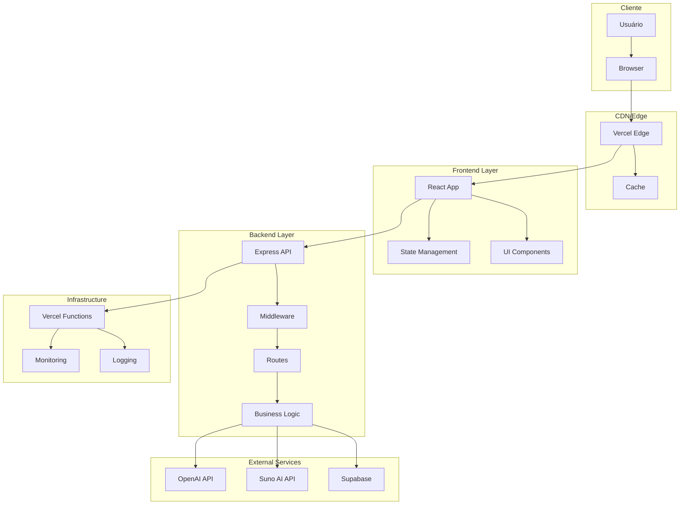
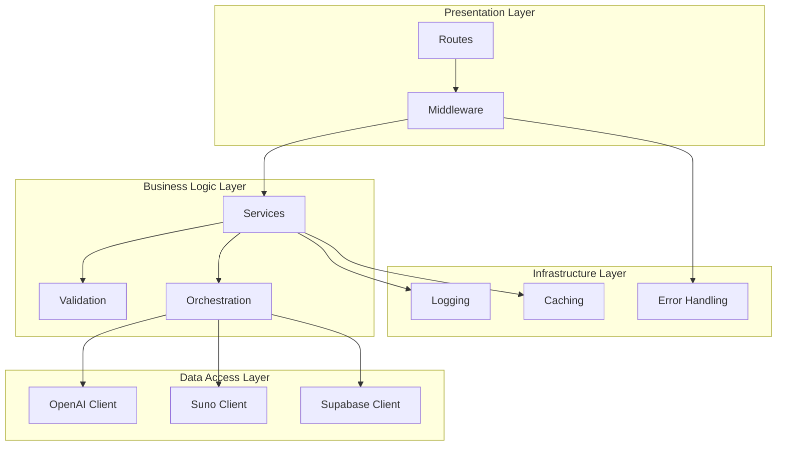

# Documentação de Arquitetura - Memora Music

## 1. Visão Geral da Arquitetura

### 1.1 Introdução

A Memora Music é uma aplicação web moderna que utiliza inteligência artificial para criar músicas personalizadas. A arquitetura foi projetada para ser escalável, maintível e eficiente, seguindo princípios de separação de responsabilidades e arquitetura orientada a serviços.

### 1.2 Princípios Arquiteturais

#### Separação de Responsabilidades

* **Frontend**: Interface do usuário e experiência

* **Backend**: Lógica de negócio e orquestração de APIs

* **Serviços Externos**: Capacidades especializadas (IA, banco de dados)

#### Escalabilidade

* Arquitetura stateless no backend

* Cache em múltiplas camadas

* Processamento assíncrono para operações longas

#### Resiliência

* Tratamento robusto de erros

* Retry automático com backoff exponencial

* Timeouts configuráveis

* Fallbacks para serviços críticos

#### Segurança

* Validação de entrada em todas as camadas

* Rate limiting

* Headers de segurança

* Sanitização de dados

### 1.3 Arquitetura de Alto Nível



## 2. Arquitetura Frontend

### 2.1 Estrutura de Componentes

```
src/
├── components/          # Componentes reutilizáveis
│   ├── ui/             # Componentes base (shadcn/ui)
│   ├── forms/          # Componentes de formulário
│   ├── layout/         # Componentes de layout
│   └── feedback/       # Componentes de feedback
├── pages/              # Páginas da aplicação
│   ├── Home.tsx
│   ├── Create.tsx
│   └── Preview.tsx
├── hooks/              # Custom hooks
│   ├── useMusic.ts
│   ├── useForm.ts
│   └── useApi.ts
├── store/              # Gerenciamento de estado
│   ├── musicStore.ts
│   ├── uiStore.ts
│   └── types.ts
├── services/           # Serviços de API
│   ├── api.ts
│   ├── music.ts
│   └── feedback.ts
├── utils/              # Utilitários
│   ├── validation.ts
│   ├── formatting.ts
│   └── constants.ts
└── styles/             # Estilos globais
    ├── globals.css
    └── components.css
```

### 2.2 Gerenciamento de Estado

#### Zustand Store Architecture

```typescript
// store/musicStore.ts
interface MusicState {
  // Estado da criação
  currentStep: number;
  formData: MusicFormData;
  
  // Estado da geração
  isGenerating: boolean;
  taskId: string | null;
  generationStatus: GenerationStatus;
  
  // Resultados
  lyrics: string | null;
  audioClips: AudioClip[];
  
  // Ações
  setStep: (step: number) => void;
  updateFormData: (data: Partial<MusicFormData>) => void;
  startGeneration: (taskId: string) => void;
  updateStatus: (status: GenerationStatus) => void;
  setResults: (lyrics: string, clips: AudioClip[]) => void;
  reset: () => void;
}
```

#### Estado Global vs Local

* **Global (Zustand)**: Estado da aplicação, dados de geração, configurações

* **Local (useState)**: Estado de componentes, formulários temporários, UI state

* **Server State (React Query)**: Cache de dados da API, sincronização

### 2.3 Roteamento e Navegação

```typescript
// App.tsx - Configuração de rotas
const router = createBrowserRouter([
  {
    path: "/",
    element: <Layout />,
    children: [
      {
        index: true,
        element: <Home />
      },
      {
        path: "create",
        element: <Create />,
        children: [
          { path: "briefing", element: <BriefingStep /> },
          { path: "lyrics", element: <LyricsStep /> },
          { path: "style", element: <StyleStep /> },
          { path: "preview", element: <PreviewStep /> }
        ]
      },
      {
        path: "feedback",
        element: <Feedback />
      }
    ]
  }
]);
```

### 2.4 Padrões de Componentes

#### Compound Components

```typescript
// components/MusicCreator/index.tsx
const MusicCreator = {
  Root: MusicCreatorRoot,
  Steps: MusicCreatorSteps,
  Step: MusicCreatorStep,
  Navigation: MusicCreatorNavigation,
  Content: MusicCreatorContent
};

// Uso
<MusicCreator.Root>
  <MusicCreator.Steps>
    <MusicCreator.Step step={1}>
      <BriefingForm />
    </MusicCreator.Step>
  </MusicCreator.Steps>
  <MusicCreator.Navigation />
</MusicCreator.Root>
```

#### Custom Hooks Pattern

```typescript
// hooks/useMusic.ts
export const useMusic = () => {
  const store = useMusicStore();
  const [isLoading, setIsLoading] = useState(false);
  
  const generateMusic = useCallback(async (formData: MusicFormData) => {
    setIsLoading(true);
    try {
      const response = await musicService.generate(formData);
      store.startGeneration(response.taskId);
      
      // Iniciar polling
      pollGenerationStatus(response.taskId);
    } catch (error) {
      handleError(error);
    } finally {
      setIsLoading(false);
    }
  }, [store]);
  
  return {
    ...store,
    isLoading,
    generateMusic
  };
};
```

## 3. Arquitetura Backend

### 3.1 Estrutura de Diretórios

```
api/
├── src/
│   ├── routes/              # Definições de rotas
│   │   ├── health.ts
│   │   ├── generate-preview.ts
│   │   ├── check-music-status.ts
│   │   ├── save-feedback.ts
│   │   └── auth.ts
│   ├── middleware/          # Middlewares
│   │   ├── cors.ts
│   │   ├── validation.ts
│   │   ├── errorHandler.ts
│   │   ├── rateLimit.ts
│   │   └── logging.ts
│   ├── services/            # Serviços de negócio
│   │   ├── openai.ts
│   │   ├── suno.ts
│   │   ├── supabase.ts
│   │   └── music.ts
│   ├── utils/               # Utilitários
│   │   ├── validation.ts
│   │   ├── retry.ts
│   │   ├── logger.ts
│   │   └── constants.ts
│   ├── types/               # Definições de tipos
│   │   ├── api.ts
│   │   ├── music.ts
│   │   └── external.ts
│   └── index.ts             # Ponto de entrada
├── package.json
├── tsconfig.json
└── .env.example
```

### 3.2 Arquitetura de Camadas



### 3.3 Padrões de Design

#### Service Layer Pattern

```typescript
// services/musicService.ts
class MusicService {
  constructor(
    private openaiService: OpenAIService,
    private sunoService: SunoService,
    private logger: Logger
  ) {}
  
  async generateMusic(request: MusicGenerationRequest): Promise<MusicGenerationResponse> {
    const taskId = generateTaskId();
    
    try {
      // Validar entrada
      const validatedRequest = await this.validateRequest(request);
      
      // Gerar letra
      const lyrics = await this.openaiService.generateLyrics(validatedRequest);
      
      // Iniciar geração de áudio (assíncrono)
      if (!request.lyricsOnly) {
        this.startAudioGeneration(taskId, lyrics, validatedRequest);
      }
      
      return {
        success: true,
        taskId,
        lyrics: request.lyricsOnly ? lyrics : undefined
      };
    } catch (error) {
      this.logger.error('Music generation failed', { taskId, error });
      throw new MusicGenerationError('Failed to generate music', error);
    }
  }
  
  private async startAudioGeneration(taskId: string, lyrics: string, request: MusicGenerationRequest) {
    // Implementação assíncrona
    setImmediate(() => {
      this.processAudioGeneration(taskId, lyrics, request)
        .catch(error => {
          this.logger.error('Audio generation failed', { taskId, error });
          this.updateTaskStatus(taskId, 'FAILED', error.message);
        });
    });
  }
}
```

#### Repository Pattern (para Supabase)

```typescript
// repositories/feedbackRepository.ts
class FeedbackRepository {
  constructor(private supabase: SupabaseClient) {}
  
  async save(feedback: FeedbackData): Promise<void> {
    const { error } = await this.supabase
      .from('feedback')
      .insert(feedback);
      
    if (error) {
      throw new DatabaseError('Failed to save feedback', error);
    }
  }
  
  async findByDateRange(startDate: Date, endDate: Date): Promise<FeedbackData[]> {
    const { data, error } = await this.supabase
      .from('feedback')
      .select('*')
      .gte('created_at', startDate.toISOString())
      .lte('created_at', endDate.toISOString());
      
    if (error) {
      throw new DatabaseError('Failed to fetch feedback', error);
    }
    
    return data || [];
  }
}
```

#### Factory Pattern (para clientes de API)

```typescript
// factories/apiClientFactory.ts
class ApiClientFactory {
  static createOpenAIClient(): OpenAI {
    return new OpenAI({
      apiKey: process.env.OPENAI_API_KEY,
      timeout: 30000,
      maxRetries: 3
    });
  }
  
  static createSunoClient(): SunoClient {
    return new SunoClient({
      apiKey: process.env.SUNO_API_KEY,
      baseURL: 'https://studio-api.suno.ai/api/external',
      timeout: 60000,
      maxRetries: 5
    });
  }
  
  static createSupabaseClient(): SupabaseClient {
    return createClient(
      process.env.SUPABASE_URL!,
      process.env.SUPABASE_ANON_KEY!
    );
  }
}
```

### 3.4 Middleware Architecture

```typescript
// middleware/index.ts - Pipeline de middleware
const middlewarePipeline = [
  // Logging de requisições
  requestLogger,
  
  // Segurança
  helmet(),
  cors(corsOptions),
  
  // Rate limiting
  rateLimit,
  
  // Parsing
  express.json({ limit: '10mb' }),
  express.urlencoded({ extended: true }),
  
  // Validação
  requestValidation,
  
  // Autenticação (futuro)
  // authentication,
  
  // Autorização (futuro)
  // authorization,
];

app.use(middlewarePipeline);
```

## 4. Integração com Serviços Externos

### 4.1 OpenAI Integration

```typescript
// services/openaiService.ts
class OpenAIService {
  private client: OpenAI;
  private logger: Logger;
  
  constructor() {
    this.client = ApiClientFactory.createOpenAIClient();
    this.logger = new Logger('OpenAIService');
  }
  
  async generateLyrics(request: LyricsGenerationRequest): Promise<string> {
    const prompt = this.buildPrompt(request);
    
    try {
      const response = await this.client.chat.completions.create({
        model: 'gpt-4',
        messages: [{ role: 'user', content: prompt }],
        max_tokens: 1000,
        temperature: 0.8
      });
      
      const lyrics = response.choices[0]?.message?.content;
      if (!lyrics) {
        throw new Error('No lyrics generated');
      }
      
      this.logger.info('Lyrics generated successfully', {
        requestId: request.id,
        tokensUsed: response.usage?.total_tokens
      });
      
      return lyrics;
    } catch (error) {
      this.logger.error('Failed to generate lyrics', { error, request });
      throw new OpenAIError('Lyrics generation failed', error);
    }
  }
  
  private buildPrompt(request: LyricsGenerationRequest): string {
    return `
      Crie uma letra de música personalizada com as seguintes características:
      - Ocasião: ${request.occasion}
      - Para: ${request.recipientName}
      - Relacionamento: ${request.relationship}
      - De: ${request.senderName}
      - Gênero musical: ${request.genre}
      - Emoção: ${request.emotion}
      - Duração: ${request.duration}
      
      A letra deve ser emotiva, personalizada e adequada para a ocasião.
      Formato: Verso 1, Refrão, Verso 2, Refrão, Ponte, Refrão final.
    `;
  }
}
```

### 4.2 Suno AI Integration

```typescript
// services/sunoService.ts
class SunoService {
  private client: AxiosInstance;
  private logger: Logger;
  
  constructor() {
    this.client = axios.create({
      baseURL: 'https://studio-api.suno.ai/api/external',
      headers: {
        'Authorization': `Bearer ${process.env.SUNO_API_KEY}`,
        'Content-Type': 'application/json'
      },
      timeout: 60000
    });
    
    this.setupInterceptors();
    this.logger = new Logger('SunoService');
  }
  
  async generateAudio(request: AudioGenerationRequest): Promise<string[]> {
    try {
      const response = await this.client.post('/generate/', {
        prompt: request.lyrics,
        tags: this.buildTags(request),
        title: request.title || 'Música Personalizada',
        make_instrumental: false,
        wait_audio: false
      });
      
      const jobIds = response.data.map((item: any) => item.id);
      
      this.logger.info('Audio generation started', {
        jobIds,
        requestId: request.id
      });
      
      return jobIds;
    } catch (error) {
      this.logger.error('Failed to start audio generation', { error, request });
      throw new SunoError('Audio generation failed', error);
    }
  }
  
  async checkGenerationStatus(jobIds: string[]): Promise<AudioClip[]> {
    try {
      const response = await this.client.get(`/?ids=${jobIds.join(',')}`);
      
      return response.data.map((item: any) => ({
        id: item.id,
        status: item.status,
        audio_url: item.audio_url,
        video_url: item.video_url,
        image_url: item.image_url,
        title: item.title,
        tags: item.tags
      }));
    } catch (error) {
      this.logger.error('Failed to check generation status', { error, jobIds });
      throw new SunoError('Status check failed', error);
    }
  }
  
  private buildTags(request: AudioGenerationRequest): string {
    const tags = [
      request.genre?.toLowerCase(),
      request.emotion?.toLowerCase(),
      request.vocalPreference?.toLowerCase()
    ].filter(Boolean);
    
    return tags.join(', ');
  }
  
  private setupInterceptors() {
    // Request interceptor
    this.client.interceptors.request.use(
      (config) => {
        this.logger.debug('Suno API request', {
          method: config.method,
          url: config.url,
          data: config.data
        });
        return config;
      },
      (error) => {
        this.logger.error('Suno API request error', error);
        return Promise.reject(error);
      }
    );
    
    // Response interceptor
    this.client.interceptors.response.use(
      (response) => {
        this.logger.debug('Suno API response', {
          status: response.status,
          data: response.data
        });
        return response;
      },
      (error) => {
        this.logger.error('Suno API response error', {
          status: error.response?.status,
          data: error.response?.data,
          message: error.message
        });
        return Promise.reject(error);
      }
    );
  }
}
```

### 4.3 Supabase Integration

```typescript
// services/supabaseService.ts
class SupabaseService {
  private client: SupabaseClient;
  private logger: Logger;
  
  constructor() {
    this.client = ApiClientFactory.createSupabaseClient();
    this.logger = new Logger('SupabaseService');
  }
  
  async saveFeedback(feedback: FeedbackData): Promise<void> {
    try {
      const { error } = await this.client
        .from('feedback')
        .insert({
          difficulty: feedback.difficulty,
          would_recommend: feedback.wouldRecommend,
          willing_to_pay: feedback.willingToPay,
          created_at: new Date().toISOString()
        });
        
      if (error) {
        throw error;
      }
      
      this.logger.info('Feedback saved successfully', { feedback });
    } catch (error) {
      this.logger.error('Failed to save feedback', { error, feedback });
      throw new DatabaseError('Failed to save feedback', error);
    }
  }
  
  async getFeedbackStats(): Promise<FeedbackStats> {
    try {
      const { data, error } = await this.client
        .from('feedback')
        .select('difficulty, would_recommend, willing_to_pay, created_at');
        
      if (error) {
        throw error;
      }
      
      return this.calculateStats(data || []);
    } catch (error) {
      this.logger.error('Failed to get feedback stats', error);
      throw new DatabaseError('Failed to get feedback stats', error);
    }
  }
  
  private calculateStats(data: any[]): FeedbackStats {
    const total = data.length;
    const avgDifficulty = data.reduce((sum, item) => sum + item.difficulty, 0) / total;
    const recommendationRate = data.filter(item => item.would_recommend).length / total;
    
    const paymentWillingness = data.reduce((acc, item) => {
      acc[item.willing_to_pay] = (acc[item.willing_to_pay] || 0) + 1;
      return acc;
    }, {});
    
    return {
      totalResponses: total,
      averageDifficulty: avgDifficulty,
      recommendationRate,
      paymentWillingness
    };
  }
}
```

## 5. Padrões de Processamento Assíncrono

### 5.1 Task Management System

```typescript
// services/taskManager.ts
interface MusicTask {
  id: string;
  status: 'PROCESSING' | 'COMPLETED' | 'PARTIAL' | 'FAILED';
  jobIds: string[];
  audioClips: AudioClip[];
  completedClips: number;
  totalExpected: number;
  lyrics: string;
  metadata: MusicMetadata;
  createdAt: Date;
  lastUpdate: Date;
  error?: string;
}

class TaskManager {
  private tasks: Map<string, MusicTask> = new Map();
  private logger: Logger;
  
  constructor() {
    this.logger = new Logger('TaskManager');
    this.startCleanupJob();
  }
  
  createTask(taskId: string, initialData: Partial<MusicTask>): MusicTask {
    const task: MusicTask = {
      id: taskId,
      status: 'PROCESSING',
      jobIds: [],
      audioClips: [],
      completedClips: 0,
      totalExpected: 2,
      lyrics: '',
      metadata: {},
      createdAt: new Date(),
      lastUpdate: new Date(),
      ...initialData
    };
    
    this.tasks.set(taskId, task);
    this.logger.info('Task created', { taskId });
    
    return task;
  }
  
  updateTask(taskId: string, updates: Partial<MusicTask>): MusicTask | null {
    const task = this.tasks.get(taskId);
    if (!task) {
      this.logger.warn('Task not found for update', { taskId });
      return null;
    }
    
    const updatedTask = {
      ...task,
      ...updates,
      lastUpdate: new Date()
    };
    
    this.tasks.set(taskId, updatedTask);
    this.logger.debug('Task updated', { taskId, updates });
    
    return updatedTask;
  }
  
  getTask(taskId: string): MusicTask | null {
    return this.tasks.get(taskId) || null;
  }
  
  deleteTask(taskId: string): boolean {
    const deleted = this.tasks.delete(taskId);
    if (deleted) {
      this.logger.info('Task deleted', { taskId });
    }
    return deleted;
  }
  
  private startCleanupJob() {
    // Limpar tarefas antigas a cada hora
    setInterval(() => {
      const cutoff = new Date(Date.now() - 24 * 60 * 60 * 1000); // 24 horas
      let cleaned = 0;
      
      for (const [taskId, task] of this.tasks.entries()) {
        if (task.createdAt < cutoff) {
          this.tasks.delete(taskId);
          cleaned++;
        }
      }
      
      if (cleaned > 0) {
        this.logger.info('Cleaned up old tasks', { count: cleaned });
      }
    }, 60 * 60 * 1000); // 1 hora
  }
}
```

### 5.2 Polling System

```typescript
// services/pollingService.ts
class PollingService {
  private sunoService: SunoService;
  private taskManager: TaskManager;
  private logger: Logger;
  
  constructor(sunoService: SunoService, taskManager: TaskManager) {
    this.sunoService = sunoService;
    this.taskManager = taskManager;
    this.logger = new Logger('PollingService');
  }
  
  async startPolling(taskId: string): Promise<void> {
    const task = this.taskManager.getTask(taskId);
    if (!task) {
      this.logger.error('Task not found for polling', { taskId });
      return;
    }
    
    this.logger.info('Starting polling for task', { taskId, jobIds: task.jobIds });
    
    const maxAttempts = 45; // ~5 minutos com intervalo de 7s
    const pollInterval = 7000; // 7 segundos
    const initialDelay = 10000; // 10 segundos inicial
    
    // Delay inicial
    await this.delay(initialDelay);
    
    for (let attempt = 1; attempt <= maxAttempts; attempt++) {
      try {
        const currentTask = this.taskManager.getTask(taskId);
        if (!currentTask || currentTask.status !== 'PROCESSING') {
          this.logger.info('Polling stopped - task completed or cancelled', { taskId });
          break;
        }
        
        const clips = await this.sunoService.checkGenerationStatus(currentTask.jobIds);
        const completedClips = clips.filter(clip => clip.status === 'complete');
        
        this.logger.debug('Polling attempt', {
          taskId,
          attempt,
          totalClips: clips.length,
          completedClips: completedClips.length
        });
        
        // Atualizar task com novos clipes
        this.taskManager.updateTask(taskId, {
          audioClips: clips,
          completedClips: completedClips.length
        });
        
        // Verificar se está completo
        if (completedClips.length >= currentTask.totalExpected) {
          this.taskManager.updateTask(taskId, {
            status: 'COMPLETED'
          });
          
          this.logger.info('Task completed successfully', {
            taskId,
            completedClips: completedClips.length,
            totalAttempts: attempt
          });
          
          break;
        }
        
        // Verificar se há clipes parciais
        if (completedClips.length > 0 && attempt > maxAttempts * 0.8) {
          this.taskManager.updateTask(taskId, {
            status: 'PARTIAL'
          });
          
          this.logger.warn('Task completed partially', {
            taskId,
            completedClips: completedClips.length,
            expectedClips: currentTask.totalExpected
          });
          
          break;
        }
        
        // Aguardar próximo polling
        if (attempt < maxAttempts) {
          await this.delay(pollInterval);
        }
        
      } catch (error) {
        this.logger.error('Polling attempt failed', {
          taskId,
          attempt,
          error: error.message
        });
        
        // Se é o último attempt, marcar como falha
        if (attempt === maxAttempts) {
          this.taskManager.updateTask(taskId, {
            status: 'FAILED',
            error: error.message
          });
        }
        
        // Aguardar antes de tentar novamente
        if (attempt < maxAttempts) {
          await this.delay(pollInterval);
        }
      }
    }
    
    // Se chegou aqui sem completar, marcar como falha
    const finalTask = this.taskManager.getTask(taskId);
    if (finalTask && finalTask.status === 'PROCESSING') {
      this.taskManager.updateTask(taskId, {
        status: 'FAILED',
        error: 'Timeout - generation took too long'
      });
      
      this.logger.error('Task failed due to timeout', { taskId });
    }
  }
  
  private delay(ms: number): Promise<void> {
    return new Promise(resolve => setTimeout(resolve, ms));
  }
}
```

## 6. Tratamento de Erros e Resiliência

### 6.1 Hierarquia de Erros

```typescript
// errors/index.ts
export class AppError extends Error {
  public readonly statusCode: number;
  public readonly isOperational: boolean;
  public readonly context?: any;
  
  constructor(
    message: string,
    statusCode: number = 500,
    isOperational: boolean = true,
    context?: any
  ) {
    super(message);
    this.statusCode = statusCode;
    this.isOperational = isOperational;
    this.context = context;
    
    Error.captureStackTrace(this, this.constructor);
  }
}

export class ValidationError extends AppError {
  constructor(message: string, context?: any) {
    super(message, 400, true, context);
  }
}

export class OpenAIError extends AppError {
  constructor(message: string, originalError?: any) {
    super(message, 502, true, { originalError });
  }
}

export class SunoError extends AppError {
  constructor(message: string, originalError?: any) {
    super(message, 502, true, { originalError });
  }
}

export class DatabaseError extends AppError {
  constructor(message: string, originalError?: any) {
    super(message, 503, true, { originalError });
  }
}

export class RateLimitError extends AppError {
  constructor(message: string = 'Rate limit exceeded') {
    super(message, 429, true);
  }
}
```

### 6.2 Error Handler Middleware

```typescript
// middleware/errorHandler.ts
export const errorHandler = (
  error: Error,
  req: Request,
  res: Response,
  next: NextFunction
) => {
  const logger = new Logger('ErrorHandler');
  
  // Log do erro
  logger.error('Request error', {
    error: error.message,
    stack: error.stack,
    url: req.url,
    method: req.method,
    body: req.body,
    params: req.params,
    query: req.query
  });
  
  // Se é um erro conhecido da aplicação
  if (error instanceof AppError) {
    return res.status(error.statusCode).json({
      success: false,
      error: error.message,
      code: error.constructor.name,
      ...(process.env.NODE_ENV === 'development' && {
        context: error.context,
        stack: error.stack
      })
    });
  }
  
  // Erros específicos de bibliotecas
  if (error.name === 'ValidationError') {
    return res.status(400).json({
      success: false,
      error: 'Validation failed',
      details: error.message
    });
  }
  
  if (error.name === 'CastError') {
    return res.status(400).json({
      success: false,
      error: 'Invalid data format'
    });
  }
  
  // Erro genérico
  res.status(500).json({
    success: false,
    error: 'Internal server error',
    ...(process.env.NODE_ENV === 'development' && {
      message: error.message,
      stack: error.stack
    })
  });
};
```

### 6.3 Retry Logic

```typescript
// utils/retry.ts
interface RetryOptions {
  maxAttempts: number;
  baseDelay: number;
  maxDelay: number;
  backoffFactor: number;
  retryCondition?: (error: any) => boolean;
}

const defaultRetryOptions: RetryOptions = {
  maxAttempts: 3,
  baseDelay: 1000,
  maxDelay: 10000,
  backoffFactor: 2,
  retryCondition: (error) => {
    // Retry em erros de rede, timeout, ou 5xx
    return (
      error.code === 'ECONNRESET' ||
      error.code === 'ETIMEDOUT' ||
      error.code === 'ENOTFOUND' ||
      (error.response && error.response.status >= 500)
    );
  }
};

export async function withRetry<T>(
  operation: () => Promise<T>,
  options: Partial<RetryOptions> = {}
): Promise<T> {
  const opts = { ...defaultRetryOptions, ...options };
  const logger = new Logger('RetryUtil');
  
  let lastError: any;
  
  for (let attempt = 1; attempt <= opts.maxAttempts; attempt++) {
    try {
      const result = await operation();
      
      if (attempt > 1) {
        logger.info('Operation succeeded after retry', { attempt });
      }
      
      return result;
    } catch (error) {
      lastError = error;
      
      logger.warn('Operation failed', {
        attempt,
        maxAttempts: opts.maxAttempts,
        error: error.message
      });
      
      // Se não deve tentar novamente ou é a última tentativa
      if (!opts.retryCondition!(error) || attempt === opts.maxAttempts) {
        break;
      }
      
      // Calcular delay com backoff exponencial
      const delay = Math.min(
        opts.baseDelay * Math.pow(opts.backoffFactor, attempt - 1),
        opts.maxDelay
      );
      
      logger.debug('Retrying after delay', { delay, nextAttempt: attempt + 1 });
      
      await new Promise(resolve => setTimeout(resolve, delay));
    }
  }
  
  logger.error('Operation failed after all retries', {
    maxAttempts: opts.maxAttempts,
    finalError: lastError.message
  });
  
  throw lastError;
}
```

## 7. Monitoramento e Observabilidade

### 7.1 Logging System

```typescript
// utils/logger.ts
import winston from 'winston';

const logFormat = winston.format.combine(
  winston.format.timestamp(),
  winston.format.errors({ stack: true }),
  winston.format.json(),
  winston.format.printf(({ timestamp, level, message, service, ...meta }) => {
    return JSON.stringify({
      timestamp,
      level,
      service,
      message,
      ...meta
    });
  })
);

const logger = winston.createLogger({
  level: process.env.LOG_LEVEL || 'info',
  format: logFormat,
  defaultMeta: {
    service: 'memora-music-api',
    version: process.env.npm_package_version || '1.0.0',
    environment: process.env.NODE_ENV || 'development'
  },
  transports: [
    new winston.transports.Console({
      format: process.env.NODE_ENV === 'development'
        ? winston.format.combine(
            winston.format.colorize(),
            winston.format.simple()
          )
        : logFormat
    })
  ]
});

// Em produção, adicionar transports para arquivos ou serviços externos
if (process.env.NODE_ENV === 'production') {
  logger.add(new winston.transports.File({
    filename: 'logs/error.log',
    level: 'error',
    maxsize: 5242880, // 5MB
    maxFiles: 5
  }));
  
  logger.add(new winston.transports.File({
    filename: 'logs/combined.log',
    maxsize: 5242880, // 5MB
    maxFiles: 5
  }));
}

export class Logger {
  private context: string;
  
  constructor(context: string) {
    this.context = context;
  }
  
  debug(message: string, meta?: any) {
    logger.debug(message, { context: this.context, ...meta });
  }
  
  info(message: string, meta?: any) {
    logger.info(message, { context: this.context, ...meta });
  }
  
  warn(message: string, meta?: any) {
    logger.warn(message, { context: this.context, ...meta });
  }
  
  error(message: string, meta?: any) {
    logger.error(message, { context: this.context, ...meta });
  }
}
```

### 7.2 Métricas e Health Checks

```typescript
// services/healthService.ts
interface HealthStatus {
  status: 'healthy' | 'degraded' | 'unhealthy';
  timestamp: string;
  uptime: number;
  version: string;
  services: {
    openai: ServiceHealth;
    suno: ServiceHealth;
    supabase: ServiceHealth;
  };
  metrics: {
    activeTasks: number;
    totalRequests: number;
    errorRate: number;
    averageResponseTime: number;
  };
}

interface ServiceHealth {
  status: 'up' | 'down' | 'degraded';
  responseTime?: number;
  lastCheck: string;
  error?: string;
}

class HealthService {
  private logger: Logger;
  private metrics: Map<string, any> = new Map();
  
  constructor() {
    this.logger = new Logger('HealthService');
    this.initializeMetrics();
  }
  
  async getHealthStatus(): Promise<HealthStatus> {
    const services = await this.checkServices();
    const metrics = this.getMetrics();
    
    const overallStatus = this.determineOverallStatus(services);
    
    return {
      status: overallStatus,
      timestamp: new Date().toISOString(),
      uptime: process.uptime(),
      version: process.env.npm_package_version || '1.0.0',
      services,
      metrics
    };
  }
  
  private async checkServices(): Promise<HealthStatus['services']> {
    const checks = await Promise.allSettled([
      this.checkOpenAI(),
      this.checkSuno(),
      this.checkSupabase()
    ]);
    
    return {
      openai: checks[0].status === 'fulfilled' ? checks[0].value : { status: 'down', lastCheck: new Date().toISOString(), error: 'Check failed' },
      suno: checks[1].status === 'fulfilled' ? checks[1].value : { status: 'down', lastCheck: new Date().toISOString(), error: 'Check failed' },
      supabase: checks[2].status === 'fulfilled' ? checks[2].value : { status: 'down', lastCheck: new Date().toISOString(), error: 'Check failed' }
    };
  }
  
  private async checkOpenAI(): Promise<ServiceHealth> {
    const startTime = Date.now();
    
    try {
      const client = ApiClientFactory.createOpenAIClient();
      await client.models.list();
      
      return {
        status: 'up',
        responseTime: Date.now() - startTime,
        lastCheck: new Date().toISOString()
      };
    } catch (error) {
      return {
        status: 'down',
        responseTime: Date.now() - startTime,
        lastCheck: new Date().toISOString(),
        error: error.message
      };
    }
  }
  
  private async checkSuno(): Promise<ServiceHealth> {
    const startTime = Date.now();
    
    try {
      const response = await axios.get('https://studio-api.suno.ai/api/external/generate/', {
        headers: {
          'Authorization': `Bearer ${process.env.SUNO_API_KEY}`
        },
        timeout: 5000
      });
      
      return {
        status: response.status === 200 ? 'up' : 'degraded',
        responseTime: Date.now() - startTime,
        lastCheck: new Date().toISOString()
      };
    } catch (error) {
      return {
        status: 'down',
        responseTime: Date.now() - startTime,
        lastCheck: new Date().toISOString(),
        error: error.message
      };
    }
  }
  
  private async checkSupabase(): Promise<ServiceHealth> {
    const startTime = Date.now();
    
    try {
      const client = ApiClientFactory.createSupabaseClient();
      const { error } = await client.from('feedback').select('count').limit(1);
      
      if (error) throw error;
      
      return {
        status: 'up',
        responseTime: Date.now() - startTime,
        lastCheck: new Date().toISOString()
      };
    } catch (error) {
      return {
        status: 'down',
        responseTime: Date.now() - startTime,
        lastCheck: new Date().toISOString(),
        error: error.message
      };
    }
  }
  
  private determineOverallStatus(services: HealthStatus['services']): HealthStatus['status'] {
    const serviceStatuses = Object.values(services).map(s => s.status);
    
    if (serviceStatuses.every(s => s === 'up')) {
      return 'healthy';
    }
    
    if (serviceStatuses.some(s => s === 'up')) {
      return 'degraded';
    }
    
    return 'unhealthy';
  }
  
  private initializeMetrics() {
    this.metrics.set('totalRequests', 0);
    this.metrics.set('totalErrors', 0);
    this.metrics.set('responseTimes', []);
    this.metrics.set('activeTasks', 0);
  }
  
  private getMetrics(): HealthStatus['metrics'] {
    const totalRequests = this.metrics.get('totalRequests') || 0;
    const totalErrors = this.metrics.get('totalErrors') || 0;
    const responseTimes = this.metrics.get('responseTimes') || [];
    const activeTasks = this.metrics.get('activeTasks') || 0;
    
    const errorRate = totalRequests > 0 ? (totalErrors / totalRequests) * 100 : 0;
    const averageResponseTime = responseTimes.length > 0
      ? responseTimes.reduce((a: number, b: number) => a + b, 0) / responseTimes.length
      : 0;
    
    return {
      activeTasks,
      totalRequests,
      errorRate: Math.round(errorRate * 100) / 100,
      averageResponseTime: Math.round(averageResponseTime)
    };
  }
  
  // Métodos para atualizar métricas
  incrementRequests() {
    const current = this.metrics.get('totalRequests') || 0;
    this.metrics.set('totalRequests', current + 1);
  }
  
  incrementErrors() {
    const current = this.metrics.get('totalErrors') || 0;
    this.metrics.set('totalErrors', current + 1);
  }
  
  addResponseTime(time: number) {
    const times = this.metrics.get('responseTimes') || [];
    times.push(time);
    
    // Manter apenas os últimos 100 tempos de resposta
    if (times.length > 100) {
      times.shift();
    }
    
    this.metrics.set('responseTimes', times);
  }
  
  setActiveTasks(count: number) {
    this.metrics.set('activeTasks', count);
  }
}
```

## 8. Segurança

### 8.1 Configuração de Segurança

```typescript
// middleware/security.ts
import helmet from 'helmet';
import rateLimit from 'express-rate-limit';
import slowDown from 'express-slow-down';

// Headers de segurança
export const securityHeaders = helmet({
  contentSecurityPolicy: {
    directives: {
      defaultSrc: ["'self'"],
      styleSrc: ["'self'", "'unsafe-inline'", "https://fonts.googleapis.com"],
      fontSrc: ["'self'", "https://fonts.gstatic.com"],
      scriptSrc: ["'self'"],
      imgSrc: ["'self'", "data:", "https:"],
      connectSrc: [
        "'self'",
        "https://api.openai.com",
        "https://studio-api.suno.ai",
        "https://*.supabase.co"
      ],
      mediaSrc: ["'self'", "https:"],
      objectSrc: ["'none'"],
      baseUri: ["'self'"],
      formAction: ["'self'"],
      frameAncestors: ["'none'"]
    }
  },
  hsts: {
    maxAge: 31536000, // 1 ano
    includeSubDomains: true,
    preload: true
  },
  noSniff: true,
  xssFilter: true,
  referrerPolicy: { policy: 'same-origin' }
});

// Rate limiting global
export const globalRateLimit = rateLimit({
  windowMs: 15 * 60 * 1000, // 15 minutos
  max: 100, // 100 requests por IP
  message: {
    error: 'Too many requests from this IP',
    retryAfter: '15 minutes'
  },
  standardHeaders: true,
  legacyHeaders: false
});

// Rate limiting para geração de música
export const musicGenerationRateLimit = rateLimit({
  windowMs: 60 * 60 * 1000, // 1 hora
  max: 5, // 5 gerações por hora por IP
  message: {
    error: 'Music generation rate limit exceeded',
    retryAfter: '1 hour',
    limit: 5
  },
  standardHeaders: true,
  legacyHeaders: false,
  keyGenerator: (req) => {
    // Usar IP + User-Agent para identificação mais precisa
    return `${req.ip}-${req.get('User-Agent')}`;
  }
});

// Slow down para requests suspeitos
export const speedLimiter = slowDown({
  windowMs: 15 * 60 * 1000, // 15 minutos
  delayAfter: 50, // Começar a atrasar após 50 requests
  delayMs: 500, // Atraso de 500ms por request adicional
  maxDelayMs: 20000 // Máximo de 20 segundos de atraso
});
```

### 8.2 Validação e Sanitização

```typescript
// middleware/validation.ts
import { z } from 'zod';
import DOMPurify from 'isomorphic-dompurify';

// Schema de validação para geração de música
export const musicGenerationSchema = z.object({
  occasion: z.string().min(1).max(100).transform(sanitizeString),
  recipientName: z.string().min(1).max(50).transform(sanitizeString),
  relationship: z.string().min(1).max(50).transform(sanitizeString),
  senderName: z.string().min(1).max(50).transform(sanitizeString),
  genre: z.enum(['Pop', 'Rock', 'Jazz', 'Classical', 'Folk', 'Electronic']),
  emotion: z.enum(['Alegre', 'Romântica', 'Nostálgica', 'Energética', 'Calma']),
  vocalPreference: z.enum(['Masculina', 'Feminina', 'Ambas']),
  duration: z.enum(['1-2 minutos', '2-3 minutos', '3-4 minutos']),
  lyricsOnly: z.boolean().optional().default(false)
});

// Schema de validação para feedback
export const feedbackSchema = z.object({
  difficulty: z.number().int().min(1).max(5),
  wouldRecommend: z.boolean(),
  willingToPay: z.enum(['Nada', 'R$ 1-5', 'R$ 5-10', 'R$ 10-20', 'R$ 20+'])
});

// Função de sanitização
function sanitizeString(value: string): string {
  // Remover HTML tags
  const cleaned = DOMPurify.sanitize(value, { ALLOWED_TAGS: [] });
  
  // Remover caracteres especiais perigosos
  return cleaned
    .replace(/[<>"'&]/g, '') // Remover caracteres HTML
    .replace(/[\x00-\x1F\x7F]/g, '') // Remover caracteres de controle
    .trim();
}

// Middleware de validação
export const validateRequest = (schema: z.ZodSchema) => {
  return (req: Request, res: Response, next: NextFunction) => {
    try {
      const validated = schema.parse(req.body);
      req.body = validated;
      next();
    } catch (error) {
      if (error instanceof z.ZodError) {
        return res.status(400).json({
          success: false,
          error: 'Validation failed',
          details: error.errors.map(err => ({
            field: err.path.join('.'),
            message: err.message
          }))
        });
      }
      
      next(error);
    }
  };
};
```

## 9. Performance e Otimização

### 9.1 Caching Strategy

```typescript
// services/cacheService.ts
import NodeCache from 'node-cache';

class CacheService {
  private cache: NodeCache;
  private logger: Logger;
  
  constructor() {
    this.cache = new NodeCache({
      stdTTL: 600, // 10 minutos padrão
      checkperiod: 120, // Verificar expiração a cada 2 minutos
      useClones: false // Melhor performance
    });
    
    this.logger = new Logger('CacheService');
    this.setupEventListeners();
  }
  
  set(key: string, value: any, ttl?: number): boolean {
    const success = this.cache.set(key, value, ttl);
    
    if (success) {
      this.logger.debug('Cache set', { key, ttl });
    }
    
    return success;
  }
  
  get<T>(key: string): T | undefined {
    const value = this.cache.get<T>(key);
    
    if (value !== undefined) {
      this.logger.debug('Cache hit', { key });
    } else {
      this.logger.debug('Cache miss', { key });
    }
    
    return value;
  }
  
  del(key: string): number {
    const deleted = this.cache.del(key);
    
    if (deleted > 0) {
      this.logger.debug('Cache deleted', { key });
    }
    
    return deleted;
  }
  
  flush(): void {
    this.cache.flushAll();
    this.logger.info('Cache flushed');
  }
  
  getStats() {
    return {
      keys: this.cache.keys().length,
      hits: this.cache.getStats().hits,
      misses: this.cache.getStats().misses,
      ksize: this.cache.getStats().ksize,
      vsize: this.cache.getStats().vsize
    };
  }
  
  private setupEventListeners() {
    this.cache.on('set', (key, value) => {
      this.logger.debug('Cache event: set', { key });
    });
    
    this.cache.on('del', (key, value) => {
      this.logger.debug('Cache event: del', { key });
    });
    
    this.cache.on('expired', (key, value) => {
      this.logger.debug('Cache event: expired', { key });
    });
  }
}

// Singleton instance
export const cacheService = new CacheService();

// Middleware de cache
export const cacheMiddleware = (ttl: number = 600) => {
  return (req: Request, res: Response, next: NextFunction) => {
    // Apenas cachear GET requests
    if (req.method !== 'GET') {
      return next();
    }
    
    const key = `${req.method}:${req.originalUrl}`;
    const cached = cacheService.get(key);
    
    if (cached) {
      return res.json(cached);
    }
    
    // Interceptar resposta para cachear
    const originalJson = res.json;
    res.json = function(body) {
      // Apenas cachear respostas de sucesso
      if (res.statusCode === 200) {
        cacheService.set(key, body, ttl);
      }
      
      return originalJson.call(this, body);
    };
    
    next();
  };
};
```

### 9.2 Compressão e Otimização

```typescript
// middleware/compression.ts
import compression from 'compression';
import { Request, Response } from 'express';

export const compressionMiddleware = compression({
  // Filtro para determinar o que comprimir
  filter: (req: Request, res: Response) => {
    // Não comprimir se o cliente não suporta
    if (req.headers['x-no-compression']) {
      return false;
    }
    
    // Não comprimir respostas pequenas
    const contentLength = res.get('Content-Length');
    if (contentLength && parseInt(contentLength) < 1024) {
      return false;
    }
    
    // Usar filtro padrão para outros casos
    return compression.filter(req, res);
  },
  
  // Nível de compressão (1-9, 6 é padrão)
  level: 6,
  
  // Threshold mínimo para compressão
  threshold: 1024, // 1KB
  
  // Tipos MIME para comprimir
    filter: (req, res) => {
      const contentType = res.get('Content-Type');
      
      if (!contentType) return false;
      
      const compressibleTypes = [
        'text/',
        'application/json',
        'application/javascript',
        'application/xml',
        'image/svg+xml'
      ];
      
      return compressibleTypes.some(type => contentType.includes(type));
    }
  });

## 10. Decisões Arquiteturais (ADRs)

### 10.1 ADR-001: Escolha do Framework Frontend

**Status**: Aceito
**Data**: 2024-01-15
**Contexto**: Necessidade de escolher framework para interface do usuário

**Decisão**: React com TypeScript

**Justificativa**:
- Ecossistema maduro e bem documentado
- Excelente suporte a TypeScript
- Componentes reutilizáveis
- Performance adequada para SPA
- Facilidade de integração com Vite

**Consequências**:
- ✅ Desenvolvimento mais rápido
- ✅ Melhor manutenibilidade
- ❌ Bundle size maior que vanilla JS
- ❌ Curva de aprendizado para novos desenvolvedores

### 10.2 ADR-002: Arquitetura de Backend

**Status**: Aceito
**Data**: 2024-01-16
**Contexto**: Definir arquitetura do servidor

**Decisão**: Express.js com arquitetura em camadas

**Justificativa**:
- Simplicidade e flexibilidade
- Ecossistema rico de middlewares
- Facilidade de deploy na Vercel
- Suporte nativo a TypeScript

**Consequências**:
- ✅ Desenvolvimento ágil
- ✅ Facilidade de manutenção
- ❌ Menos estrutura que frameworks opinativos
- ❌ Necessidade de configuração manual

### 10.3 ADR-003: Processamento Assíncrono

**Status**: Aceito
**Data**: 2024-01-18
**Contexto**: Geração de música demora 2-5 minutos

**Decisão**: Sistema de polling com tasks em memória

**Justificativa**:
- Simplicidade de implementação
- Não requer infraestrutura adicional
- Adequado para MVP
- Fácil de migrar para Redis posteriormente

**Consequências**:
- ✅ Implementação rápida
- ✅ Sem dependências externas
- ❌ Perda de tasks em restart
- ❌ Não escalável para múltiplas instâncias

### 10.4 ADR-004: Gerenciamento de Estado Frontend

**Status**: Aceito
**Data**: 2024-01-20
**Contexto**: Necessidade de compartilhar estado entre componentes

**Decisão**: Zustand para estado global

**Justificativa**:
- API simples e intuitiva
- Bundle size pequeno
- Boa integração com TypeScript
- Menos boilerplate que Redux

**Consequências**:
- ✅ Código mais limpo
- ✅ Melhor developer experience
- ❌ Menos ferramentas de debug
- ❌ Comunidade menor que Redux

## 11. Padrões e Convenções

### 11.1 Convenções de Código

#### Nomenclatura
```typescript
// Componentes: PascalCase
const MusicCreator = () => {};

// Hooks: camelCase com prefixo 'use'
const useMusic = () => {};

// Constantes: UPPER_SNAKE_CASE
const API_BASE_URL = 'https://api.example.com';

// Variáveis e funções: camelCase
const musicData = {};
const generateMusic = () => {};

// Tipos e interfaces: PascalCase
interface MusicRequest {}
type GenerationStatus = 'processing' | 'completed';

// Enums: PascalCase
enum MusicGenre {
  Pop = 'Pop',
  Rock = 'Rock'
}
```

#### Estrutura de Arquivos
```
// Componentes
components/
  ComponentName/
    index.tsx          # Exportação principal
    ComponentName.tsx  # Implementação
    ComponentName.test.tsx
    ComponentName.stories.tsx
    types.ts
    styles.module.css

// Hooks
hooks/
  useHookName.ts
  useHookName.test.ts

// Serviços
services/
  serviceName.ts
  serviceName.test.ts
  types.ts
```

### 11.2 Padrões de Commit

```bash
# Formato: <type>(<scope>): <description>

# Tipos
feat: nova funcionalidade
fix: correção de bug
docs: documentação
style: formatação, ponto e vírgula
refactor: refatoração de código
test: adição de testes
chore: tarefas de build, configuração

# Exemplos
feat(music): add lyrics generation
fix(api): handle timeout errors
docs(readme): update installation guide
refactor(components): extract common logic
test(music): add generation flow tests
chore(deps): update dependencies
```

### 11.3 Padrões de API

#### Estrutura de Response
```typescript
// Sucesso
{
  "success": true,
  "data": { ... },
  "message": "Operation completed successfully"
}

// Erro
{
  "success": false,
  "error": "Error message",
  "code": "ERROR_CODE",
  "details": { ... }
}

// Paginação
{
  "success": true,
  "data": [...],
  "pagination": {
    "page": 1,
    "limit": 10,
    "total": 100,
    "totalPages": 10
  }
}
```

#### Status Codes
```typescript
// 2xx - Sucesso
200 // OK - Operação bem-sucedida
201 // Created - Recurso criado
202 // Accepted - Operação aceita (assíncrona)
204 // No Content - Operação bem-sucedida sem conteúdo

// 4xx - Erro do cliente
400 // Bad Request - Dados inválidos
401 // Unauthorized - Não autenticado
403 // Forbidden - Não autorizado
404 // Not Found - Recurso não encontrado
409 // Conflict - Conflito de estado
422 // Unprocessable Entity - Validação falhou
429 // Too Many Requests - Rate limit

// 5xx - Erro do servidor
500 // Internal Server Error - Erro interno
502 // Bad Gateway - Erro de serviço externo
503 // Service Unavailable - Serviço indisponível
504 // Gateway Timeout - Timeout de serviço externo
```

## 12. Roadmap Técnico

### 12.1 Fase Atual (MVP)

**Concluído**:
- ✅ Arquitetura básica frontend/backend
- ✅ Integração com OpenAI e Suno AI
- ✅ Sistema de geração assíncrona
- ✅ Interface de usuário responsiva
- ✅ Sistema de feedback
- ✅ Deploy na Vercel

**Em Andamento**:
- 🔄 Otimização de performance
- 🔄 Melhorias de UX
- 🔄 Testes automatizados

### 12.2 Próximas Fases

#### Fase 2: Autenticação e Persistência (Q2 2024)
- Sistema de autenticação (NextAuth.js)
- Histórico de músicas por usuário
- Favoritos e playlists
- Migração para PostgreSQL

#### Fase 3: Funcionalidades Avançadas (Q3 2024)
- Editor de letras avançado
- Múltiplos estilos musicais
- Compartilhamento social
- Sistema de avaliações

#### Fase 4: Escalabilidade (Q4 2024)
- Migração para microserviços
- Sistema de filas (Redis/Bull)
- CDN para áudios
- Monitoramento avançado

#### Fase 5: Monetização (Q1 2025)
- Sistema de pagamentos
- Planos premium
- API pública
- Marketplace de templates

### 12.3 Melhorias Técnicas Planejadas

#### Performance
- [ ] Implementar Service Workers
- [ ] Lazy loading de componentes
- [ ] Otimização de imagens
- [ ] Compressão de áudio
- [ ] Cache distribuído (Redis)

#### Segurança
- [ ] Autenticação multi-fator
- [ ] Auditoria de segurança
- [ ] Criptografia de dados sensíveis
- [ ] Proteção contra DDoS
- [ ] Compliance LGPD

#### Observabilidade
- [ ] Métricas de negócio
- [ ] Alertas proativos
- [ ] Dashboards de performance
- [ ] Tracing distribuído
- [ ] Análise de logs avançada

#### Qualidade
- [ ] Cobertura de testes > 80%
- [ ] Testes E2E automatizados
- [ ] Análise estática de código
- [ ] Performance budgets
- [ ] Accessibility compliance

## 13. Considerações de Deployment

### 13.1 Estratégia de Deploy

#### Ambientes
```
Development → Staging → Production
     ↓           ↓         ↓
  localhost   preview   production
```

#### Pipeline CI/CD
```yaml
# .github/workflows/deploy.yml
name: Deploy
on:
  push:
    branches: [main]
  pull_request:
    branches: [main]

jobs:
  test:
    runs-on: ubuntu-latest
    steps:
      - uses: actions/checkout@v3
      - uses: actions/setup-node@v3
      - run: npm ci
      - run: npm run lint
      - run: npm run type-check
      - run: npm run test
      - run: npm run build
  
  deploy:
    needs: test
    runs-on: ubuntu-latest
    if: github.ref == 'refs/heads/main'
    steps:
      - uses: actions/checkout@v3
      - uses: amondnet/vercel-action@v20
        with:
          vercel-token: ${{ secrets.VERCEL_TOKEN }}
          vercel-org-id: ${{ secrets.ORG_ID }}
          vercel-project-id: ${{ secrets.PROJECT_ID }}
          vercel-args: '--prod'
```

### 13.2 Configuração de Produção

#### Variáveis de Ambiente
```bash
# Produção
NODE_ENV=production
LOG_LEVEL=info

# APIs
OPENAI_API_KEY=sk-prod-...
SUNO_API_KEY=prod-...
SUPABASE_URL=https://prod.supabase.co
SUPABASE_ANON_KEY=prod-key

# Segurança
CORS_ORIGIN=https://memoramusic.com
RATE_LIMIT_ENABLED=true

# Monitoramento
SENTRY_DSN=https://...
VERCEL_ANALYTICS_ID=...
```

#### Otimizações de Build
```typescript
// vite.config.prod.ts
export default defineConfig({
  build: {
    minify: 'terser',
    sourcemap: false,
    rollupOptions: {
      output: {
        manualChunks: {
          vendor: ['react', 'react-dom'],
          ui: ['@radix-ui/react-dialog']
        }
      }
    },
    terserOptions: {
      compress: {
        drop_console: true,
        drop_debugger: true
      }
    }
  }
});
```

## 14. Conclusão

A arquitetura da Memora Music foi projetada com foco em:

1. **Simplicidade**: Arquitetura clara e fácil de entender
2. **Escalabilidade**: Preparada para crescimento futuro
3. **Manutenibilidade**: Código bem estruturado e documentado
4. **Performance**: Otimizada para experiência do usuário
5. **Segurança**: Implementação de boas práticas de segurança

### Pontos Fortes
- Separação clara de responsabilidades
- Integração robusta com serviços de IA
- Sistema de tratamento de erros abrangente
- Arquitetura preparada para evolução

### Áreas de Melhoria
- Implementar cache distribuído
- Adicionar testes automatizados
- Melhorar observabilidade
- Implementar autenticação

### Próximos Passos
1. Completar testes automatizados
2. Implementar monitoramento avançado
3. Otimizar performance
4. Preparar para autenticação
5. Planejar migração para microserviços

Esta documentação serve como guia técnico para desenvolvimento, manutenção e evolução da plataforma Memora Music.

