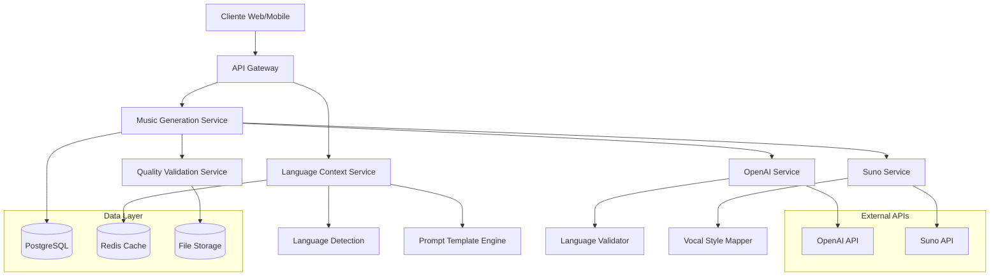

# Arquitetura Técnica - Sistema Multilíngue de Geração Musical

## 1. Arquitetura Geral do Sistema

### 1.1 Visão Arquitetural



### 1.2 Componentes Principais

#### Language Context Service
- Gerenciamento de contexto linguístico
- Detecção automática de idioma
- Mapeamento de configurações por idioma

#### Music Generation Service
- Orquestração do fluxo de geração
- Integração com APIs externas
- Validação de qualidade

#### Quality Validation Service
- Validação de consistência linguística
- Análise de qualidade vocal
- Métricas de performance

## 2. Especificação Tecnológica

### 2.1 Stack Tecnológico

- **Frontend**: Next.js 14+ com App Router, React 18, TypeScript
- **Backend**: Next.js API Routes com validação Zod
- **Database**: PostgreSQL com Prisma ORM
- **Cache**: Redis para otimização de performance
- **Authentication**: NextAuth.js
- **Monitoring**: Sentry + OpenTelemetry
- **Deployment**: Vercel

### 2.2 Dependências Adicionais

```json
{
  "dependencies": {
    "franc": "^6.1.0",
    "langdetect": "^0.2.1",
    "zod-to-openapi": "^2.0.0",
    "@prisma/client": "^5.0.0",
    "redis": "^4.6.0",
    "pino": "^8.15.0"
  }
}
```

## 3. Definições de Rotas da API

### 3.1 Rotas Principais

| Rota | Método | Propósito |
|------|--------|----------|
| `/api/v1/languages` | GET | Lista idiomas suportados |
| `/api/v1/languages/context/{locale}` | GET | Obtém contexto de idioma específico |
| `/api/v1/music/generate` | POST | Gera música multilíngue |
| `/api/v1/music/validate-language` | POST | Valida consistência de idioma |
| `/api/v1/templates/prompts/{locale}` | GET | Obtém templates de prompt por idioma |

### 3.2 Contratos de API

#### Geração de Música Multilíngue

```typescript
// POST /api/v1/music/generate
interface GenerateMusicRequest {
  briefing: {
    theme: string;
    mood: string;
    genre: string;
    duration?: number;
  };
  language: {
    locale: string; // 'pt-BR', 'en-US', etc.
    vocalStyle?: string;
    culturalContext?: string;
  };
  options?: {
    cacheEnabled?: boolean;
    qualityLevel?: 'standard' | 'premium';
  };
}

interface GenerateMusicResponse {
  success: boolean;
  data?: {
    musicId: string;
    lyrics: string;
    audioUrl: string;
    language: {
      detected: string;
      requested: string;
      confidence: number;
    };
    metadata: {
      genre: string;
      vocalStyle: string;
      duration: number;
      generatedAt: string;
    };
  };
  error?: {
    code: string;
    message: string;
    details?: any;
  };
}
```

#### Contexto de Idioma

```typescript
// GET /api/v1/languages/context/{locale}
interface LanguageContextResponse {
  locale: string;
  displayName: string;
  isSupported: boolean;
  configuration: {
    openai: {
      promptTemplate: string;
      culturalSuffix: string;
      maxTokens: number;
    };
    suno: {
      languageTag: string;
      supportedVocalStyles: string[];
      defaultVocalStyle: string;
    };
    validation: {
      confidenceThreshold: number;
      fallbackLocale: string;
    };
  };
}
```

## 4. Arquitetura de Serviços

### 4.1 Language Context Service

```typescript
// src/services/language/LanguageContextService.ts
export class LanguageContextService {
  private contexts: Map<string, LanguageContext> = new Map();
  private cache: Redis;
  
  constructor(cache: Redis) {
    this.cache = cache;
    this.loadContexts();
  }
  
  async getContext(locale: string): Promise<LanguageContext> {
    const cacheKey = `lang_context:${locale}`;
    
    // Try cache first
    const cached = await this.cache.get(cacheKey);
    if (cached) {
      return JSON.parse(cached);
    }
    
    // Load from configuration
    const context = this.contexts.get(locale);
    if (!context) {
      throw new UnsupportedLanguageError(locale);
    }
    
    // Cache for 1 hour
    await this.cache.setex(cacheKey, 3600, JSON.stringify(context));
    
    return context;
  }
  
  getSupportedLanguages(): string[] {
    return Array.from(this.contexts.keys());
  }
  
  private loadContexts(): void {
    // Load from configuration files or database
    const configs = this.loadLanguageConfigurations();
    configs.forEach(config => {
      this.contexts.set(config.locale, config);
    });
  }
}
```

### 4.2 Multilingual Music Generation Service

```typescript
// src/services/music/MultilingualMusicService.ts
export class MultilingualMusicService {
  constructor(
    private languageService: LanguageContextService,
    private openaiService: OpenAIService,
    private sunoService: SunoService,
    private validationService: QualityValidationService,
    private logger: Logger
  ) {}
  
  async generateMusic(request: GenerateMusicRequest): Promise<GenerateMusicResponse> {
    const startTime = Date.now();
    
    try {
      // 1. Get language context
      const context = await this.languageService.getContext(request.language.locale);
      
      // 2. Generate lyrics with OpenAI
      const lyrics = await this.generateLyrics(request.briefing, context);
      
      // 3. Validate language consistency
      await this.validationService.validateLanguage(lyrics, context);
      
      // 4. Generate music with Suno
      const music = await this.generateAudio(lyrics, request.briefing, context);
      
      // 5. Final quality validation
      const qualityScore = await this.validationService.validateQuality(music, context);
      
      // 6. Store results
      const musicRecord = await this.storeMusicRecord({
        ...music,
        lyrics,
        language: context.locale,
        qualityScore,
        generationTime: Date.now() - startTime
      });
      
      this.logger.info('Music generated successfully', {
        musicId: musicRecord.id,
        language: context.locale,
        duration: Date.now() - startTime
      });
      
      return {
        success: true,
        data: {
          musicId: musicRecord.id,
          lyrics,
          audioUrl: music.audioUrl,
          language: {
            detected: context.locale,
            requested: request.language.locale,
            confidence: qualityScore.languageConfidence
          },
          metadata: {
            genre: request.briefing.genre,
            vocalStyle: context.suno.defaultVocalStyle,
            duration: music.duration,
            generatedAt: new Date().toISOString()
          }
        }
      };
      
    } catch (error) {
      this.logger.error('Music generation failed', {
        error: error.message,
        language: request.language.locale,
        duration: Date.now() - startTime
      });
      
      return {
        success: false,
        error: {
          code: error.code || 'GENERATION_FAILED',
          message: error.message,
          details: error.details
        }
      };
    }
  }
  
  private async generateLyrics(
    briefing: Briefing, 
    context: LanguageContext
  ): Promise<string> {
    const prompt = this.buildPrompt(briefing, context);
    
    const response = await this.openaiService.complete({
      prompt,
      maxTokens: context.openai.maxTokens,
      temperature: 0.7,
      language: context.locale
    });
    
    return response.text;
  }
  
  private async generateAudio(
    lyrics: string, 
    briefing: Briefing, 
    context: LanguageContext
  ): Promise<GeneratedAudio> {
    const vocalStyle = briefing.vocalStyle || context.suno.defaultVocalStyle;
    
    return await this.sunoService.generate({
      lyrics,
      genre: briefing.genre,
      language: context.suno.languageTag,
      vocalStyle,
      duration: briefing.duration || 180
    });
  }
}
```

### 4.3 Quality Validation Service

```typescript
// src/services/validation/QualityValidationService.ts
export class QualityValidationService {
  constructor(
    private languageDetector: LanguageDetector,
    private logger: Logger
  ) {}
  
  async validateLanguage(
    text: string, 
    context: LanguageContext
  ): Promise<LanguageValidationResult> {
    const detected = await this.languageDetector.detect(text);
    const confidence = this.calculateConfidence(detected, context.locale);
    
    if (confidence < context.validation.confidenceThreshold) {
      throw new LanguageMismatchError(
        `Expected ${context.locale}, detected ${detected.language} with confidence ${confidence}`
      );
    }
    
    return {
      isValid: true,
      detectedLanguage: detected.language,
      confidence,
      expectedLanguage: context.locale
    };
  }
  
  async validateQuality(
    music: GeneratedAudio, 
    context: LanguageContext
  ): Promise<QualityScore> {
    const scores = await Promise.all([
      this.validateAudioQuality(music.audioUrl),
      this.validateVocalClarity(music.audioUrl, context),
      this.validateLanguageConsistency(music.lyrics, context)
    ]);
    
    return {
      overall: this.calculateOverallScore(scores),
      audioQuality: scores[0],
      vocalClarity: scores[1],
      languageConfidence: scores[2],
      timestamp: new Date().toISOString()
    };
  }
}
```

## 5. Modelo de Dados

### 5.1 Schema do Banco de Dados

```sql
-- Extensão da tabela de músicas para suporte multilíngue
ALTER TABLE songs ADD COLUMN IF NOT EXISTS language VARCHAR(10) DEFAULT 'pt-BR';
ALTER TABLE songs ADD COLUMN IF NOT EXISTS vocal_style VARCHAR(50);
ALTER TABLE songs ADD COLUMN IF NOT EXISTS quality_score JSONB;
ALTER TABLE songs ADD COLUMN IF NOT EXISTS generation_metadata JSONB;

-- Nova tabela para contextos de idioma
CREATE TABLE IF NOT EXISTS language_contexts (
    locale VARCHAR(10) PRIMARY KEY,
    display_name VARCHAR(100) NOT NULL,
    is_active BOOLEAN DEFAULT true,
    configuration JSONB NOT NULL,
    created_at TIMESTAMP WITH TIME ZONE DEFAULT NOW(),
    updated_at TIMESTAMP WITH TIME ZONE DEFAULT NOW()
);

-- Tabela para templates de prompt por idioma
CREATE TABLE IF NOT EXISTS prompt_templates (
    id UUID PRIMARY KEY DEFAULT gen_random_uuid(),
    locale VARCHAR(10) REFERENCES language_contexts(locale),
    template_type VARCHAR(50) NOT NULL, -- 'base', 'genre_specific', etc.
    template_content TEXT NOT NULL,
    variables JSONB,
    is_active BOOLEAN DEFAULT true,
    created_at TIMESTAMP WITH TIME ZONE DEFAULT NOW(),
    updated_at TIMESTAMP WITH TIME ZONE DEFAULT NOW()
);

-- Tabela para métricas de qualidade por idioma
CREATE TABLE IF NOT EXISTS quality_metrics (
    id UUID PRIMARY KEY DEFAULT gen_random_uuid(),
    song_id UUID REFERENCES songs(id),
    locale VARCHAR(10),
    quality_scores JSONB NOT NULL,
    validation_results JSONB,
    created_at TIMESTAMP WITH TIME ZONE DEFAULT NOW()
);

-- Índices para performance
CREATE INDEX IF NOT EXISTS idx_songs_language ON songs(language);
CREATE INDEX IF NOT EXISTS idx_songs_vocal_style ON songs(vocal_style);
CREATE INDEX IF NOT EXISTS idx_prompt_templates_locale ON prompt_templates(locale);
CREATE INDEX IF NOT EXISTS idx_quality_metrics_locale ON quality_metrics(locale);
CREATE INDEX IF NOT EXISTS idx_quality_metrics_song_id ON quality_metrics(song_id);

-- Dados iniciais para contextos de idioma
INSERT INTO language_contexts (locale, display_name, configuration) VALUES
('pt-BR', 'Português (Brasil)', '{
  "openai": {
    "promptTemplate": "Crie uma letra de música em português brasileiro sobre {theme}",
    "culturalSuffix": "A letra deve ser em português brasileiro, com rimas naturais e vocabulário brasileiro.",
    "maxTokens": 500
  },
  "suno": {
    "languageTag": "portuguese",
    "supportedVocalStyles": ["brazilian-male", "brazilian-female", "sertanejo", "bossa-nova"],
    "defaultVocalStyle": "brazilian-male"
  },
  "validation": {
    "confidenceThreshold": 0.8,
    "fallbackLocale": "pt-BR"
  }
}'),
('en-US', 'English (United States)', '{
  "openai": {
    "promptTemplate": "Create song lyrics in English about {theme}",
    "culturalSuffix": "The lyrics should be in English, with natural rhymes and American vocabulary.",
    "maxTokens": 500
  },
  "suno": {
    "languageTag": "english",
    "supportedVocalStyles": ["american-male", "american-female", "country", "pop"],
    "defaultVocalStyle": "american-male"
  },
  "validation": {
    "confidenceThreshold": 0.8,
    "fallbackLocale": "en-US"
  }
}')
ON CONFLICT (locale) DO NOTHING;
```

### 5.2 Modelo de Dados com Prisma

```prisma
// prisma/schema.prisma
model Song {
  id                   String   @id @default(cuid())
  title               String
  lyrics              String
  audioUrl            String?
  language            String   @default("pt-BR")
  vocalStyle          String?
  qualityScore        Json?
  generationMetadata  Json?
  userId              String
  createdAt           DateTime @default(now())
  updatedAt           DateTime @updatedAt
  
  user                User     @relation(fields: [userId], references: [id])
  qualityMetrics      QualityMetric[]
  
  @@index([language])
  @@index([vocalStyle])
  @@map("songs")
}

model LanguageContext {
  locale        String   @id
  displayName   String
  isActive      Boolean  @default(true)
  configuration Json
  createdAt     DateTime @default(now())
  updatedAt     DateTime @updatedAt
  
  promptTemplates PromptTemplate[]
  
  @@map("language_contexts")
}

model PromptTemplate {
  id              String   @id @default(cuid())
  locale          String
  templateType    String
  templateContent String
  variables       Json?
  isActive        Boolean  @default(true)
  createdAt       DateTime @default(now())
  updatedAt       DateTime @updatedAt
  
  languageContext LanguageContext @relation(fields: [locale], references: [locale])
  
  @@index([locale])
  @@map("prompt_templates")
}

model QualityMetric {
  id                String   @id @default(cuid())
  songId            String
  locale            String
  qualityScores     Json
  validationResults Json?
  createdAt         DateTime @default(now())
  
  song              Song     @relation(fields: [songId], references: [id])
  
  @@index([locale])
  @@index([songId])
  @@map("quality_metrics")
}
```

## 6. Configuração de Deployment

### 6.1 Variáveis de Ambiente

```bash
# .env.example

# Configurações de idioma
DEFAULT_LANGUAGE=pt-BR
SUPPORTED_LANGUAGES=pt-BR,en-US,es-ES
LANGUAGE_DETECTION_ENABLED=true

# APIs externas
OPENAI_API_KEY=sk-...
OPENAI_MODEL=gpt-4
OPENAI_MAX_TOKENS=500

SUNO_API_KEY=...
SUNO_API_URL=https://api.suno.ai/v1

# Cache e Performance
REDIS_URL=redis://localhost:6379
CACHE_TTL_LANGUAGE_CONTEXT=3600
CACHE_TTL_PROMPT_TEMPLATES=7200

# Qualidade e Validação
LANGUAGE_CONFIDENCE_THRESHOLD=0.8
QUALITY_SCORE_THRESHOLD=0.7
ENABLE_QUALITY_VALIDATION=true

# Monitoramento
SENTRY_DSN=...
OTEL_EXPORTER_OTLP_ENDPOINT=...
LOG_LEVEL=info

# Performance
MAX_CONCURRENT_GENERATIONS=10
GENERATION_TIMEOUT_MS=60000
```

### 6.2 Configuração do Vercel

```json
// vercel.json
{
  "functions": {
    "app/api/v1/music/generate.ts": {
      "maxDuration": 60
    }
  },
  "env": {
    "SUPPORTED_LANGUAGES": "pt-BR,en-US,es-ES",
    "DEFAULT_LANGUAGE": "pt-BR"
  },
  "headers": [
    {
      "source": "/api/(.*)",
      "headers": [
        {
          "key": "Access-Control-Allow-Origin",
          "value": "*"
        },
        {
          "key": "Access-Control-Allow-Methods",
          "value": "GET, POST, PUT, DELETE, OPTIONS"
        },
        {
          "key": "Access-Control-Allow-Headers",
          "value": "Content-Type, Authorization, Accept-Language"
        }
      ]
    }
  ]
}
```

## 7. Monitoramento e Observabilidade

### 7.1 Métricas Técnicas

```typescript
// src/monitoring/MetricsCollector.ts
export class MetricsCollector {
  private metrics = {
    generationsByLanguage: new Map<string, number>(),
    averageGenerationTime: new Map<string, number>(),
    qualityScores: new Map<string, number[]>(),
    errorRates: new Map<string, number>()
  };
  
  recordGeneration(language: string, duration: number, qualityScore: number) {
    // Update generation count
    const current = this.metrics.generationsByLanguage.get(language) || 0;
    this.metrics.generationsByLanguage.set(language, current + 1);
    
    // Update average time
    const times = this.metrics.averageGenerationTime.get(language) || 0;
    this.metrics.averageGenerationTime.set(language, (times + duration) / 2);
    
    // Update quality scores
    const scores = this.metrics.qualityScores.get(language) || [];
    scores.push(qualityScore);
    this.metrics.qualityScores.set(language, scores);
  }
  
  getLanguageMetrics(language: string) {
    const scores = this.metrics.qualityScores.get(language) || [];
    return {
      totalGenerations: this.metrics.generationsByLanguage.get(language) || 0,
      averageTime: this.metrics.averageGenerationTime.get(language) || 0,
      averageQuality: scores.reduce((a, b) => a + b, 0) / scores.length || 0,
      errorRate: this.metrics.errorRates.get(language) || 0
    };
  }
}
```

### 7.2 Dashboards de Monitoramento

```typescript
// app/api/v1/metrics/languages/route.ts
export async function GET() {
  const metrics = await metricsCollector.getAllLanguageMetrics();
  
  return NextResponse.json({
    timestamp: new Date().toISOString(),
    metrics: {
      byLanguage: metrics,
      overall: {
        totalGenerations: Object.values(metrics).reduce((sum, m) => sum + m.totalGenerations, 0),
        averageQuality: Object.values(metrics).reduce((sum, m) => sum + m.averageQuality, 0) / Object.keys(metrics).length,
        supportedLanguages: Object.keys(metrics)
      }
    }
  });
}
```

## 8. Testes e Validação

### 8.1 Testes de Integração

```typescript
// tests/integration/multilingual-generation.test.ts
describe('Multilingual Music Generation', () => {
  const testCases = [
    { locale: 'pt-BR', theme: 'amor', expectedLanguage: 'portuguese' },
    { locale: 'en-US', theme: 'love', expectedLanguage: 'english' },
    { locale: 'es-ES', theme: 'amor', expectedLanguage: 'spanish' }
  ];
  
  testCases.forEach(({ locale, theme, expectedLanguage }) => {
    it(`should generate music in ${locale}`, async () => {
      const request: GenerateMusicRequest = {
        briefing: {
          theme,
          mood: 'happy',
          genre: 'pop'
        },
        language: {
          locale
        }
      };
      
      const response = await musicService.generateMusic(request);
      
      expect(response.success).toBe(true);
      expect(response.data?.language.detected).toBe(locale);
      
      // Validate language detection
      const detectedLang = await languageDetector.detect(response.data!.lyrics);
      expect(detectedLang.language).toBe(expectedLanguage);
    });
  });
});
```

### 8.2 Testes de Performance

```typescript
// tests/performance/concurrent-generation.test.ts
describe('Concurrent Generation Performance', () => {
  it('should handle multiple languages simultaneously', async () => {
    const requests = [
      { locale: 'pt-BR', theme: 'saudade' },
      { locale: 'en-US', theme: 'freedom' },
      { locale: 'es-ES', theme: 'pasión' }
    ].map(({ locale, theme }) => ({
      briefing: { theme, mood: 'melancholic', genre: 'ballad' },
      language: { locale }
    }));
    
    const startTime = Date.now();
    const results = await Promise.allSettled(
      requests.map(req => musicService.generateMusic(req))
    );
    const duration = Date.now() - startTime;
    
    // All should succeed
    const successful = results.filter(r => r.status === 'fulfilled').length;
    expect(successful).toBe(requests.length);
    
    // Should complete within reasonable time
    expect(duration).toBeLessThan(90000); // 90 seconds
  });
});
```

## 9. Considerações de Segurança

### 9.1 Validação de Entrada

```typescript
// src/validation/schemas.ts
import { z } from 'zod';

export const GenerateMusicSchema = z.object({
  briefing: z.object({
    theme: z.string().min(1).max(200),
    mood: z.string().min(1).max(50),
    genre: z.string().min(1).max(50),
    duration: z.number().min(30).max(600).optional()
  }),
  language: z.object({
    locale: z.string().regex(/^[a-z]{2}-[A-Z]{2}$/),
    vocalStyle: z.string().max(50).optional(),
    culturalContext: z.string().max(100).optional()
  }),
  options: z.object({
    cacheEnabled: z.boolean().optional(),
    qualityLevel: z.enum(['standard', 'premium']).optional()
  }).optional()
});
```

### 9.2 Rate Limiting por Idioma

```typescript
// src/middleware/rateLimiting.ts
export class LanguageAwareRateLimiter {
  private limits = new Map<string, { count: number; resetTime: number }>();
  
  async checkLimit(userId: string, locale: string): Promise<boolean> {
    const key = `${userId}:${locale}`;
    const now = Date.now();
    const limit = this.limits.get(key);
    
    if (!limit || now > limit.resetTime) {
      this.limits.set(key, {
        count: 1,
        resetTime: now + (60 * 1000) // 1 minute
      });
      return true;
    }
    
    if (limit.count >= this.getLanguageLimit(locale)) {
      return false;
    }
    
    limit.count++;
    return true;
  }
  
  private getLanguageLimit(locale: string): number {
    // Different limits for different languages based on processing cost
    const limits = {
      'pt-BR': 10, // Higher limit for primary language
      'en-US': 8,
      'es-ES': 6,
      'default': 5
    };
    
    return limits[locale] || limits.default;
  }
}
```

## 10. Plano de Rollback

### 10.1 Estratégia de Feature Flags

```typescript
// src/config/featureFlags.ts
export const FEATURE_FLAGS = {
  MULTILINGUAL_GENERATION: process.env.ENABLE_MULTILINGUAL === 'true',
  LANGUAGE_DETECTION: process.env.ENABLE_LANGUAGE_DETECTION === 'true',
  QUALITY_VALIDATION: process.env.ENABLE_QUALITY_VALIDATION === 'true'
};

// Usage in service
if (FEATURE_FLAGS.MULTILINGUAL_GENERATION && locale !== 'pt-BR') {
  return await this.generateMultilingualMusic(request);
} else {
  return await this.generatePortugueseMusic(request);
}
```

### 10.2 Fallback para Português

```typescript
// src/services/fallback/FallbackService.ts
export class FallbackService {
  async handleLanguageFailure(
    request: GenerateMusicRequest,
    error: Error
  ): Promise<GenerateMusicResponse> {
    this.logger.warn('Language generation failed, falling back to Portuguese', {
      originalLocale: request.language.locale,
      error: error.message
    });
    
    // Convert request to Portuguese
    const fallbackRequest = {
      ...request,
      language: {
        ...request.language,
        locale: 'pt-BR'
      }
    };
    
    return await this.musicService.generateMusic(fallbackRequest);
  }
}
```

Esta arquitetura técnica fornece uma base sólida para implementar o sistema multilíngue de geração musical, mantendo a compatibilidade com o sistema existente e permitindo expansão futura para novos idiomas.