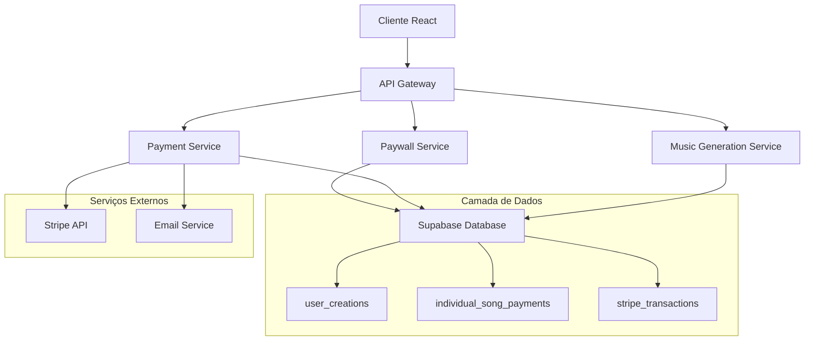
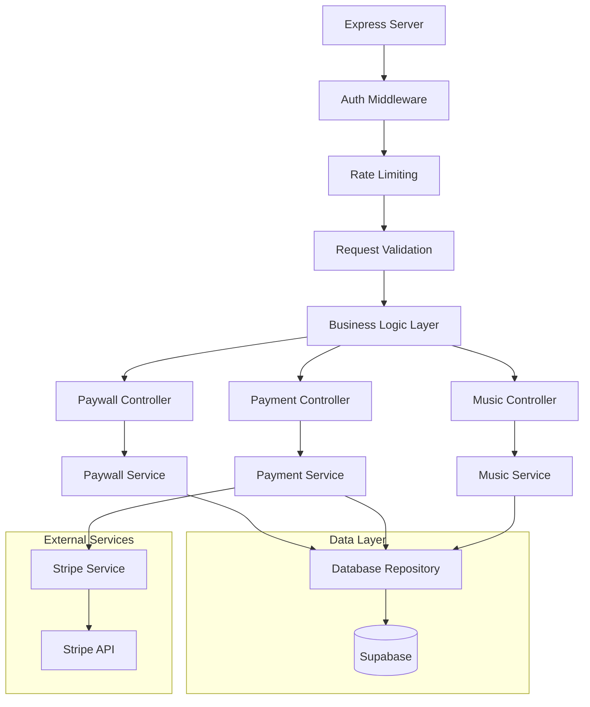
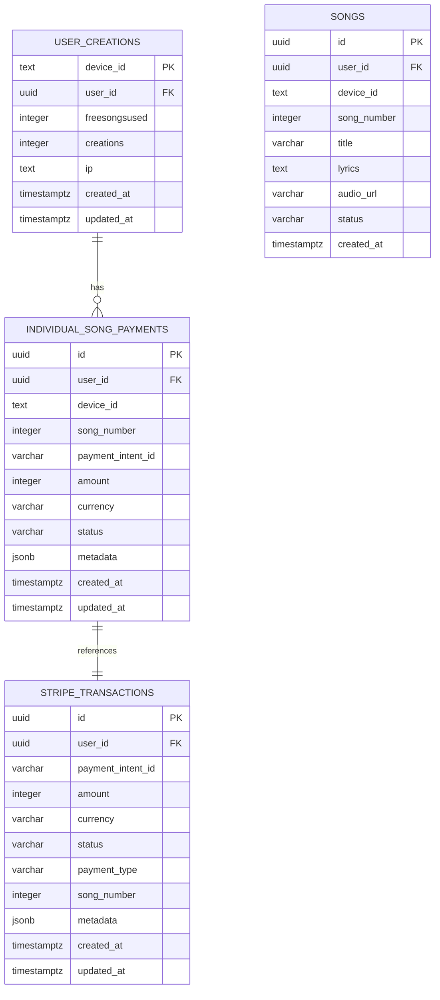

# Arquitetura Técnica - Sistema de Pagamento Individual por Música

## 1. Arquitetura Geral



## 2. Descrição da Tecnologia

- **Frontend:** React 18 + TypeScript + Tailwind CSS + Vite
- **Backend:** Node.js + Express + TypeScript
- **Banco de Dados:** Supabase (PostgreSQL)
- **Pagamentos:** Stripe API
- **Autenticação:** Supabase Auth
- **Email:** Nodemailer (opcional)

## 3. Definições de Rotas

| Rota | Propósito |
|------|----------|
| `/api/user/creation-status` | Verificar se usuário pode criar música (modificada) |
| `/api/stripe/create-individual-payment` | Criar pagamento para música individual (nova) |
| `/api/stripe/confirm-individual-payment` | Confirmar pagamento individual (nova) |
| `/api/stripe/webhook` | Webhook do Stripe (modificada) |
| `/api/generate-preview` | Gerar música (modificada) |
| `/api/user/song-history` | Histórico de músicas com status de pagamento (nova) |

## 4. Definições de API

### 4.1 API Core - Verificação de Status

**Verificação de status de criação (modificada)**
```
GET /api/user/creation-status
```

**Headers:**
| Nome | Tipo | Obrigatório | Descrição |
|------|------|-------------|----------|
| x-device-id | string | true | ID do dispositivo |
| x-guest-id | string | false | ID do convidado |
| authorization | string | false | Token Bearer para usuários autenticados |

**Response:**
| Campo | Tipo | Descrição |
|-------|------|----------|
| isFree | boolean | Se pode criar música gratuitamente |
| reason | string | Motivo (free_quota, individual_payment, payment_required) |
| songNumber | number | Número da próxima música |
| amount | number | Valor necessário para pagamento (se aplicável) |
| currency | string | Moeda (BRL) |

**Exemplo de Response:**
```json
{
  "isFree": false,
  "reason": "payment_required",
  "songNumber": 2,
  "amount": 500,
  "currency": "brl"
}
```

### 4.2 API Core - Pagamento Individual

**Criar pagamento individual**
```
POST /api/stripe/create-individual-payment
```

**Request:**
| Campo | Tipo | Obrigatório | Descrição |
|-------|------|-------------|----------|
| deviceId | string | true | ID do dispositivo |
| songNumber | number | true | Número da música a ser paga |
| userId | string | false | ID do usuário (se autenticado) |

**Response:**
| Campo | Tipo | Descrição |
|-------|------|----------|
| success | boolean | Status da operação |
| clientSecret | string | Client secret do Stripe |
| paymentIntentId | string | ID do Payment Intent |
| amount | number | Valor em centavos |

**Exemplo:**
```json
{
  "success": true,
  "clientSecret": "pi_1234567890_secret_abcdef",
  "paymentIntentId": "pi_1234567890",
  "amount": 500
}
```

### 4.3 API Core - Histórico de Músicas

**Buscar histórico com status de pagamento**
```
GET /api/user/song-history
```

**Headers:**
| Nome | Tipo | Obrigatório | Descrição |
|------|------|-------------|----------|
| x-device-id | string | true | ID do dispositivo |
| authorization | string | false | Token Bearer |

**Response:**
| Campo | Tipo | Descrição |
|-------|------|----------|
| songs | array | Lista de músicas |
| songs[].id | string | ID da música |
| songs[].title | string | Título da música |
| songs[].songNumber | number | Número sequencial |
| songs[].isFree | boolean | Se foi gratuita |
| songs[].paymentStatus | string | Status do pagamento |
| songs[].amount | number | Valor pago |
| songs[].createdAt | string | Data de criação |

**Exemplo:**
```json
{
  "songs": [
    {
      "id": "song_123",
      "title": "Minha Primeira Música",
      "songNumber": 1,
      "isFree": true,
      "paymentStatus": "free",
      "amount": 0,
      "createdAt": "2024-01-15T10:30:00Z"
    },
    {
      "id": "song_124",
      "title": "Segunda Música",
      "songNumber": 2,
      "isFree": false,
      "paymentStatus": "paid",
      "amount": 500,
      "createdAt": "2024-01-16T14:20:00Z"
    }
  ]
}
```

## 5. Arquitetura do Servidor



## 6. Modelo de Dados

### 6.1 Diagrama de Entidades



### 6.2 DDL (Data Definition Language)

**Tabela de Pagamentos Individuais**
```sql
-- Criar tabela principal
CREATE TABLE individual_song_payments (
    id UUID PRIMARY KEY DEFAULT gen_random_uuid(),
    user_id UUID REFERENCES auth.users(id),
    device_id TEXT NOT NULL,
    song_number INTEGER NOT NULL,
    payment_intent_id VARCHAR NOT NULL UNIQUE,
    amount INTEGER NOT NULL,
    currency VARCHAR DEFAULT 'brl',
    status VARCHAR NOT NULL CHECK (status IN ('pending', 'confirmed', 'failed', 'expired')),
    metadata JSONB DEFAULT '{}',
    created_at TIMESTAMPTZ DEFAULT NOW(),
    updated_at TIMESTAMPTZ DEFAULT NOW(),
    
    -- Constraint única por usuário/dispositivo/música
    UNIQUE(user_id, device_id, song_number)
);

-- Índices para performance
CREATE INDEX idx_individual_payments_user_device 
    ON individual_song_payments(user_id, device_id);
    
CREATE INDEX idx_individual_payments_status 
    ON individual_song_payments(status) 
    WHERE status IN ('pending', 'confirmed');
    
CREATE INDEX idx_individual_payments_song_number 
    ON individual_song_payments(song_number);
    
CREATE INDEX idx_individual_payments_payment_intent 
    ON individual_song_payments(payment_intent_id);

-- Trigger para updated_at
CREATE OR REPLACE FUNCTION update_updated_at_column()
RETURNS TRIGGER AS $$
BEGIN
    NEW.updated_at = NOW();
    RETURN NEW;
END;
$$ language 'plpgsql';

CREATE TRIGGER update_individual_payments_updated_at 
    BEFORE UPDATE ON individual_song_payments 
    FOR EACH ROW EXECUTE FUNCTION update_updated_at_column();
```

**Modificações na Tabela Existente**
```sql
-- Adicionar campos à tabela stripe_transactions
ALTER TABLE stripe_transactions 
ADD COLUMN payment_type VARCHAR DEFAULT 'premium' 
CHECK (payment_type IN ('premium', 'individual_song'));

ALTER TABLE stripe_transactions 
ADD COLUMN song_number INTEGER;

-- Índice para novos campos
CREATE INDEX idx_stripe_transactions_payment_type 
    ON stripe_transactions(payment_type);
    
CREATE INDEX idx_stripe_transactions_song_number 
    ON stripe_transactions(song_number) 
    WHERE song_number IS NOT NULL;
```

**Tabela de Músicas (se não existir)**
```sql
CREATE TABLE songs (
    id UUID PRIMARY KEY DEFAULT gen_random_uuid(),
    user_id UUID REFERENCES auth.users(id),
    device_id TEXT NOT NULL,
    song_number INTEGER NOT NULL,
    title VARCHAR(255) NOT NULL,
    lyrics TEXT,
    audio_url VARCHAR(500),
    status VARCHAR DEFAULT 'created' CHECK (status IN ('created', 'processing', 'completed', 'failed')),
    metadata JSONB DEFAULT '{}',
    created_at TIMESTAMPTZ DEFAULT NOW(),
    updated_at TIMESTAMPTZ DEFAULT NOW(),
    
    -- Constraint única por usuário/dispositivo/número
    UNIQUE(user_id, device_id, song_number)
);

-- Índices
CREATE INDEX idx_songs_user_device ON songs(user_id, device_id);
CREATE INDEX idx_songs_status ON songs(status);
CREATE INDEX idx_songs_created_at ON songs(created_at DESC);
```

**Políticas RLS (Row Level Security)**
```sql
-- Habilitar RLS
ALTER TABLE individual_song_payments ENABLE ROW LEVEL SECURITY;
ALTER TABLE songs ENABLE ROW LEVEL SECURITY;

-- Políticas para individual_song_payments
CREATE POLICY "Users can view their own payments" 
    ON individual_song_payments FOR SELECT 
    USING (auth.uid() = user_id OR user_id IS NULL);
    
CREATE POLICY "Users can insert their own payments" 
    ON individual_song_payments FOR INSERT 
    WITH CHECK (auth.uid() = user_id OR user_id IS NULL);
    
CREATE POLICY "System can update payment status" 
    ON individual_song_payments FOR UPDATE 
    USING (true); -- Permitir updates do sistema via service role

-- Políticas para songs
CREATE POLICY "Users can view their own songs" 
    ON songs FOR SELECT 
    USING (auth.uid() = user_id OR user_id IS NULL);
    
CREATE POLICY "Users can insert their own songs" 
    ON songs FOR INSERT 
    WITH CHECK (auth.uid() = user_id OR user_id IS NULL);
    
CREATE POLICY "Users can update their own songs" 
    ON songs FOR UPDATE 
    USING (auth.uid() = user_id OR user_id IS NULL);
```

**Dados Iniciais**
```sql
-- Configurações do sistema
INSERT INTO system_config (key, value, description) VALUES 
('INDIVIDUAL_SONG_PRICE', '500', 'Preço por música individual em centavos'),
('FREE_SONG_LIMIT', '1', 'Limite de músicas gratuitas por usuário'),
('PAYMENT_EXPIRY_HOURS', '24', 'Horas para expirar pagamento pendente')
ON CONFLICT (key) DO UPDATE SET 
    value = EXCLUDED.value,
    updated_at = NOW();

-- Migração de usuários premium existentes (exemplo)
-- Criar registros temporários para usuários premium atuais
INSERT INTO individual_song_payments (
    user_id, 
    device_id, 
    song_number, 
    payment_intent_id, 
    amount, 
    status, 
    metadata
)
SELECT 
    COALESCE(uc.user_id, uuid_generate_v4()),
    uc.device_id,
    generate_series(2, GREATEST(2, uc.freesongsused + 5)), -- Dar crédito extra
    'legacy_premium_' || uc.device_id || '_' || generate_series(2, GREATEST(2, uc.freesongsused + 5)),
    500,
    'confirmed',
    jsonb_build_object(
        'migration_type', 'legacy_premium',
        'original_premium_date', st.created_at,
        'migration_date', NOW()
    )
FROM user_creations uc
JOIN stripe_transactions st ON (
    (uc.user_id IS NOT NULL AND st.user_id = uc.user_id) OR
    (st.metadata->>'deviceId' = uc.device_id)
)
WHERE st.status = 'succeeded'
  AND st.payment_type = 'premium'
ON CONFLICT (user_id, device_id, song_number) DO NOTHING;
```

## 7. Funções Auxiliares

**Função para verificar pagamento individual**
```sql
CREATE OR REPLACE FUNCTION check_individual_payment(
    p_user_id UUID,
    p_device_id TEXT,
    p_song_number INTEGER
) RETURNS BOOLEAN AS $$
DECLARE
    payment_exists BOOLEAN := FALSE;
BEGIN
    SELECT EXISTS(
        SELECT 1 FROM individual_song_payments
        WHERE (user_id = p_user_id OR user_id IS NULL)
          AND device_id = p_device_id
          AND song_number = p_song_number
          AND status = 'confirmed'
    ) INTO payment_exists;
    
    RETURN payment_exists;
END;
$$ LANGUAGE plpgsql SECURITY DEFINER;
```

**Função para obter próximo número de música**
```sql
CREATE OR REPLACE FUNCTION get_next_song_number(
    p_user_id UUID,
    p_device_id TEXT
) RETURNS INTEGER AS $$
DECLARE
    next_number INTEGER;
BEGIN
    SELECT COALESCE(MAX(song_number), 0) + 1
    INTO next_number
    FROM songs
    WHERE (user_id = p_user_id OR user_id IS NULL)
      AND device_id = p_device_id;
    
    RETURN next_number;
END;
$$ LANGUAGE plpgsql SECURITY DEFINER;
```

**Função para limpar pagamentos expirados**
```sql
CREATE OR REPLACE FUNCTION cleanup_expired_payments()
RETURNS INTEGER AS $$
DECLARE
    expired_count INTEGER;
BEGIN
    UPDATE individual_song_payments
    SET status = 'expired',
        updated_at = NOW()
    WHERE status = 'pending'
      AND created_at < NOW() - INTERVAL '24 hours';
    
    GET DIAGNOSTICS expired_count = ROW_COUNT;
    
    RETURN expired_count;
END;
$$ LANGUAGE plpgsql SECURITY DEFINER;
```

## 8. Considerações de Performance

### 8.1 Otimizações de Banco
- Índices compostos para consultas frequentes
- Particionamento por data para tabelas grandes
- Limpeza automática de registros antigos
- Cache de consultas frequentes

### 8.2 Otimizações de API
- Rate limiting por endpoint
- Validação de entrada com Zod
- Conexão pool otimizada
- Logs estruturados para monitoramento

### 8.3 Monitoramento
- Métricas de latência por endpoint
- Taxa de sucesso de pagamentos
- Alertas para falhas críticas
- Dashboard de métricas de negócio

Esta arquitetura técnica fornece uma base sólida para implementar o sistema de pagamento individual por música, mantendo performance, segurança e escalabilidade.