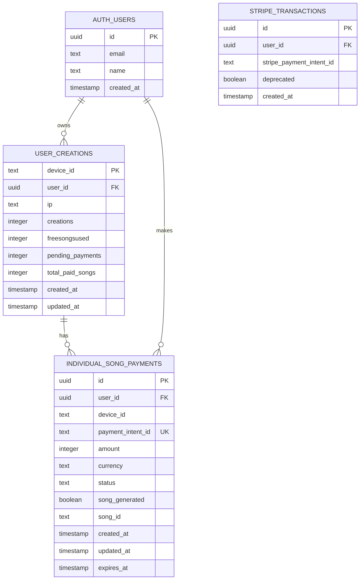
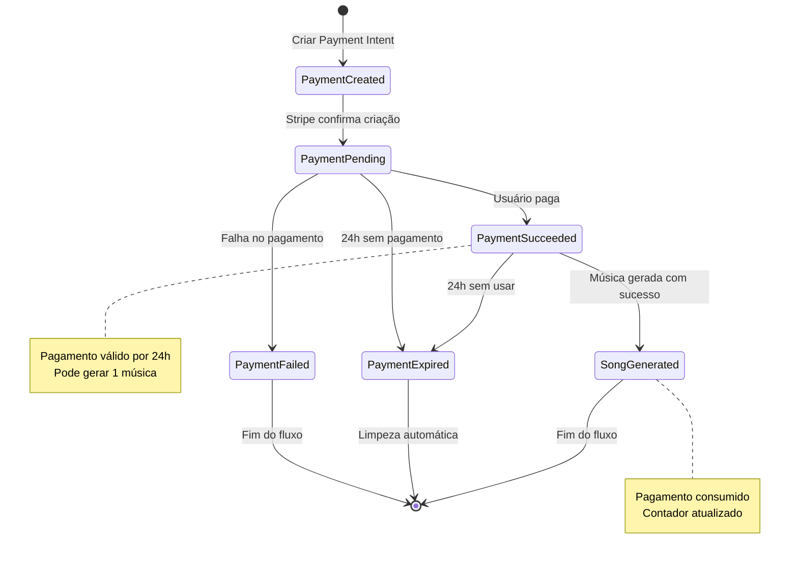
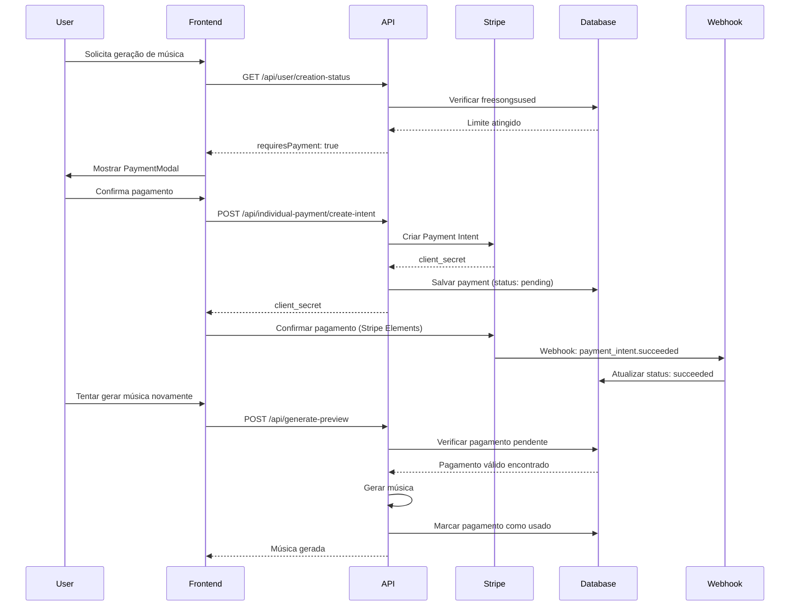

# Arquitetura Técnica - Sistema de Pagamento Individual por Música

## 1. Arquitetura Geral

```mermaid
graph TD
    A[User Browser] --> B[React Frontend]
    B --> C[Next.js API Routes]
    C --> D[Supabase Database]
    C --> E[Stripe Payment API]
    E --> F[Webhook Handler]
    F --> D
    
    subgraph "Frontend Layer"
        B
        G[PaymentModal Component]
        H[Music Store]
        B --> G
        B --> H
    end
    
    subgraph "API Layer"
        C
        I[/api/user/creation-status]
        J[/api/generate-preview]
        K[/api/individual-payment/*]
        L[/api/stripe/webhook]
        C --> I
        C --> J
        C --> K
        C --> L
    end
    
    subgraph "Data Layer"
        D
        M[(user_creations)]
        N[(individual_song_payments)]
        O[(stripe_transactions - deprecated)]
        D --> M
        D --> N
        D --> O
    end
    
    subgraph "External Services"
        E
        P[Stripe Dashboard]
        E --> P
    end
```

## 2. Tecnologias e Dependências

### 2.1 Stack Principal
- **Frontend**: Next.js 14+ com App Router, React 18, TypeScript
- **Styling**: Tailwind CSS + shadcn/ui
- **Estado**: Zustand (musicStore, uiStore)
- **Formulários**: react-hook-form + zod
- **HTTP Client**: Axios
- **Backend**: Next.js API Routes
- **Database**: Supabase (PostgreSQL)
- **Pagamentos**: Stripe API v2023-10-16
- **Autenticação**: Supabase Auth

### 2.2 Novas Dependências
```json
{
  "@stripe/stripe-js": "^2.1.0",
  "@stripe/react-stripe-js": "^2.1.0",
  "stripe": "^14.0.0"
}
```

## 3. Definições de Rotas

### 3.1 Rotas Frontend
| Rota | Propósito |
|------|----------|
| `/` | Página inicial com geração de música |
| `/login` | Autenticação de usuários |
| `/profile` | Perfil do usuário e histórico |
| `/payment-success` | Confirmação de pagamento individual |
| `/payment-cancel` | Cancelamento de pagamento |

### 3.2 Rotas API
| Rota | Método | Propósito |
|------|--------|----------|
| `/api/user/creation-status` | GET | Verificar status de criação e paywall |
| `/api/generate-preview` | POST | Gerar música (com verificação de pagamento) |
| `/api/individual-payment/create-intent` | POST | Criar Payment Intent individual |
| `/api/individual-payment/confirm` | POST | Confirmar pagamento individual |
| `/api/individual-payment/status` | GET | Status do pagamento |
| `/api/stripe/webhook` | POST | Webhook para eventos do Stripe |

## 4. Definições de API

### 4.1 API de Status de Criação

**GET /api/user/creation-status**

Request Headers:
| Header | Tipo | Obrigatório | Descrição |
|--------|------|-------------|----------|
| x-device-id | string | true | ID único do dispositivo |
| x-guest-id | string | false | ID do usuário convidado |
| authorization | string | false | Token de autenticação |

Response:
```typescript
interface CreationStatusResponse {
  success: boolean;
  isFree: boolean;
  freeSongsUsed: number;
  message: string;
  userType: 'guest' | 'authenticated' | 'guest_paid' | 'authenticated_paid';
  hasPendingPayment?: boolean;
  paymentId?: string;
  requiresPayment?: boolean;
  paymentType?: 'individual_song';
}
```

Exemplo de Response:
```json
{
  "success": true,
  "isFree": false,
  "freeSongsUsed": 1,
  "message": "Limite de músicas gratuitas atingido",
  "userType": "authenticated",
  "requiresPayment": true,
  "paymentType": "individual_song"
}
```

### 4.2 API de Pagamento Individual

**POST /api/individual-payment/create-intent**

Request:
```typescript
interface CreatePaymentIntentRequest {
  // Headers automáticos: x-device-id, authorization
}
```

Response:
```typescript
interface CreatePaymentIntentResponse {
  success: boolean;
  clientSecret?: string;
  paymentIntentId?: string;
  amount: number;
  currency: string;
  message?: string;
}
```

**GET /api/individual-payment/status/:paymentIntentId**

Response:
```typescript
interface PaymentStatusResponse {
  success: boolean;
  status: 'pending' | 'succeeded' | 'failed' | 'canceled';
  songGenerated: boolean;
  expiresAt: string;
  canGenerateSong: boolean;
}
```

### 4.3 API de Geração de Música

**POST /api/generate-preview**

Request:
```typescript
interface GeneratePreviewRequest {
  prompt: string;
  style?: string;
  duration?: number;
  // Headers: x-device-id, x-guest-id, authorization
}
```

Response (Sucesso):
```typescript
interface GeneratePreviewResponse {
  success: true;
  songId: string;
  audioUrl: string;
  paymentConsumed?: boolean;
  remainingFreeGenerations?: number;
}
```

Response (Pagamento Necessário):
```typescript
interface PaymentRequiredResponse {
  success: false;
  error: 'PAYMENT_REQUIRED';
  message: string;
  freeSongsUsed: number;
  maxFreeSongs: number;
  requiresPayment: true;
  paymentType: 'individual_song';
}
```

## 5. Modelo de Dados

### 5.1 Diagrama ER



### 5.2 DDL - Definição das Tabelas

#### Modificação da Tabela `user_creations`
```sql
-- Adicionar novas colunas para controle de pagamentos individuais
ALTER TABLE user_creations 
ADD COLUMN pending_payments INTEGER DEFAULT 0,
ADD COLUMN total_paid_songs INTEGER DEFAULT 0;

-- Índices para performance
CREATE INDEX idx_user_creations_pending_payments 
ON user_creations(pending_payments) 
WHERE pending_payments > 0;

CREATE INDEX idx_user_creations_total_paid 
ON user_creations(total_paid_songs) 
WHERE total_paid_songs > 0;

-- Comentários
COMMENT ON COLUMN user_creations.pending_payments IS 'Número de pagamentos pendentes não utilizados';
COMMENT ON COLUMN user_creations.total_paid_songs IS 'Total de músicas pagas geradas pelo usuário';
```

#### Nova Tabela `individual_song_payments`
```sql
-- Tabela para controle de pagamentos individuais por música
CREATE TABLE individual_song_payments (
    id UUID PRIMARY KEY DEFAULT gen_random_uuid(),
    user_id UUID REFERENCES auth.users(id) ON DELETE SET NULL,
    device_id TEXT NOT NULL,
    payment_intent_id TEXT UNIQUE NOT NULL,
    amount INTEGER NOT NULL CHECK (amount > 0),
    currency TEXT NOT NULL DEFAULT 'brl' CHECK (currency IN ('brl', 'usd')),
    status TEXT NOT NULL CHECK (status IN ('pending', 'succeeded', 'failed', 'canceled')),
    song_generated BOOLEAN NOT NULL DEFAULT FALSE,
    song_id TEXT,
    created_at TIMESTAMP WITH TIME ZONE DEFAULT NOW(),
    updated_at TIMESTAMP WITH TIME ZONE DEFAULT NOW(),
    expires_at TIMESTAMP WITH TIME ZONE DEFAULT (NOW() + INTERVAL '24 hours')
);

-- Índices para performance
CREATE INDEX idx_individual_payments_user_id 
ON individual_song_payments(user_id) 
WHERE user_id IS NOT NULL;

CREATE INDEX idx_individual_payments_device_id 
ON individual_song_payments(device_id);

CREATE INDEX idx_individual_payments_status 
ON individual_song_payments(status);

CREATE INDEX idx_individual_payments_expires 
ON individual_song_payments(expires_at) 
WHERE status = 'pending';

CREATE INDEX idx_individual_payments_available 
ON individual_song_payments(status, song_generated, expires_at) 
WHERE status = 'succeeded' AND song_generated = FALSE;

-- Trigger para atualizar updated_at
CREATE OR REPLACE FUNCTION update_individual_payments_updated_at()
RETURNS TRIGGER AS $$
BEGIN
    NEW.updated_at = NOW();
    RETURN NEW;
END;
$$ LANGUAGE plpgsql;

CREATE TRIGGER trigger_update_individual_payments_updated_at
    BEFORE UPDATE ON individual_song_payments
    FOR EACH ROW
    EXECUTE FUNCTION update_individual_payments_updated_at();

-- RLS (Row Level Security)
ALTER TABLE individual_song_payments ENABLE ROW LEVEL SECURITY;

-- Política para visualização
CREATE POLICY "Users can view own payments" ON individual_song_payments
    FOR SELECT USING (
        auth.uid() = user_id OR 
        device_id = COALESCE(
            current_setting('request.headers', true)::json->>'x-device-id',
            current_setting('request.headers', true)::json->>'X-Device-ID'
        )
    );

-- Política para inserção
CREATE POLICY "Users can insert own payments" ON individual_song_payments
    FOR INSERT WITH CHECK (
        auth.uid() = user_id OR 
        device_id = COALESCE(
            current_setting('request.headers', true)::json->>'x-device-id',
            current_setting('request.headers', true)::json->>'X-Device-ID'
        )
    );

-- Política para atualização (apenas sistema)
CREATE POLICY "System can update payments" ON individual_song_payments
    FOR UPDATE USING (true) WITH CHECK (true);

-- Comentários
COMMENT ON TABLE individual_song_payments IS 'Controle de pagamentos individuais por música';
COMMENT ON COLUMN individual_song_payments.expires_at IS 'Data de expiração do pagamento (24h após criação)';
COMMENT ON COLUMN individual_song_payments.song_generated IS 'Indica se a música foi gerada usando este pagamento';
```

#### Deprecação da Tabela `stripe_transactions`
```sql
-- Marcar tabela como depreciada (manter para histórico)
ALTER TABLE stripe_transactions 
ADD COLUMN deprecated BOOLEAN DEFAULT TRUE;

COMMENT ON COLUMN stripe_transactions.deprecated IS 'Tabela depreciada - usar individual_song_payments';

-- Criar view para compatibilidade (se necessário)
CREATE VIEW legacy_premium_users AS
SELECT DISTINCT user_id, created_at
FROM stripe_transactions 
WHERE deprecated IS NOT TRUE;
```

### 5.3 Funções Auxiliares

#### Função de Limpeza de Pagamentos Expirados
```sql
CREATE OR REPLACE FUNCTION cleanup_expired_payments()
RETURNS TABLE(cleaned_count INTEGER) AS $$
DECLARE
    deleted_count INTEGER;
BEGIN
    -- Deletar pagamentos pendentes expirados
    DELETE FROM individual_song_payments 
    WHERE status = 'pending' 
    AND expires_at < NOW();
    
    GET DIAGNOSTICS deleted_count = ROW_COUNT;
    
    -- Log da limpeza
    INSERT INTO system_logs (event_type, message, created_at)
    VALUES (
        'cleanup_expired_payments',
        format('Removed %s expired payments', deleted_count),
        NOW()
    );
    
    RETURN QUERY SELECT deleted_count;
END;
$$ LANGUAGE plpgsql SECURITY DEFINER;

-- Comentário
COMMENT ON FUNCTION cleanup_expired_payments() IS 'Remove pagamentos pendentes expirados (executar via cron)';
```

#### Função de Estatísticas de Pagamento
```sql
CREATE OR REPLACE FUNCTION get_payment_stats()
RETURNS TABLE(
    total_payments BIGINT,
    successful_payments BIGINT,
    pending_payments BIGINT,
    songs_generated BIGINT,
    total_revenue NUMERIC
) AS $$
BEGIN
    RETURN QUERY
    SELECT 
        COUNT(*) as total_payments,
        COUNT(*) FILTER (WHERE status = 'succeeded') as successful_payments,
        COUNT(*) FILTER (WHERE status = 'pending' AND expires_at > NOW()) as pending_payments,
        COUNT(*) FILTER (WHERE song_generated = TRUE) as songs_generated,
        COALESCE(SUM(amount) FILTER (WHERE status = 'succeeded'), 0)::NUMERIC / 100 as total_revenue
    FROM individual_song_payments;
END;
$$ LANGUAGE plpgsql SECURITY DEFINER;
```

## 6. Fluxo de Estados do Pagamento



## 7. Arquitetura de Segurança

### 7.1 Validação de Pagamentos



### 7.2 Prevenção de Fraudes

1. **Validação de Webhook**: Verificação de assinatura Stripe
2. **Expiração de Pagamentos**: TTL de 24h para pagamentos não utilizados
3. **Rate Limiting**: Limite de tentativas de pagamento por IP/usuário
4. **Idempotência**: Prevenção de dupla cobrança
5. **Logs de Auditoria**: Rastreamento completo de transações

## 8. Monitoramento e Observabilidade

### 8.1 Métricas Principais

```typescript
// Métricas de negócio
interface BusinessMetrics {
  // Conversão
  paymentConversionRate: number; // % de usuários que pagam após limite
  averageTimeToPayment: number; // Tempo médio até pagamento
  
  // Receita
  dailyRevenue: number;
  revenuePerUser: number;
  
  // Uso
  freeSongsGenerated: number;
  paidSongsGenerated: number;
  expiredPayments: number;
}

// Métricas técnicas
interface TechnicalMetrics {
  // Performance
  paymentApiLatency: number;
  webhookProcessingTime: number;
  
  // Erros
  paymentFailureRate: number;
  webhookFailureRate: number;
  
  // Sistema
  databaseConnections: number;
  stripeApiCalls: number;
}
```

### 8.2 Alertas

1. **Alto volume de pagamentos falhados** (>5% em 1h)
2. **Webhooks não processados** (>10 em fila)
3. **Pagamentos expirados não limpos** (>100 registros)
4. **Latência alta na API** (>2s p95)
5. **Queda na conversão** (<50% da média)

## 9. Plano de Rollback

### 9.1 Estratégia de Rollback

1. **Rollback de Código**: Deploy da versão anterior
2. **Rollback de Banco**: 
   - Manter tabelas antigas
   - Reativar função `hasUnlimitedAccess`
   - Desabilitar novas APIs

### 9.2 Script de Rollback

```sql
-- Emergency rollback script
-- Arquivo: rollback_individual_payments.sql

-- 1. Desabilitar novas funcionalidades
ALTER TABLE individual_song_payments DISABLE TRIGGER ALL;

-- 2. Reativar verificação premium (temporário)
UPDATE stripe_transactions SET deprecated = FALSE 
WHERE created_at > '2024-01-01';

-- 3. Resetar contadores se necessário
-- UPDATE user_creations SET freesongsused = 0 WHERE freesongsused > 1;

-- 4. Log do rollback
INSERT INTO system_logs (event_type, message, created_at)
VALUES ('emergency_rollback', 'Individual payments system rolled back', NOW());
```

## 10. Performance e Otimização

### 10.1 Índices Críticos

```sql
-- Índices para queries mais frequentes
CREATE INDEX CONCURRENTLY idx_payments_user_available 
ON individual_song_payments(user_id, status, song_generated, expires_at) 
WHERE status = 'succeeded' AND song_generated = FALSE;

CREATE INDEX CONCURRENTLY idx_payments_device_available 
ON individual_song_payments(device_id, status, song_generated, expires_at) 
WHERE status = 'succeeded' AND song_generated = FALSE;
```

### 10.2 Cache Strategy

```typescript
// Cache de status de usuário (Redis)
interface UserStatusCache {
  userId: string;
  deviceId: string;
  freesongsused: number;
  hasPendingPayment: boolean;
  lastUpdated: number;
  ttl: 300; // 5 minutos
}
```

### 10.3 Otimizações de Query

```sql
-- Query otimizada para verificação de pagamento pendente
WITH user_identifiers AS (
  SELECT unnest(ARRAY[$1, $2, $3]) as identifier
  WHERE unnest(ARRAY[$1, $2, $3]) IS NOT NULL
)
SELECT p.payment_intent_id, p.expires_at
FROM individual_song_payments p
JOIN user_identifiers ui ON (p.user_id::text = ui.identifier OR p.device_id = ui.identifier)
WHERE p.status = 'succeeded' 
  AND p.song_generated = FALSE 
  AND p.expires_at > NOW()
LIMIT 1;
```

Esta arquitetura técnica fornece a base sólida para implementar o sistema de pagamento individual por música, garantindo escalabilidade, segurança e manutenibilidade.