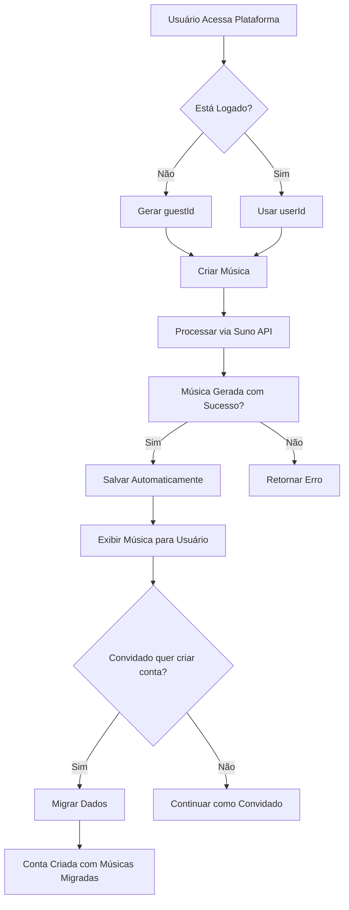

# Documento de Requisitos do Produto: Salvamento Automático e Suporte a Convidados

## 1. Visão Geral do Produto

Este projeto visa implementar um sistema de salvamento automático de músicas geradas, com suporte completo tanto para usuários autenticados quanto para usuários anônimos (convidados). O sistema deve garantir que todas as músicas criadas sejam preservadas automaticamente, e que usuários convidados possam migrar suas criações ao se cadastrarem na plataforma.

O objetivo é eliminar a perda de músicas geradas e melhorar a experiência do usuário, permitindo que convidados experimentem a plataforma sem perder seu trabalho ao decidirem criar uma conta.

## 2. Funcionalidades Principais

### 2.1 Papéis de Usuário

| Papel | Método de Identificação | Permissões Principais |
|-------|------------------------|----------------------|
| Usuário Autenticado | Login com email/senha ou OAuth | Acesso completo às suas músicas, histórico persistente, perfil personalizado |
| Usuário Convidado | ID único gerado automaticamente | Criação e acesso temporário às músicas, migração posterior para conta permanente |

### 2.2 Módulos Funcionais

Nossos requisitos consistem nas seguintes funcionalidades principais:

1. **Salvamento Automático**: Salvamento transparente de músicas após geração bem-sucedida
2. **Gestão de Convidados**: Sistema de identificação e rastreamento para usuários não autenticados
3. **Migração de Dados**: Transferência de músicas de convidado para conta permanente
4. **Listagem Inteligente**: Exibição de músicas baseada no tipo de usuário
5. **Limpeza Automática**: Remoção de dados antigos de convidados

### 2.3 Detalhes das Funcionalidades

| Funcionalidade | Módulo | Descrição da Funcionalidade |
|----------------|--------|-----------------------------|
| Geração de Música | Salvamento Automático | Detectar conclusão da geração via Suno API. Extrair dados da música (título, letras, URLs de áudio). Salvar automaticamente no banco com userId ou guestId. Registrar logs de auditoria. |
| Identificação de Convidado | Gestão de Convidados | Gerar ID único para sessões anônimas. Armazenar no localStorage do navegador. Validar formato do guestId (UUID ou alfanumérico 20-50 chars). Associar músicas ao guestId. |
| Listagem de Músicas | Listagem Inteligente | Buscar músicas por userId (autenticado) ou guestId (convidado). Implementar paginação e ordenação. Retornar estatísticas (total, recentes). Aplicar filtros de segurança via RLS. |
| Migração de Conta | Migração de Dados | Validar guestId e userId. Executar UPDATE para transferir propriedade. Limpar guestId após migração. Retornar contagem de músicas migradas. Registrar operação nos logs. |
| Limpeza de Dados | Limpeza Automática | Identificar registros de convidados >30 dias. Executar DELETE em lote. Registrar estatísticas de limpeza. Executar via job agendado. |

## 3. Fluxo Principal de Operações

### Fluxo do Usuário Convidado:
1. Usuário acessa a plataforma sem fazer login
2. Sistema gera automaticamente um `guestId` único
3. Usuário cria uma música através do formulário
4. Sistema processa a geração via Suno API
5. **Música é salva automaticamente** com o `guestId`
6. Usuário pode visualizar suas músicas na lista
7. (Opcional) Usuário decide criar uma conta
8. Sistema migra todas as músicas do `guestId` para o `userId`

### Fluxo do Usuário Autenticado:
1. Usuário faz login na plataforma
2. Sistema identifica o `userId` da sessão
3. Usuário cria uma música através do formulário
4. Sistema processa a geração via Suno API
5. **Música é salva automaticamente** com o `userId`
6. Usuário acessa histórico completo de suas músicas

## 4. Design da Interface do Usuário

### 4.1 Estilo de Design

- **Cores Primárias**: Manter paleta existente da aplicação
- **Estilo de Botões**: Consistente com design system atual
- **Fontes**: Utilizar tipografia padrão da plataforma
- **Layout**: Integração transparente com interface existente
- **Ícones**: Adicionar indicadores visuais para status de salvamento

### 4.2 Visão Geral do Design das Páginas

| Página | Módulo | Elementos da UI |
|--------|--------|----------------|
| Geração de Música | Salvamento Automático | Indicador de progresso com status "Salvando...". Toast de confirmação "Música salva com sucesso". Ícone de salvamento automático no cabeçalho. |
| Lista de Músicas | Listagem Inteligente | Badge "Convidado" para usuários não autenticados. Contador de músicas no cabeçalho. Paginação com loading states. Filtros por data e gênero. |
| Processo de Cadastro | Migração de Dados | Modal de confirmação "X músicas serão migradas". Barra de progresso durante migração. Mensagem de sucesso com contagem final. |
| Configurações | Limpeza Automática | (Admin) Painel com estatísticas de limpeza. Botão manual para executar limpeza. Logs de operações recentes. |

### 4.3 Responsividade

O produto mantém a responsividade existente da plataforma, sendo mobile-first com adaptações para desktop. Todas as novas funcionalidades devem funcionar perfeitamente em dispositivos móveis, especialmente o fluxo de migração de dados que pode ocorrer durante o cadastro mobile.

## 5. Critérios de Aceitação

### 5.1 Salvamento Automático
- [ ] Toda música gerada com sucesso deve ser salva automaticamente
- [ ] Salvamento não deve falhar a geração em caso de erro
- [ ] Logs detalhados devem ser registrados para cada operação
- [ ] Tempo de salvamento não deve exceder 500ms

### 5.2 Gestão de Convidados
- [ ] GuestId deve ser gerado automaticamente na primeira visita
- [ ] GuestId deve persistir durante toda a sessão
- [ ] Validação de formato deve rejeitar IDs inválidos
- [ ] Músicas de convidados devem ser acessíveis apenas pelo guestId correto

### 5.3 Migração de Dados
- [ ] Migração deve transferir 100% das músicas do convidado
- [ ] GuestId deve ser limpo após migração bem-sucedida
- [ ] Operação deve ser idempotente (não duplicar em caso de retry)
- [ ] Usuário deve receber confirmação com contagem de músicas migradas

### 5.4 Segurança e Performance
- [ ] Rate limiting deve prevenir abuso dos endpoints
- [ ] Políticas RLS devem impedir acesso não autorizado
- [ ] Limpeza automática deve remover dados antigos (>30 dias)
- [ ] Queries devem usar índices otimizados

## 6. Métricas de Sucesso

### 6.1 Métricas Técnicas
- **Taxa de Salvamento**: 100% das gerações bem-sucedidas devem ser salvas
- **Tempo de Resposta**: <500ms para salvamento automático
- **Taxa de Erro**: <1% de falhas no salvamento
- **Performance de Migração**: <2s para migrar até 50 músicas

### 6.2 Métricas de Negócio
- **Taxa de Conversão**: % de convidados que criam conta após usar a plataforma
- **Retenção de Dados**: % de músicas preservadas durante migração
- **Satisfação do Usuário**: Feedback positivo sobre não perder músicas
- **Redução de Suporte**: Menos tickets sobre músicas perdidas

## 7. Considerações de Implementação

### 7.1 Fases de Desenvolvimento

**Fase 1 - Salvamento Automático (Crítica)**
- Implementar detecção de conclusão na geração
- Adicionar função de salvamento automático
- Integrar com SongService existente
- Testes de integração completos

**Fase 2 - Gestão de Convidados (Importante)**
- Implementar geração de guestId no frontend
- Modificar endpoints para aceitar guestId
- Validação e sanitização de dados
- Testes de segurança

**Fase 3 - Migração e Limpeza (Desejável)**
- Implementar fluxo de migração no frontend
- Job de limpeza automática
- Métricas e monitoramento
- Otimizações de performance

### 7.2 Riscos e Mitigações

**Risco Alto**: Perda de dados durante migração
- **Mitigação**: Transações atômicas + rollback automático

**Risco Médio**: Performance degradada com muitos convidados
- **Mitigação**: Índices otimizados + limpeza regular

**Risco Baixo**: Conflitos de guestId
- **Mitigação**: UUIDs + validação de unicidade

## 8. Dependências e Integrações

### 8.1 Sistemas Existentes
- **Supabase**: Banco de dados e autenticação
- **Suno API**: Geração de músicas
- **Frontend React**: Interface do usuário
- **Express Backend**: APIs e lógica de negócio

### 8.2 Novas Dependências
- Nenhuma nova dependência externa necessária
- Utilização de bibliotecas já presentes no projeto
- Aproveitamento máximo da infraestrutura existente

## 9. Cronograma Estimado

- **Semana 1**: Análise técnica e preparação
- **Semana 2**: Implementação do salvamento automático
- **Semana 3**: Gestão de convidados e migração
- **Semana 4**: Testes, otimizações e deploy

**Total**: 4 semanas para implementação completa

## 10. Definição de Pronto

O projeto será considerado concluído quando:

1. ✅ Todas as músicas geradas são salvas automaticamente
2. ✅ Convidados podem usar a plataforma sem perder dados
3. ✅ Migração de dados funciona perfeitamente
4. ✅ Limpeza automática remove dados antigos
5. ✅ Todos os testes passam (unitários + integração)
6. ✅ Performance atende aos critérios estabelecidos
7. ✅ Documentação técnica está completa
8. ✅ Deploy em produção real