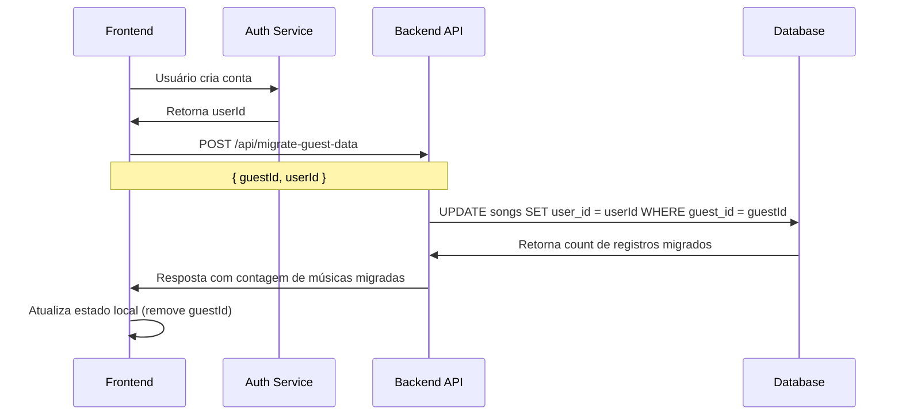

# Documentação Técnica: Reestruturação do Backend para Salvamento Automático e Suporte a Convidados

## 1. Análise da Arquitetura Atual

### 1.1 Estado Atual do Sistema

**Banco de Dados (Supabase PostgreSQL):**
- Tabela `songs` já implementada com campos `user_id` e `guest_id`
- Restrição `CHECK` garantindo que um dos IDs seja preenchido
- Políticas RLS configuradas para usuários autenticados e `service_role`
- Função RPC `migrate_guest_songs_to_user` já implementada

**APIs Existentes:**
- `GET /api/songs` - Lista músicas por usuário ou convidado
- `POST /api/migrate-guest-data` - Migra dados de convidado para usuário
- `POST /api/generate-preview` - Gera música via Suno API
- `GET /api/generate-preview/check-music-status/:taskId` - Verifica status da geração

**Serviços:**
- `SongService` com métodos CRUD completos
- Integração com Supabase via SDK oficial
- Validação de dados com Zod schemas

### 1.2 Gaps Identificados

**Problema Principal:** O salvamento de músicas não é automático. Atualmente:
1. A música é gerada via Suno API
2. O status é verificado via polling
3. **NÃO há salvamento automático no banco quando a geração é concluída**
4. O frontend precisa fazer uma chamada separada para salvar (que não existe)

## 2. Especificações para Modificação do Esquema

### 2.1 Estrutura da Tabela `songs` (Já Implementada)

```sql
CREATE TABLE songs (
    id UUID PRIMARY KEY DEFAULT gen_random_uuid(),
    user_id UUID REFERENCES auth.users(id) ON DELETE CASCADE,
    guest_id VARCHAR(255),
    title VARCHAR(500) NOT NULL,
    lyrics TEXT,
    prompt TEXT,
    genre VARCHAR(100),
    mood VARCHAR(100),
    audio_url_option1 TEXT,
    audio_url_option2 TEXT,
    suno_task_id VARCHAR(255),
    generation_status VARCHAR(50) DEFAULT 'completed',
    created_at TIMESTAMP WITH TIME ZONE DEFAULT NOW(),
    updated_at TIMESTAMP WITH TIME ZONE DEFAULT NOW(),
    
    -- Restrição para garantir que pelo menos um ID seja fornecido
    CONSTRAINT check_user_or_guest CHECK (
        (user_id IS NOT NULL AND guest_id IS NULL) OR 
        (user_id IS NULL AND guest_id IS NOT NULL)
    )
);

-- Índices para performance
CREATE INDEX idx_songs_user_id ON songs(user_id);
CREATE INDEX idx_songs_guest_id ON songs(guest_id);
CREATE INDEX idx_songs_suno_task_id ON songs(suno_task_id);
CREATE INDEX idx_songs_created_at ON songs(created_at DESC);
```

### 2.2 Políticas RLS (Já Implementadas)

```sql
-- Política para usuários autenticados
CREATE POLICY "Users can manage their own songs" ON songs
    FOR ALL USING (auth.uid() = user_id);

-- Política para service_role (backend)
CREATE POLICY "Service role can manage all songs" ON songs
    FOR ALL USING (auth.role() = 'service_role');
```

## 3. Redesign do Endpoint de Geração para Salvamento Automático

### 3.1 Modificações Necessárias no `generate-preview.ts`

**Localização do Ponto de Integração:**
No arquivo `/api/routes/generate-preview.ts`, linha ~870, onde o status é verificado como `COMPLETED`:

```typescript
// Verificar se o job está completo
if ((jobData.status === 'SUCCESS' || jobData.status === 'FIRST_SUCCESS') && jobData.response) {
  // AQUI: Adicionar salvamento automático
  await autoSaveSongToDatabase(task, jobData.response);
}
```

### 3.2 Implementação da Função de Salvamento Automático

```typescript
import { SongService } from '../../src/lib/services/songService.js';

/**
 * Salva automaticamente a música no banco de dados quando a geração é concluída
 */
async function autoSaveSongToDatabase(task: any, sunoResponse: any) {
  try {
    console.log(`💾 [${task.taskId}] Iniciando salvamento automático...`);
    
    // Extrair URLs de áudio das respostas da Suno
    const audioUrls = extractAudioUrls(sunoResponse);
    
    // Preparar dados da música
    const songData = {
      userId: task.metadata.userId || null,
      guestId: task.metadata.guestId || null,
      title: task.metadata.songTitle || 'Música Sem Título',
      lyrics: task.lyrics || null,
      prompt: task.metadata.originalPrompt || null,
      genre: task.metadata.genre || null,
      mood: task.metadata.mood || null,
      audioUrlOption1: audioUrls[0] || null,
      audioUrlOption2: audioUrls[1] || null,
      sunoTaskId: task.taskId
    };
    
    // Validar que temos pelo menos userId ou guestId
    if (!songData.userId && !songData.guestId) {
      console.error(`❌ [${task.taskId}] Erro: userId e guestId estão ausentes`);
      return;
    }
    
    // Salvar no banco de dados
    const savedSong = await SongService.createSong(songData);
    
    console.log(`✅ [${task.taskId}] Música salva automaticamente:`, {
      songId: savedSong.id,
      title: savedSong.title,
      userId: savedSong.userId,
      guestId: savedSong.guestId
    });
    
    // Adicionar ID da música salva aos metadados da task
    task.metadata.savedSongId = savedSong.id;
    
  } catch (error) {
    console.error(`❌ [${task.taskId}] Erro no salvamento automático:`, error);
    // Não falhar a geração por causa do erro de salvamento
  }
}

/**
 * Extrai URLs de áudio da resposta da Suno API
 */
function extractAudioUrls(sunoResponse: any): string[] {
  const urls: string[] = [];
  
  try {
    const jobsArray = Array.isArray(sunoResponse) ? sunoResponse : [sunoResponse];
    
    jobsArray.forEach(job => {
      if (job.sunoData && Array.isArray(job.sunoData)) {
        job.sunoData.forEach(clip => {
          if (clip.audioUrl || clip.sourceAudioUrl) {
            urls.push(clip.audioUrl || clip.sourceAudioUrl);
          }
        });
      }
    });
  } catch (error) {
    console.error('Erro ao extrair URLs de áudio:', error);
  }
  
  return urls;
}
```

### 3.3 Modificações no Payload da Requisição

O endpoint `POST /api/generate-preview` deve ser modificado para aceitar `userId` e `guestId`:

```typescript
// Adicionar ao schema de validação
const generatePreviewSchema = z.object({
  // ... campos existentes ...
  
  // Novos campos para identificação
  userId: z.string().uuid().optional(),
  guestId: z.string().min(1).optional(),
}).refine(
  (data) => data.userId || data.guestId,
  { 
    message: "Either userId or guestId must be provided",
    path: ["userId", "guestId"]
  }
);
```

## 4. Especificações dos Endpoints

### 4.1 Endpoint GET /api/songs (Já Implementado)

**Funcionalidade:** Lista músicas do usuário ou convidado

**Request:**
```typescript
GET /api/songs?userId=<uuid>&limit=20&offset=0
// OU
GET /api/songs?guestId=<string>&limit=20&offset=0
```

**Response:**
```typescript
{
  "success": true,
  "data": {
    "songs": [
      {
        "id": "uuid",
        "userId": "uuid" | null,
        "guestId": "string" | null,
        "title": "string",
        "lyrics": "string" | null,
        "audioUrlOption1": "string" | null,
        "audioUrlOption2": "string" | null,
        "createdAt": "ISO date",
        "updatedAt": "ISO date"
      }
    ],
    "pagination": {
      "limit": 20,
      "offset": 0,
      "hasMore": boolean
    },
    "stats": {
      "total": number,
      "recent": number
    }
  }
}
```

### 4.2 Endpoint POST /api/migrate-guest-data (Já Implementado)

**Funcionalidade:** Migra músicas de convidado para usuário autenticado

**Request:**
```typescript
POST /api/migrate-guest-data
{
  "guestId": "string",
  "userId": "uuid" // Obtido da autenticação
}
```

**Response:**
```typescript
{
  "success": true,
  "message": "Migração concluída com sucesso! X músicas migradas.",
  "data": {
    "migratedCount": number,
    "guestId": "string",
    "userId": "uuid",
    "songs": [
      {
        "id": "uuid",
        "title": "string",
        "createdAt": "ISO date"
      }
    ]
  }
}
```

### 4.3 Modificações no Endpoint POST /api/generate-preview

**Request Modificado:**
```typescript
POST /api/generate-preview
{
  // Campos existentes de geração
  "occasion": "string",
  "recipientName": "string",
  "relationship": "string",
  "senderName": "string",
  "hobbies": "string",
  "qualities": "string",
  "genre": "string",
  "mood": "string",
  
  // Novos campos para identificação
  "userId": "uuid" | null,
  "guestId": "string" | null
}
```

**Response (Inalterado):**
```typescript
{
  "success": true,
  "taskId": "string",
  "message": "Geração iniciada com sucesso",
  "estimatedTime": "2-5 minutos"
}
```

## 5. Fluxo de Migração de Dados

### 5.1 Cenário: Convidado Cria Conta



### 5.2 Implementação no Frontend

```typescript
// No componente de autenticação
const handleSuccessfulSignup = async (userId: string) => {
  const guestId = localStorage.getItem('guestId');
  
  if (guestId) {
    try {
      const response = await fetch('/api/migrate-guest-data', {
        method: 'POST',
        headers: { 'Content-Type': 'application/json' },
        body: JSON.stringify({ guestId, userId })
      });
      
      const result = await response.json();
      
      if (result.success) {
        console.log(`${result.data.migratedCount} músicas migradas`);
        localStorage.removeItem('guestId'); // Limpar guestId
        // Atualizar estado da aplicação
      }
    } catch (error) {
      console.error('Erro na migração:', error);
    }
  }
};
```

## 6. Considerações de Segurança e Validação

### 6.1 Validação de Dados

**Validação de GuestId:**
```typescript
// Função já implementada em song.js
export function isValidGuestId(guestId) {
  const uuidRegex = /^[0-9a-f]{8}-[0-9a-f]{4}-4[0-9a-f]{3}-[89ab][0-9a-f]{3}-[0-9a-f]{12}$/i;
  const alphanumericRegex = /^[a-zA-Z0-9_-]{20,50}$/;
  
  return uuidRegex.test(guestId) || alphanumericRegex.test(guestId);
}
```

**Sanitização de Dados:**
```typescript
// Função já implementada em song.js
export function sanitizeSongTitle(title) {
  return title
    .trim()
    .replace(/[<>"'&]/g, '') // Remove caracteres perigosos
    .substring(0, 500); // Garante tamanho máximo
}
```

### 6.2 Políticas de Segurança

**Rate Limiting:**
- Implementar rate limiting no endpoint de geração (máx 5 gerações por hora por IP)
- Rate limiting no endpoint de migração (máx 3 migrações por usuário por dia)

**Validação de Propriedade:**
- Verificar se o `guestId` pertence ao mesmo IP/sessão antes da migração
- Implementar timeout para limpeza de dados de convidados antigos (30 dias)

**Logs de Auditoria:**
```typescript
// Adicionar logs de auditoria para operações sensíveis
console.log(`[AUDIT] Migration: ${guestId} -> ${userId} (${migratedCount} songs)`);
console.log(`[AUDIT] Auto-save: Song ${songId} for ${userId || guestId}`);
```

## 7. Plano de Implementação

### 7.1 Fase 1: Modificar Endpoint de Geração
- [ ] Adicionar campos `userId` e `guestId` ao schema de validação
- [ ] Implementar função `autoSaveSongToDatabase`
- [ ] Integrar salvamento automático no ponto de conclusão
- [ ] Testar fluxo completo de geração + salvamento

### 7.2 Fase 2: Validação e Testes
- [ ] Testar cenário de usuário autenticado
- [ ] Testar cenário de convidado
- [ ] Testar migração de dados
- [ ] Validar políticas de segurança

### 7.3 Fase 3: Otimizações
- [ ] Implementar cleanup de dados antigos
- [ ] Adicionar métricas e monitoramento
- [ ] Otimizar queries de banco de dados

## 8. Riscos e Mitigações

**Risco 1:** Falha no salvamento automático
- **Mitigação:** Logs detalhados + não falhar a geração por erro de salvamento

**Risco 2:** Dados órfãos de convidados
- **Mitigação:** Job de limpeza automática após 30 dias

**Risco 3:** Migração duplicada
- **Mitigação:** Verificar se já existe `user_id` antes da migração

**Risco 4:** Performance com muitos convidados
- **Mitigação:** Índices otimizados + paginação + cleanup regular

## 9. Métricas de Sucesso

- **Taxa de Salvamento:** 100% das músicas geradas com sucesso devem ser salvas automaticamente
- **Taxa de Migração:** >95% das migrações devem ser bem-sucedidas
- **Performance:** Salvamento automático não deve adicionar >500ms ao tempo de resposta
- **Limpeza:** Dados de convidados antigos devem ser removidos automaticamente