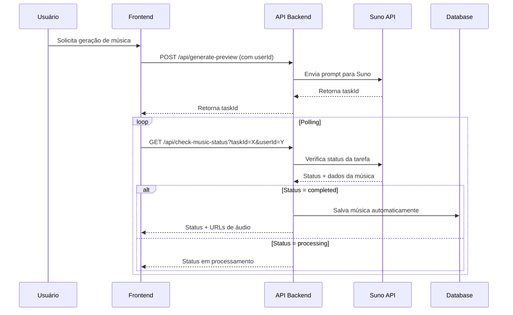
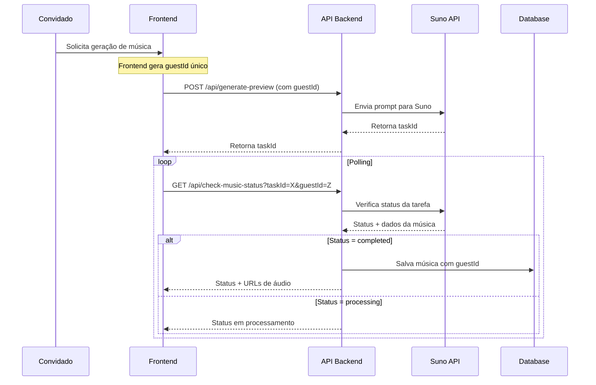
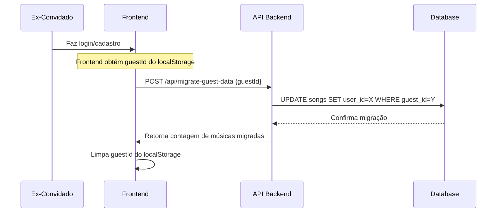

# Arquitetura Técnica: Sistema de Salvamento Automático e Suporte a Convidados

## 1. Visão Geral

Este documento detalha a implementação de um sistema robusto para salvamento automático de músicas geradas, com suporte completo para usuários autenticados e convidados (anônimos). O sistema inclui mecanismos de migração de dados quando convidados criam contas.

## 2. Modificações no Esquema do Banco de Dados

### 2.1 Estrutura da Tabela `songs`

```sql
-- Criação da tabela songs com suporte a usuários e convidados
CREATE TABLE songs (
    id UUID PRIMARY KEY DEFAULT gen_random_uuid(),
    user_id UUID REFERENCES users(id) ON DELETE CASCADE,
    guest_id VARCHAR(255),
    title VARCHAR(500) NOT NULL,
    lyrics TEXT,
    prompt TEXT,
    genre VARCHAR(100),
    mood VARCHAR(100),
    audio_url_option1 TEXT,
    audio_url_option2 TEXT,
    suno_task_id VARCHAR(255),
    generation_status VARCHAR(50) DEFAULT 'completed',
    created_at TIMESTAMP WITH TIME ZONE DEFAULT NOW(),
    updated_at TIMESTAMP WITH TIME ZONE DEFAULT NOW(),
    
    -- Restrição para garantir que pelo menos um ID esteja presente
    CONSTRAINT check_user_or_guest CHECK (
        (user_id IS NOT NULL AND guest_id IS NULL) OR 
        (user_id IS NULL AND guest_id IS NOT NULL)
    )
);

-- Índices para otimização de consultas
CREATE INDEX idx_songs_user_id ON songs(user_id) WHERE user_id IS NOT NULL;
CREATE INDEX idx_songs_guest_id ON songs(guest_id) WHERE guest_id IS NOT NULL;
CREATE INDEX idx_songs_created_at ON songs(created_at DESC);
CREATE INDEX idx_songs_suno_task_id ON songs(suno_task_id) WHERE suno_task_id IS NOT NULL;

-- Políticas RLS (Row Level Security)
ALTER TABLE songs ENABLE ROW LEVEL SECURITY;

-- Política para usuários autenticados
CREATE POLICY "Users can view their own songs" ON songs
    FOR SELECT USING (auth.uid() = user_id);

CREATE POLICY "Users can insert their own songs" ON songs
    FOR INSERT WITH CHECK (auth.uid() = user_id);

-- Política para convidados (via service_role)
CREATE POLICY "Service can manage guest songs" ON songs
    FOR ALL USING (true);
```

### 2.2 Tabela de Usuários (se não existir)

```sql
-- Tabela de usuários básica (caso não exista)
CREATE TABLE IF NOT EXISTS users (
    id UUID PRIMARY KEY DEFAULT gen_random_uuid(),
    email VARCHAR(255) UNIQUE NOT NULL,
    name VARCHAR(255),
    created_at TIMESTAMP WITH TIME ZONE DEFAULT NOW(),
    updated_at TIMESTAMP WITH TIME ZONE DEFAULT NOW()
);
```

## 3. Contratos de API com Zod

### 3.1 Schemas de Validação

```typescript
// src/lib/schemas/song.ts
import { z } from 'zod';

export const SongSchema = z.object({
  id: z.string().uuid(),
  userId: z.string().uuid().nullable(),
  guestId: z.string().nullable(),
  title: z.string().min(1).max(500),
  lyrics: z.string().optional(),
  prompt: z.string().optional(),
  genre: z.string().optional(),
  mood: z.string().optional(),
  audioUrlOption1: z.string().url().optional(),
  audioUrlOption2: z.string().url().optional(),
  sunoTaskId: z.string().optional(),
  generationStatus: z.enum(['pending', 'processing', 'completed', 'failed']),
  createdAt: z.date(),
  updatedAt: z.date()
});

export const CreateSongSchema = z.object({
  userId: z.string().uuid().optional(),
  guestId: z.string().optional(),
  title: z.string().min(1).max(500),
  lyrics: z.string().optional(),
  prompt: z.string().optional(),
  genre: z.string().optional(),
  mood: z.string().optional(),
  audioUrlOption1: z.string().url().optional(),
  audioUrlOption2: z.string().url().optional(),
  sunoTaskId: z.string().optional()
}).refine(
  (data) => data.userId || data.guestId,
  { message: "Either userId or guestId must be provided" }
);

export const ListSongsQuerySchema = z.object({
  guestId: z.string().optional(),
  limit: z.coerce.number().min(1).max(100).default(20),
  offset: z.coerce.number().min(0).default(0)
});

export const MigrateGuestDataSchema = z.object({
  guestId: z.string().min(1)
});

export type Song = z.infer<typeof SongSchema>;
export type CreateSong = z.infer<typeof CreateSongSchema>;
export type ListSongsQuery = z.infer<typeof ListSongsQuerySchema>;
export type MigrateGuestData = z.infer<typeof MigrateGuestDataSchema>;
```

## 4. Implementação dos Endpoints

### 4.1 Modificação do Endpoint de Geração

```typescript
// api/check-music-status.ts (modificado)
import { NextRequest, NextResponse } from 'next/server';
import { supabase } from '@/lib/supabase';
import { CreateSongSchema } from '@/lib/schemas/song';

export async function GET(request: NextRequest) {
  try {
    const { searchParams } = new URL(request.url);
    const taskId = searchParams.get('taskId');
    const userId = searchParams.get('userId');
    const guestId = searchParams.get('guestId');

    if (!taskId) {
      return NextResponse.json(
        { error: 'Task ID é obrigatório' },
        { status: 400 }
      );
    }

    // Verificar status na API da Suno
    const sunoResponse = await fetch(`https://api.suno.ai/tasks/${taskId}`, {
      headers: {
        'Authorization': `Bearer ${process.env.SUNO_API_KEY}`
      }
    });

    const taskData = await sunoResponse.json();

    // Se a geração foi concluída com sucesso, salvar automaticamente
    if (taskData.status === 'completed' && taskData.clips?.length > 0) {
      await saveGeneratedSong({
        taskId,
        userId,
        guestId,
        taskData
      });
    }

    return NextResponse.json({
      status: taskData.status,
      clips: taskData.clips,
      message: getStatusMessage(taskData.status)
    });

  } catch (error) {
    console.error('Erro ao verificar status:', error);
    return NextResponse.json(
      { error: 'Erro interno do servidor' },
      { status: 500 }
    );
  }
}

// Função auxiliar para salvamento automático
async function saveGeneratedSong({
  taskId,
  userId,
  guestId,
  taskData
}: {
  taskId: string;
  userId?: string;
  guestId?: string;
  taskData: any;
}) {
  try {
    const clips = taskData.clips || [];
    const primaryClip = clips[0];
    
    if (!primaryClip) return;

    // Validar dados antes de salvar
    const songData = CreateSongSchema.parse({
      userId: userId || null,
      guestId: guestId || null,
      title: primaryClip.title || 'Música Gerada',
      lyrics: primaryClip.lyrics,
      prompt: primaryClip.prompt,
      genre: primaryClip.metadata?.genre,
      mood: primaryClip.metadata?.mood,
      audioUrlOption1: clips[0]?.audio_url,
      audioUrlOption2: clips[1]?.audio_url,
      sunoTaskId: taskId
    });

    // Inserir no banco de dados
    const { error } = await supabase
      .from('songs')
      .insert({
        user_id: songData.userId,
        guest_id: songData.guestId,
        title: songData.title,
        lyrics: songData.lyrics,
        prompt: songData.prompt,
        genre: songData.genre,
        mood: songData.mood,
        audio_url_option1: songData.audioUrlOption1,
        audio_url_option2: songData.audioUrlOption2,
        suno_task_id: songData.sunoTaskId,
        generation_status: 'completed'
      });

    if (error) {
      console.error('Erro ao salvar música:', error);
    }
  } catch (error) {
    console.error('Erro no salvamento automático:', error);
  }
}

function getStatusMessage(status: string): string {
  const messages = {
    'pending': 'Sua música está na fila de processamento...',
    'processing': 'Gerando sua música... Isso pode levar alguns minutos.',
    'completed': 'Música gerada com sucesso!',
    'failed': 'Falha na geração. Tente novamente.'
  };
  return messages[status] || 'Status desconhecido';
}
```

### 4.2 Endpoint GET /api/songs

```typescript
// app/api/songs/route.ts
import { NextRequest, NextResponse } from 'next/server';
import { supabase } from '@/lib/supabase';
import { ListSongsQuerySchema } from '@/lib/schemas/song';
import { getServerSession } from 'next-auth';
import { authOptions } from '@/lib/auth';

export async function GET(request: NextRequest) {
  try {
    const { searchParams } = new URL(request.url);
    const session = await getServerSession(authOptions);
    
    // Validar parâmetros de query
    const queryParams = ListSongsQuerySchema.parse({
      guestId: searchParams.get('guestId'),
      limit: searchParams.get('limit'),
      offset: searchParams.get('offset')
    });

    let query = supabase
      .from('songs')
      .select('*')
      .order('created_at', { ascending: false })
      .range(queryParams.offset, queryParams.offset + queryParams.limit - 1);

    // Filtrar por usuário autenticado ou convidado
    if (session?.user?.id) {
      query = query.eq('user_id', session.user.id);
    } else if (queryParams.guestId) {
      query = query.eq('guest_id', queryParams.guestId);
    } else {
      return NextResponse.json(
        { error: 'Usuário não autenticado ou guestId não fornecido' },
        { status: 401 }
      );
    }

    const { data: songs, error } = await query;

    if (error) {
      console.error('Erro ao buscar músicas:', error);
      return NextResponse.json(
        { error: 'Erro ao buscar músicas' },
        { status: 500 }
      );
    }

    return NextResponse.json({
      songs: songs || [],
      pagination: {
        limit: queryParams.limit,
        offset: queryParams.offset,
        total: songs?.length || 0
      }
    });

  } catch (error) {
    console.error('Erro no endpoint de listagem:', error);
    return NextResponse.json(
      { error: 'Erro interno do servidor' },
      { status: 500 }
    );
  }
}
```

### 4.3 Endpoint POST /api/migrate-guest-data

```typescript
// app/api/migrate-guest-data/route.ts
import { NextRequest, NextResponse } from 'next/server';
import { supabase } from '@/lib/supabase';
import { MigrateGuestDataSchema } from '@/lib/schemas/song';
import { getServerSession } from 'next-auth';
import { authOptions } from '@/lib/auth';

export async function POST(request: NextRequest) {
  try {
    const session = await getServerSession(authOptions);
    
    if (!session?.user?.id) {
      return NextResponse.json(
        { error: 'Usuário não autenticado' },
        { status: 401 }
      );
    }

    const body = await request.json();
    const { guestId } = MigrateGuestDataSchema.parse(body);

    // Verificar se existem músicas para migrar
    const { data: guestSongs, error: fetchError } = await supabase
      .from('songs')
      .select('id')
      .eq('guest_id', guestId)
      .is('user_id', null);

    if (fetchError) {
      console.error('Erro ao buscar músicas do convidado:', fetchError);
      return NextResponse.json(
        { error: 'Erro ao verificar músicas do convidado' },
        { status: 500 }
      );
    }

    if (!guestSongs || guestSongs.length === 0) {
      return NextResponse.json({
        message: 'Nenhuma música encontrada para migrar',
        migratedCount: 0
      });
    }

    // Migrar músicas do convidado para o usuário autenticado
    const { error: updateError } = await supabase
      .from('songs')
      .update({
        user_id: session.user.id,
        guest_id: null,
        updated_at: new Date().toISOString()
      })
      .eq('guest_id', guestId)
      .is('user_id', null);

    if (updateError) {
      console.error('Erro ao migrar músicas:', updateError);
      return NextResponse.json(
        { error: 'Erro ao migrar músicas' },
        { status: 500 }
      );
    }

    return NextResponse.json({
      message: 'Músicas migradas com sucesso',
      migratedCount: guestSongs.length
    });

  } catch (error) {
    console.error('Erro no endpoint de migração:', error);
    return NextResponse.json(
      { error: 'Erro interno do servidor' },
      { status: 500 }
    );
  }
}
```

## 5. Fluxos de Dados

### 5.1 Fluxo de Geração para Usuário Autenticado



### 5.2 Fluxo de Geração para Convidado



### 5.3 Fluxo de Migração de Dados



## 6. Considerações de Segurança

### 6.1 Autenticação e Autorização

- **Row Level Security (RLS)**: Implementado no Supabase para garantir que usuários só acessem suas próprias músicas
- **Validação de entrada**: Todos os endpoints utilizam Zod para validação rigorosa
- **Sanitização**: Dados são sanitizados antes de serem armazenados no banco

### 6.2 Proteção contra Abuso

```typescript
// Middleware de rate limiting (exemplo)
import rateLimit from 'express-rate-limit';

const generateMusicLimiter = rateLimit({
  windowMs: 15 * 60 * 1000, // 15 minutos
  max: 5, // máximo 5 gerações por IP
  message: 'Muitas tentativas de geração. Tente novamente em 15 minutos.'
});

const migrationLimiter = rateLimit({
  windowMs: 60 * 60 * 1000, // 1 hora
  max: 3, // máximo 3 migrações por usuário
  message: 'Limite de migrações excedido. Tente novamente em 1 hora.'
});
```

### 6.3 Validação de GuestId

```typescript
// Função para validar formato do guestId
export function isValidGuestId(guestId: string): boolean {
  // Deve ser um UUID v4 ou string alfanumérica de 20-50 caracteres
  const uuidRegex = /^[0-9a-f]{8}-[0-9a-f]{4}-4[0-9a-f]{3}-[89ab][0-9a-f]{3}-[0-9a-f]{12}$/i;
  const alphanumericRegex = /^[a-zA-Z0-9]{20,50}$/;
  
  return uuidRegex.test(guestId) || alphanumericRegex.test(guestId);
}
```

## 7. Monitoramento e Logs

### 7.1 Métricas Importantes

- Taxa de sucesso de salvamento automático
- Tempo médio de geração de música
- Número de migrações de dados por dia
- Erros de validação por endpoint

### 7.2 Logs Estruturados

```typescript
// Exemplo de logging estruturado
import { logger } from '@/lib/logger';

// No salvamento automático
logger.info('Música salva automaticamente', {
  taskId,
  userId: userId || null,
  guestId: guestId || null,
  duration: Date.now() - startTime
});

// Na migração
logger.info('Migração de dados concluída', {
  userId,
  guestId,
  migratedCount,
  duration: Date.now() - startTime
});
```

## 8. Testes

### 8.1 Testes Unitários

```typescript
// __tests__/api/songs.test.ts
import { GET } from '@/app/api/songs/route';
import { NextRequest } from 'next/server';

describe('/api/songs', () => {
  it('deve retornar músicas do usuário autenticado', async () => {
    // Mock da sessão
    jest.mocked(getServerSession).mockResolvedValue({
      user: { id: 'user-123' }
    });

    const request = new NextRequest('http://localhost/api/songs');
    const response = await GET(request);
    const data = await response.json();

    expect(response.status).toBe(200);
    expect(data.songs).toBeDefined();
  });

  it('deve retornar erro para usuário não autenticado sem guestId', async () => {
    jest.mocked(getServerSession).mockResolvedValue(null);

    const request = new NextRequest('http://localhost/api/songs');
    const response = await GET(request);

    expect(response.status).toBe(401);
  });
});
```

### 8.2 Testes de Integração

```typescript
// __tests__/integration/music-generation.test.ts
describe('Fluxo completo de geração', () => {
  it('deve gerar e salvar música para usuário autenticado', async () => {
    // 1. Gerar música
    const generateResponse = await fetch('/api/generate-preview', {
      method: 'POST',
      body: JSON.stringify({ prompt: 'Teste', userId: 'user-123' })
    });
    
    const { taskId } = await generateResponse.json();
    
    // 2. Simular conclusão
    // Mock da resposta da Suno API
    
    // 3. Verificar salvamento
    const songsResponse = await fetch('/api/songs');
    const { songs } = await songsResponse.json();
    
    expect(songs).toHaveLength(1);
    expect(songs[0].suno_task_id).toBe(taskId);
  });
});
```

## 9. Deployment e Configuração

### 9.1 Variáveis de Ambiente

```bash
# .env.example
SUNO_API_KEY=your_suno_api_key
SUPABASE_URL=your_supabase_url
SUPABASE_ANON_KEY=your_supabase_anon_key
SUPABASE_SERVICE_ROLE_KEY=your_service_role_key
NEXTAUTH_SECRET=your_nextauth_secret
NEXTAUTH_URL=http://localhost:3000
```

### 9.2 Scripts de Migração

```bash
# Aplicar migrações
npx supabase db push

# Verificar status das migrações
npx supabase db status

# Rollback (se necessário)
npx supabase db reset
```

## 10. Próximos Passos

1. **Implementar cache**: Redis para armazenar status de tarefas temporariamente
2. **Webhooks**: Receber notificações da Suno API em vez de polling
3. **Cleanup**: Job para limpar músicas de convidados antigas (>30 dias)
4. **Analytics**: Implementar tracking de uso e métricas de negócio
5. **Backup**: Estratégia de backup para URLs de áudio

## 11. Riscos e Mitigações

| Risco | Impacto | Probabilidade | Mitigação |
|-------|---------|---------------|----------|
| Falha no salvamento automático | Alto | Baixo | Retry logic + logs detalhados |
| Migração duplicada | Médio | Médio | Validação de estado antes da migração |
| Abuso de guestId | Alto | Médio | Rate limiting + validação rigorosa |
| Perda de dados de convidados | Alto | Baixo | Backup regular + retenção de 30 dias |

Esta arquitetura fornece uma base sólida para o salvamento automático de músicas com suporte completo a convidados e migração de dados, mantendo alta segurança e performance.