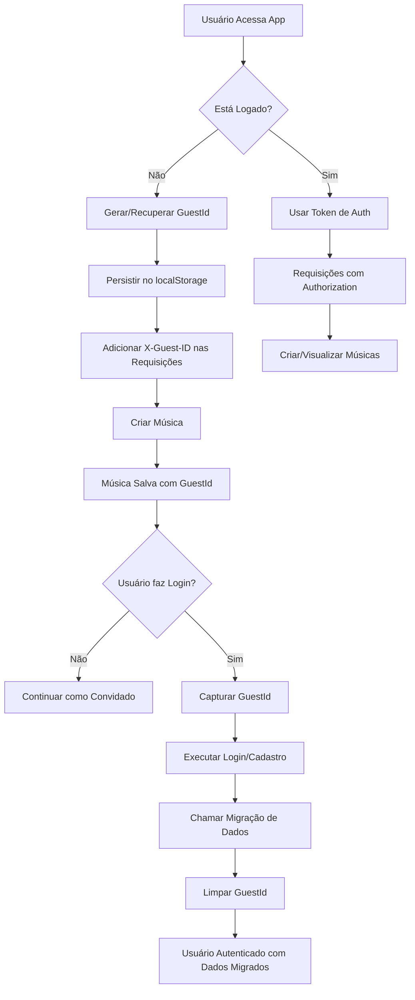
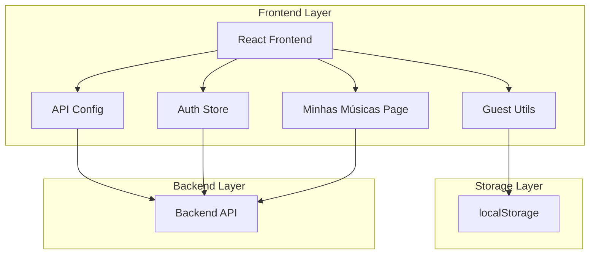
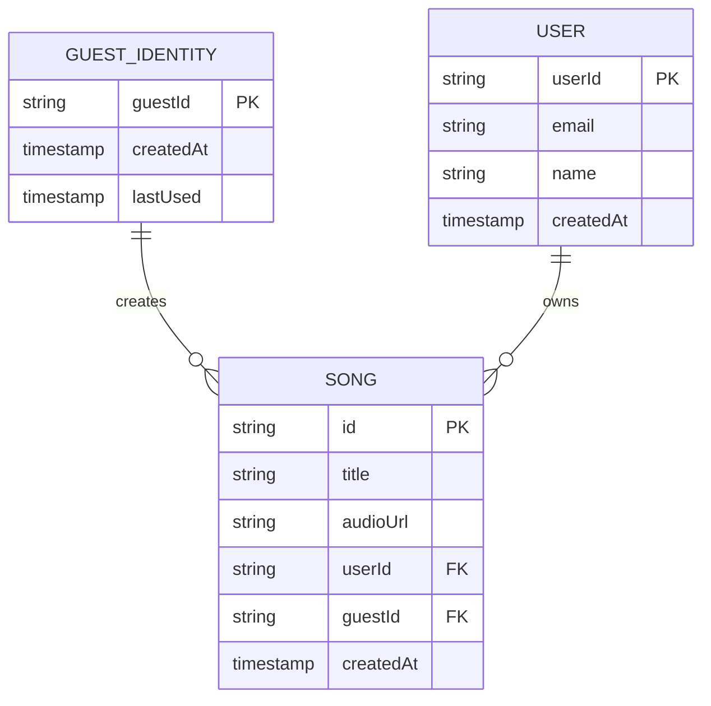

# Sistema de Gerenciamento de Identidade de Convidado - Front-end

## 1. Visão Geral do Produto

Sistema robusto de identidade para usuários convidados no front-end da plataforma Memora Music, permitindo geração automática de músicas para usuários não autenticados e migração transparente de dados após login/cadastro.

- Soluciona o problema de perda de dados para usuários que criam músicas antes de se registrar
- Utilizado por usuários anônimos e autenticados da plataforma
- Garante continuidade da experiência do usuário e preservação de dados

## 2. Funcionalidades Principais

### 2.1 Papéis de Usuário

| Papel | Método de Identificação | Permissões Principais |
|-------|------------------------|----------------------|
| Usuário Convidado | GuestId gerado automaticamente | Pode criar músicas, visualizar suas criações temporárias |
| Usuário Autenticado | Token de autenticação | Acesso completo, histórico permanente, migração de dados |

### 2.2 Módulos Funcionais

Nosso sistema de identidade de convidado consiste nas seguintes páginas principais:

1. **Utilitário de Identidade**: geração e persistência do guestId, validação de localStorage
2. **Interceptador de API**: integração automática do guestId em requisições, detecção de estado de autenticação
3. **Fluxo de Migração**: transferência de dados após autenticação, limpeza de identidade temporária
4. **Página Minhas Músicas**: visualização unificada para convidados e autenticados

### 2.3 Detalhes das Páginas

| Nome da Página | Nome do Módulo | Descrição da Funcionalidade |
|----------------|----------------|-----------------------------|
| Utilitário Guest | Geração de ID | Gerar UUID único, persistir no localStorage, recuperar ID existente |
| Interceptador API | Middleware de Requisição | Detectar estado de autenticação, adicionar guestId ao header X-Guest-ID, integrar com authStore |
| Store de Autenticação | Fluxo de Migração | Capturar guestId antes do login, chamar endpoint de migração, limpar dados temporários |
| Minhas Músicas | Lista de Músicas | Buscar músicas por userId ou guestId, renderizar lista unificada, suportar paginação |

## 3. Processo Principal

### Fluxo do Usuário Convidado
1. Usuário acessa a aplicação sem estar logado
2. Sistema gera automaticamente um guestId único
3. GuestId é persistido no localStorage
4. Todas as requisições de API incluem o guestId no header
5. Músicas criadas são associadas ao guestId no backend
6. Usuário pode visualizar suas músicas na página "Minhas Músicas"

### Fluxo de Migração após Autenticação
1. Usuário decide fazer login ou cadastro
2. Sistema captura o guestId existente antes da autenticação
3. Processo de login/cadastro é executado
4. Após sucesso, sistema chama endpoint de migração com guestId
5. Backend transfere dados do guestId para o userId
6. GuestId é removido do localStorage
7. Usuário agora vê todas as músicas (migradas + futuras) em sua conta



## 4. Design da Interface do Usuário

### 4.1 Estilo de Design
- **Cores**: Manter paleta existente da aplicação (primária e secundária)
- **Estilo de Botão**: Consistente com design system atual
- **Fonte**: Utilizar tipografia padrão da aplicação
- **Layout**: Integração transparente sem alterações visuais perceptíveis
- **Ícones**: Utilizar biblioteca de ícones existente

### 4.2 Visão Geral do Design das Páginas

| Nome da Página | Nome do Módulo | Elementos da UI |
|----------------|----------------|----------------|
| Utilitário Guest | Geração de ID | Funcionalidade invisível ao usuário, apenas logs de desenvolvimento |
| Interceptador API | Middleware | Transparente, sem interface visual |
| Fluxo de Migração | Processo de Login | Indicador de carregamento durante migração, mensagem de sucesso |
| Minhas Músicas | Lista de Músicas | Cards de música, botões de reprodução, indicadores de carregamento, paginação |

### 4.3 Responsividade
O sistema é mobile-first e desktop-adaptativo, com otimização para interação touch em dispositivos móveis.

## 5. Arquitetura Técnica

### 5.1 Diagrama de Arquitetura



### 5.2 Descrição da Tecnologia
- Frontend: React@18 + TypeScript + Vite
- Estado: Zustand (authStore existente)
- Utilitários: uuid para geração de IDs
- Storage: localStorage nativo do browser
- Backend: Express.js com endpoints existentes

### 5.3 Definições de Rotas

| Rota | Propósito |
|------|----------|
| /minhas-musicas | Página de listagem de músicas do usuário (convidado ou autenticado) |
| /criar | Página de criação de música (já existente, será integrada com guestId) |
| /login | Página de login (será integrada com fluxo de migração) |
| /cadastro | Página de cadastro (será integrada com fluxo de migração) |

### 5.4 Definições de API

#### 5.4.1 APIs Principais

**Geração de Música**
```
POST /api/generate-preview
```

Request Headers:
| Nome do Parâmetro | Tipo | Obrigatório | Descrição |
|-------------------|------|-------------|----------|
| Authorization | string | false | Token Bearer para usuários autenticados |
| X-Guest-ID | string | false | ID do convidado para usuários não autenticados |

**Migração de Dados**
```
POST /api/migrate-guest-data
```

Request:
| Nome do Parâmetro | Tipo | Obrigatório | Descrição |
|-------------------|------|-------------|----------|
| guestId | string | true | ID do convidado a ser migrado |

Response:
| Nome do Parâmetro | Tipo | Descrição |
|-------------------|------|----------|
| success | boolean | Status da migração |
| migratedCount | number | Número de músicas migradas |

**Listagem de Músicas**
```
GET /api/songs
```

Request Headers:
| Nome do Parâmetro | Tipo | Obrigatório | Descrição |
|-------------------|------|-------------|----------|
| Authorization | string | false | Token Bearer para usuários autenticados |
| X-Guest-ID | string | false | ID do convidado para usuários não autenticados |

Response:
```json
{
  "songs": [
    {
      "id": "uuid",
      "title": "Título da Música",
      "audioUrl": "https://suno-api.com/audio/...",
      "createdAt": "2024-01-01T00:00:00Z"
    }
  ],
  "total": 10,
  "page": 1
}
```

## 6. Modelo de Dados

### 6.1 Definição do Modelo de Dados



### 6.2 Estrutura do localStorage

```typescript
// Chave: 'memora-guest-id'
// Valor: string (UUID v4)
interface GuestStorage {
  'memora-guest-id': string;
}
```

### 6.3 Tipos TypeScript

```typescript
// Tipos para o sistema de identidade de convidado
interface GuestIdentity {
  guestId: string;
  createdAt: Date;
}

interface MigrationResult {
  success: boolean;
  migratedCount: number;
  error?: string;
}

interface Song {
  id: string;
  title: string;
  audioUrl: string;
  userId?: string;
  guestId?: string;
  createdAt: string;
}

interface SongsResponse {
  songs: Song[];
  total: number;
  page: number;
}
```

## 7. Critérios de Aceite

### 7.1 Geração e Persistência do GuestId
- [ ] GuestId é gerado automaticamente na primeira visita
- [ ] GuestId persiste entre sessões do browser
- [ ] GuestId é um UUID v4 válido
- [ ] Função getOrCreateGuestId() retorna sempre o mesmo ID para o mesmo browser
- [ ] Sistema funciona mesmo com localStorage desabilitado (fallback)

### 7.2 Integração com API
- [ ] Requisições para /api/generate-preview incluem X-Guest-ID quando usuário não está logado
- [ ] Requisições incluem Authorization header quando usuário está logado
- [ ] Sistema detecta corretamente o estado de autenticação
- [ ] Não há conflito entre guestId e userId nas requisições

### 7.3 Fluxo de Migração
- [ ] GuestId é capturado antes do processo de login/cadastro
- [ ] Migração é chamada automaticamente após login/cadastro bem-sucedido
- [ ] GuestId é removido do localStorage após migração
- [ ] Usuário vê todas as músicas (migradas + novas) após login
- [ ] Processo de migração não bloqueia a interface
- [ ] Erros de migração são tratados graciosamente

### 7.4 Página Minhas Músicas
- [ ] Página carrega músicas corretas para usuários convidados
- [ ] Página carrega músicas corretas para usuários autenticados
- [ ] Interface é consistente entre os dois tipos de usuário
- [ ] Paginação funciona corretamente
- [ ] Loading states são exibidos adequadamente
- [ ] Tratamento de erro quando não há músicas

### 7.5 Segurança e Performance
- [ ] GuestId não contém informações pessoais
- [ ] Sistema não vaza dados entre diferentes convidados
- [ ] Performance não é impactada pela verificação de identidade
- [ ] Não há memory leaks no gerenciamento do guestId

## 8. Plano de Implementação

### Fase 1: Utilitário de Identidade (1-2 dias)
- Criar `src/utils/guest.ts`
- Implementar `getOrCreateGuestId()`
- Adicionar tipos TypeScript
- Testes unitários

### Fase 2: Integração com API (1-2 dias)
- Modificar `src/config/api.ts`
- Integrar detecção de estado de autenticação
- Adicionar guestId aos headers
- Testes de integração

### Fase 3: Fluxo de Migração (2-3 dias)
- Modificar `src/store/authStore.ts`
- Implementar captura e migração de guestId
- Adicionar tratamento de erros
- Testes do fluxo completo

### Fase 4: Página Minhas Músicas (2-3 dias)
- Criar `src/pages/MinhasMusicas.tsx`
- Implementar listagem unificada
- Adicionar paginação e loading states
- Testes de interface

### Fase 5: Testes e Refinamentos (1-2 dias)
- Testes end-to-end
- Otimizações de performance
- Documentação final
- Deploy e monitoramento

## 9. Riscos e Mitigações

### Riscos Técnicos
- **localStorage indisponível**: Implementar fallback com sessionStorage ou cookies
- **Conflitos de ID**: Validar unicidade e implementar retry logic
- **Falha na migração**: Implementar retry automático e logs detalhados

### Riscos de UX
- **Perda de dados**: Implementar backup temporário durante migração
- **Confusão do usuário**: Adicionar indicadores visuais claros do estado
- **Performance**: Implementar cache e otimizações de requisição

## 10. Monitoramento e Métricas

### Métricas de Sucesso
- Taxa de conversão de convidado para usuário registrado
- Número de músicas criadas por convidados
- Taxa de sucesso da migração de dados
- Tempo de resposta das APIs com guestId

### Logs e Observabilidade
- Log de geração de novos guestIds
- Log de tentativas de migração
- Métricas de performance das requisições
- Alertas para falhas de migração