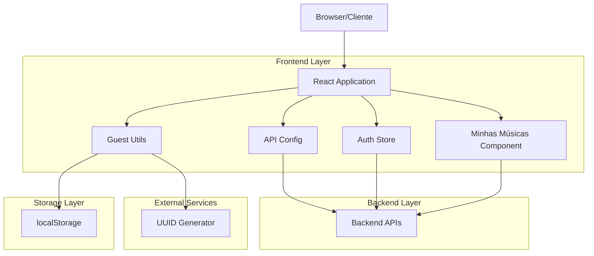
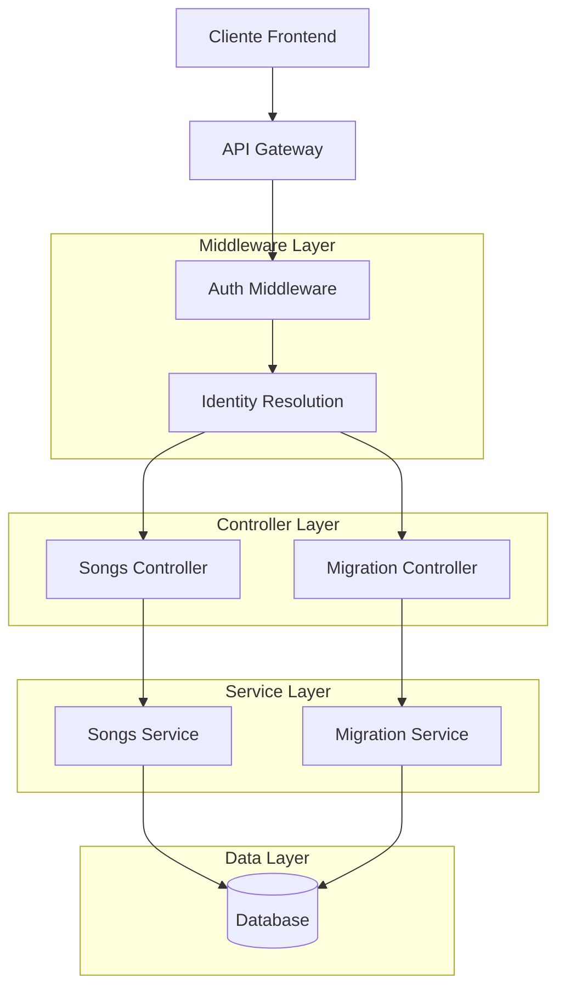
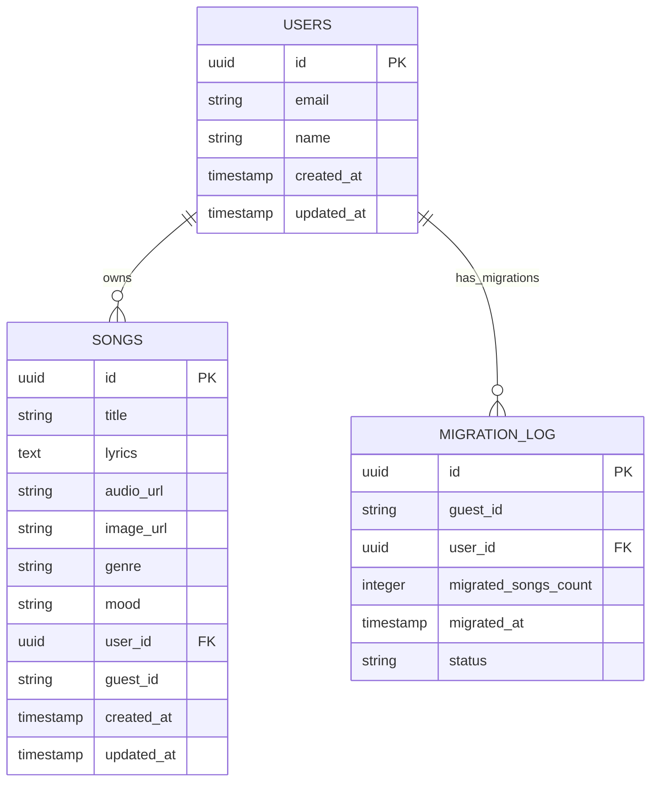

# Arquitetura Técnica - Sistema de Identidade de Convidado Front-end

## 1. Arquitetura de Design



## 2. Descrição da Tecnologia

- Frontend: React@18 + TypeScript + Vite + Zustand
- Utilitários: uuid@9 para geração de identificadores únicos
- Storage: localStorage nativo do navegador
- Estado: Zustand store existente (authStore)
- Requisições: fetch API nativa com interceptadores customizados

## 3. Definições de Rotas

| Rota | Propósito |
|------|----------|
| / | Página inicial (integrada com sistema de identidade) |
| /criar | Página de criação de música (modificada para suportar guestId) |
| /minhas-musicas | Nova página para listagem de músicas do usuário |
| /login | Página de login (modificada com fluxo de migração) |
| /cadastro | Página de cadastro (modificada com fluxo de migração) |

## 4. Definições de API

### 4.1 APIs Principais

**Interceptador de Requisições**
```typescript
// Modificação em src/config/api.ts
interface ApiRequestConfig {
  url: string;
  method: 'GET' | 'POST' | 'PUT' | 'DELETE';
  body?: any;
  headers?: Record<string, string>;
}

interface ApiResponse<T> {
  data: T;
  status: number;
  message?: string;
}
```

**Endpoint de Migração**
```
POST /api/migrate-guest-data
```

Request:
| Parâmetro | Tipo | Obrigatório | Descrição |
|-----------|------|-------------|----------|
| guestId | string | true | UUID do convidado a ser migrado |

Response:
| Parâmetro | Tipo | Descrição |
|-----------|------|----------|
| success | boolean | Status da operação de migração |
| migratedCount | number | Quantidade de registros migrados |
| message | string | Mensagem descritiva do resultado |

Exemplo de Response:
```json
{
  "success": true,
  "migratedCount": 3,
  "message": "Dados migrados com sucesso"
}
```

**Listagem de Músicas**
```
GET /api/songs
```

Request Headers:
| Parâmetro | Tipo | Obrigatório | Descrição |
|-----------|------|-------------|----------|
| Authorization | string | false | Bearer token para usuários autenticados |
| X-Guest-ID | string | false | UUID para usuários convidados |

Response:
| Parâmetro | Tipo | Descrição |
|-----------|------|----------|
| songs | Song[] | Array de músicas do usuário |
| total | number | Total de músicas disponíveis |
| page | number | Página atual (para paginação) |
| hasMore | boolean | Indica se há mais páginas |

## 5. Arquitetura do Servidor (Modificações Necessárias)



## 6. Modelo de Dados

### 6.1 Definição do Modelo de Dados



### 6.2 Linguagem de Definição de Dados

**Modificações na Tabela Songs (já existente)**
```sql
-- Adicionar índice para guest_id se não existir
CREATE INDEX IF NOT EXISTS idx_songs_guest_id ON songs(guest_id);
CREATE INDEX IF NOT EXISTS idx_songs_user_id ON songs(user_id);
CREATE INDEX IF NOT EXISTS idx_songs_created_at ON songs(created_at DESC);
```

**Nova Tabela Migration Log**
```sql
CREATE TABLE migration_log (
    id UUID PRIMARY KEY DEFAULT gen_random_uuid(),
    guest_id VARCHAR(255) NOT NULL,
    user_id UUID NOT NULL REFERENCES users(id),
    migrated_songs_count INTEGER DEFAULT 0,
    migrated_at TIMESTAMP WITH TIME ZONE DEFAULT NOW(),
    status VARCHAR(50) DEFAULT 'completed',
    created_at TIMESTAMP WITH TIME ZONE DEFAULT NOW()
);

-- Índices para performance
CREATE INDEX idx_migration_log_guest_id ON migration_log(guest_id);
CREATE INDEX idx_migration_log_user_id ON migration_log(user_id);
CREATE INDEX idx_migration_log_migrated_at ON migration_log(migrated_at DESC);

-- Dados iniciais (se necessário)
-- Nenhum dado inicial necessário
```

## 7. Implementação Detalhada

### 7.1 Estrutura de Arquivos

```
src/
├── utils/
│   ├── guest.ts                 # Novo: Utilitários de identidade de convidado
│   └── constants.ts             # Modificado: Adicionar constantes do sistema
├── config/
│   └── api.ts                   # Modificado: Interceptador de requisições
├── store/
│   └── authStore.ts             # Modificado: Fluxo de migração
├── pages/
│   ├── MinhasMusicas.tsx        # Novo: Página de listagem de músicas
│   ├── Criar.tsx               # Modificado: Integração com guestId
│   └── Index.tsx               # Modificado: Inicialização do guestId
├── components/
│   ├── SongCard.tsx            # Novo: Componente para exibir músicas
│   └── LoadingSpinner.tsx      # Existente: Reutilizado
├── hooks/
│   ├── useGuestIdentity.ts     # Novo: Hook para gerenciar identidade
│   └── useSongs.ts             # Novo: Hook para buscar músicas
└── types/
    └── guest.ts                # Novo: Tipos TypeScript
```

### 7.2 Componentes Principais

**Guest Utils (`src/utils/guest.ts`)**
```typescript
import { v4 as uuidv4 } from 'uuid';

const GUEST_ID_KEY = 'memora-guest-id';

export interface GuestIdentity {
  guestId: string;
  createdAt: string;
}

export function getOrCreateGuestId(): string {
  try {
    const existingId = localStorage.getItem(GUEST_ID_KEY);
    if (existingId) {
      return existingId;
    }
    
    const newGuestId = uuidv4();
    localStorage.setItem(GUEST_ID_KEY, newGuestId);
    return newGuestId;
  } catch (error) {
    // Fallback para quando localStorage não está disponível
    console.warn('localStorage não disponível, usando ID de sessão');
    return `session-${Date.now()}-${Math.random().toString(36).substr(2, 9)}`;
  }
}

export function clearGuestId(): void {
  try {
    localStorage.removeItem(GUEST_ID_KEY);
  } catch (error) {
    console.warn('Erro ao limpar guestId:', error);
  }
}

export function hasGuestId(): boolean {
  try {
    return localStorage.getItem(GUEST_ID_KEY) !== null;
  } catch (error) {
    return false;
  }
}
```

**API Config Modificado (`src/config/api.ts`)**
```typescript
import { getOrCreateGuestId } from '../utils/guest';
import { useAuthStore } from '../store/authStore';

interface ApiRequestOptions {
  method?: 'GET' | 'POST' | 'PUT' | 'DELETE';
  body?: any;
  headers?: Record<string, string>;
}

export async function apiRequest<T>(
  endpoint: string, 
  options: ApiRequestOptions = {}
): Promise<T> {
  const { method = 'GET', body, headers = {} } = options;
  const { token, isLoggedIn } = useAuthStore.getState();
  
  // Configurar headers de autenticação
  if (isLoggedIn && token) {
    headers['Authorization'] = `Bearer ${token}`;
  } else {
    // Adicionar guestId para usuários não autenticados
    const guestId = getOrCreateGuestId();
    headers['X-Guest-ID'] = guestId;
  }
  
  headers['Content-Type'] = 'application/json';
  
  const config: RequestInit = {
    method,
    headers,
    ...(body && { body: JSON.stringify(body) })
  };
  
  const response = await fetch(`/api${endpoint}`, config);
  
  if (!response.ok) {
    throw new Error(`API Error: ${response.status} ${response.statusText}`);
  }
  
  return response.json();
}
```

**Auth Store Modificado (`src/store/authStore.ts`)**
```typescript
import { create } from 'zustand';
import { apiRequest } from '../config/api';
import { clearGuestId, hasGuestId, getOrCreateGuestId } from '../utils/guest';

interface AuthState {
  // ... estados existentes
  login: (email: string, password: string) => Promise<void>;
  signup: (userData: SignupData) => Promise<void>;
  migrateGuestData: (guestId: string) => Promise<void>;
}

export const useAuthStore = create<AuthState>((set, get) => ({
  // ... estados existentes
  
  login: async (email: string, password: string) => {
    // Capturar guestId antes do login
    const guestId = hasGuestId() ? getOrCreateGuestId() : null;
    
    try {
      // Executar login
      const response = await apiRequest<LoginResponse>('/auth/login', {
        method: 'POST',
        body: { email, password }
      });
      
      // Atualizar estado de autenticação
      set({ 
        user: response.user, 
        token: response.token, 
        isLoggedIn: true 
      });
      
      // Migrar dados se havia guestId
      if (guestId) {
        await get().migrateGuestData(guestId);
      }
    } catch (error) {
      console.error('Erro no login:', error);
      throw error;
    }
  },
  
  signup: async (userData: SignupData) => {
    // Capturar guestId antes do cadastro
    const guestId = hasGuestId() ? getOrCreateGuestId() : null;
    
    try {
      // Executar cadastro
      const response = await apiRequest<SignupResponse>('/auth/signup', {
        method: 'POST',
        body: userData
      });
      
      // Atualizar estado de autenticação
      set({ 
        user: response.user, 
        token: response.token, 
        isLoggedIn: true 
      });
      
      // Migrar dados se havia guestId
      if (guestId) {
        await get().migrateGuestData(guestId);
      }
    } catch (error) {
      console.error('Erro no cadastro:', error);
      throw error;
    }
  },
  
  migrateGuestData: async (guestId: string) => {
    try {
      const result = await apiRequest<MigrationResult>('/migrate-guest-data', {
        method: 'POST',
        body: { guestId }
      });
      
      if (result.success) {
        // Limpar guestId após migração bem-sucedida
        clearGuestId();
        console.log(`Migração concluída: ${result.migratedCount} músicas migradas`);
      } else {
        console.error('Falha na migração:', result.message);
      }
    } catch (error) {
      console.error('Erro na migração de dados:', error);
      // Não bloquear o fluxo de login por falha na migração
    }
  }
}));
```

**Página Minhas Músicas (`src/pages/MinhasMusicas.tsx`)**
```typescript
import React, { useEffect, useState } from 'react';
import { apiRequest } from '../config/api';
import { SongCard } from '../components/SongCard';
import { LoadingSpinner } from '../components/LoadingSpinner';

interface Song {
  id: string;
  title: string;
  audioUrl: string;
  imageUrl?: string;
  createdAt: string;
}

interface SongsResponse {
  songs: Song[];
  total: number;
  page: number;
  hasMore: boolean;
}

export function MinhasMusicas() {
  const [songs, setSongs] = useState<Song[]>([]);
  const [loading, setLoading] = useState(true);
  const [error, setError] = useState<string | null>(null);
  const [page, setPage] = useState(1);
  const [hasMore, setHasMore] = useState(false);
  
  const fetchSongs = async (pageNum: number = 1) => {
    try {
      setLoading(true);
      const response = await apiRequest<SongsResponse>(
        `/songs?page=${pageNum}&limit=10`
      );
      
      if (pageNum === 1) {
        setSongs(response.songs);
      } else {
        setSongs(prev => [...prev, ...response.songs]);
      }
      
      setHasMore(response.hasMore);
      setPage(pageNum);
    } catch (err) {
      setError('Erro ao carregar músicas');
      console.error('Erro ao buscar músicas:', err);
    } finally {
      setLoading(false);
    }
  };
  
  useEffect(() => {
    fetchSongs();
  }, []);
  
  const loadMore = () => {
    if (hasMore && !loading) {
      fetchSongs(page + 1);
    }
  };
  
  if (loading && songs.length === 0) {
    return (
      <div className="flex justify-center items-center min-h-screen">
        <LoadingSpinner />
      </div>
    );
  }
  
  if (error) {
    return (
      <div className="container mx-auto px-4 py-8">
        <div className="text-center text-red-600">
          <p>{error}</p>
          <button 
            onClick={() => fetchSongs()} 
            className="mt-4 px-4 py-2 bg-blue-500 text-white rounded hover:bg-blue-600"
          >
            Tentar Novamente
          </button>
        </div>
      </div>
    );
  }
  
  return (
    <div className="container mx-auto px-4 py-8">
      <h1 className="text-3xl font-bold mb-8">Minhas Músicas</h1>
      
      {songs.length === 0 ? (
        <div className="text-center py-12">
          <p className="text-gray-600 mb-4">Você ainda não criou nenhuma música.</p>
          <a 
            href="/criar" 
            className="px-6 py-3 bg-blue-500 text-white rounded-lg hover:bg-blue-600 transition-colors"
          >
            Criar Primeira Música
          </a>
        </div>
      ) : (
        <>
          <div className="grid grid-cols-1 md:grid-cols-2 lg:grid-cols-3 gap-6">
            {songs.map(song => (
              <SongCard key={song.id} song={song} />
            ))}
          </div>
          
          {hasMore && (
            <div className="text-center mt-8">
              <button
                onClick={loadMore}
                disabled={loading}
                className="px-6 py-3 bg-gray-500 text-white rounded-lg hover:bg-gray-600 disabled:opacity-50 transition-colors"
              >
                {loading ? 'Carregando...' : 'Carregar Mais'}
              </button>
            </div>
          )}
        </>
      )}
    </div>
  );
}
```

## 8. Testes e Validação

### 8.1 Testes Unitários
```typescript
// src/utils/__tests__/guest.test.ts
import { getOrCreateGuestId, clearGuestId, hasGuestId } from '../guest';

describe('Guest Identity Utils', () => {
  beforeEach(() => {
    localStorage.clear();
  });
  
  test('should generate new guestId when none exists', () => {
    const guestId = getOrCreateGuestId();
    expect(guestId).toBeDefined();
    expect(typeof guestId).toBe('string');
    expect(guestId.length).toBeGreaterThan(0);
  });
  
  test('should return same guestId on subsequent calls', () => {
    const firstCall = getOrCreateGuestId();
    const secondCall = getOrCreateGuestId();
    expect(firstCall).toBe(secondCall);
  });
  
  test('should clear guestId correctly', () => {
    getOrCreateGuestId();
    expect(hasGuestId()).toBe(true);
    
    clearGuestId();
    expect(hasGuestId()).toBe(false);
  });
});
```

### 8.2 Testes de Integração
```typescript
// src/store/__tests__/authStore.test.ts
import { useAuthStore } from '../authStore';
import { getOrCreateGuestId, clearGuestId } from '../../utils/guest';

describe('Auth Store Migration Flow', () => {
  test('should migrate guest data on successful login', async () => {
    // Setup: criar guestId
    const guestId = getOrCreateGuestId();
    
    // Mock API responses
    global.fetch = jest.fn()
      .mockResolvedValueOnce({
        ok: true,
        json: () => Promise.resolve({
          user: { id: '123', email: 'test@example.com' },
          token: 'mock-token'
        })
      })
      .mockResolvedValueOnce({
        ok: true,
        json: () => Promise.resolve({
          success: true,
          migratedCount: 2
        })
      });
    
    // Execute login
    await useAuthStore.getState().login('test@example.com', 'password');
    
    // Verify migration was called and guestId was cleared
    expect(fetch).toHaveBeenCalledTimes(2);
    expect(localStorage.getItem('memora-guest-id')).toBeNull();
  });
});
```

## 9. Considerações de Performance

### 9.1 Otimizações
- **Lazy Loading**: Componentes carregados sob demanda
- **Memoização**: React.memo para componentes de música
- **Paginação**: Carregamento incremental de músicas
- **Cache**: localStorage para dados temporários

### 9.2 Métricas de Performance
- Tempo de geração do guestId: < 10ms
- Tempo de resposta da API com guestId: < 500ms
- Tempo de migração de dados: < 2s para até 100 músicas
- Tamanho do bundle adicional: < 5KB

## 10. Segurança

### 10.1 Considerações de Segurança
- GuestId não contém informações pessoais
- Validação de UUID no backend
- Rate limiting para endpoints de migração
- Sanitização de dados de entrada

### 10.2 Políticas de Retenção
- GuestId removido após migração bem-sucedida
- Dados de convidado mantidos por 30 dias após inatividade
- Logs de migração mantidos por auditoria

## 11. Monitoramento

### 11.1 Métricas Técnicas
- Taxa de sucesso da migração de dados
- Número de guestIds gerados por dia
- Tempo médio de migração
- Erros de API relacionados a identidade

### 11.2 Alertas
- Falha na migração > 5% em 1 hora
- Tempo de resposta da API > 1s
- Erro na geração de guestId
- localStorage indisponível em > 1% dos usuários