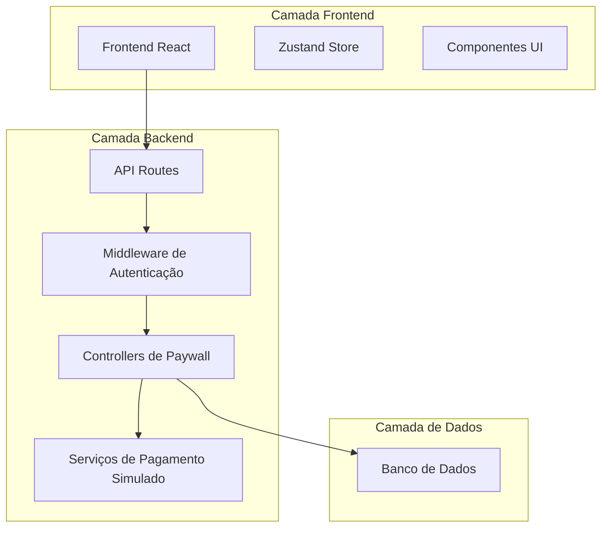
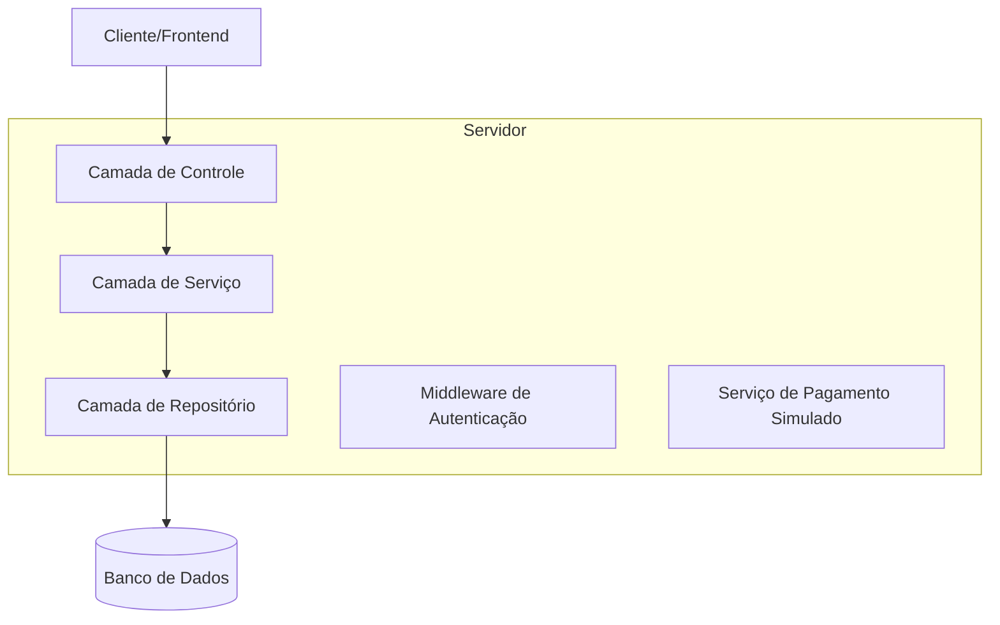
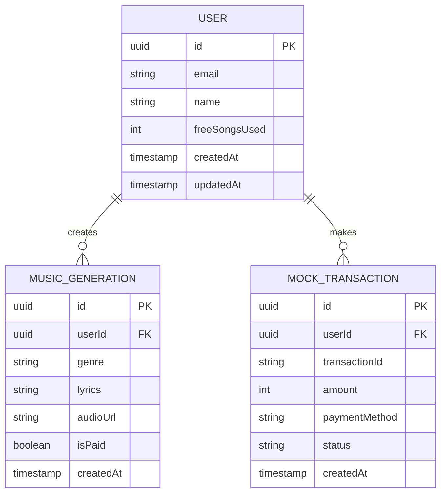

# Arquitetura Técnica - Sistema de Paywall com Gateway Simulado

## 1. Design da Arquitetura



## 2. Descrição das Tecnologias

- Frontend: React@18 + TypeScript + Zustand + Tailwind CSS
- Backend: Node.js + Express + Prisma ORM
- Banco de Dados: PostgreSQL
- Autenticação: Sistema existente (Supabase/NextAuth)

## 3. Definições de Rotas

| Rota | Propósito |
|------|----------|
| /criar | Página de criação com sistema de aviso de custo |
| /resultados | Página de resultados com botão "Criar outra música" |
| /api/user/creation-status | Endpoint para verificar status de criação do usuário |
| /api/confirm-mock-payment | Endpoint para confirmar pagamento simulado |
| /api/generate-music | Endpoint protegido para geração de música |

## 4. Definições de API

### 4.1 APIs Principais

**Verificação de Status de Criação**
```
GET /api/user/creation-status
```

Request: Requer autenticação (token no header)

Response:
| Nome do Parâmetro | Tipo | Descrição |
|-------------------|------|----------|
| isFree | boolean | Se a próxima criação é gratuita |
| freeSongsUsed | number | Quantidade de músicas gratuitas já utilizadas |
| message | string | Mensagem explicativa |

Exemplo:
```json
{
  "isFree": false,
  "freeSongsUsed": 1,
  "message": "Próxima música será paga"
}
```

**Confirmação de Pagamento Simulado**
```
POST /api/confirm-mock-payment
```

Request:
| Nome do Parâmetro | Tipo | Obrigatório | Descrição |
|-------------------|------|-------------|----------|
| amount | number | true | Valor do pagamento em centavos |
| paymentMethod | string | true | Método de pagamento simulado |

Response:
| Nome do Parâmetro | Tipo | Descrição |
|-------------------|------|----------|
| success | boolean | Status da confirmação |
| transactionId | string | ID da transação simulada |
| message | string | Mensagem de confirmação |

Exemplo:
```json
{
  "success": true,
  "transactionId": "mock_txn_123456",
  "message": "Pagamento simulado confirmado"
}
```

**Geração de Música (Protegida)**
```
POST /api/generate-music
```

Request: Dados existentes + verificação de pagamento

Response: Dados existentes ou erro 402 Payment Required

## 5. Arquitetura do Servidor



## 6. Modelo de Dados

### 6.1 Definição do Modelo de Dados



### 6.2 Linguagem de Definição de Dados

**Atualização da Tabela de Usuários**
```sql
-- Adicionar campo freeSongsUsed à tabela existente
ALTER TABLE user_creations ADD COLUMN freeSongsUsed INTEGER DEFAULT 0;

-- Criar índice para otimizar consultas
CREATE INDEX idx_user_creations_free_songs_used ON user_creations(freeSongsUsed);
```

**Tabela de Transações Simuladas**
```sql
-- Criar tabela para transações simuladas
CREATE TABLE mock_transactions (
    id UUID PRIMARY KEY DEFAULT gen_random_uuid(),
    userId UUID NOT NULL REFERENCES users(id) ON DELETE CASCADE,
    transactionId VARCHAR(255) UNIQUE NOT NULL,
    amount INTEGER NOT NULL,
    paymentMethod VARCHAR(50) NOT NULL DEFAULT 'mock_card',
    status VARCHAR(20) NOT NULL DEFAULT 'completed',
    createdAt TIMESTAMP WITH TIME ZONE DEFAULT NOW(),
    updatedAt TIMESTAMP WITH TIME ZONE DEFAULT NOW()
);

-- Criar índices
CREATE INDEX idx_mock_transactions_user_id ON mock_transactions(userId);
CREATE INDEX idx_mock_transactions_created_at ON mock_transactions(createdAt DESC);

-- Dados iniciais (opcional para testes)
INSERT INTO mock_transactions (userId, transactionId, amount, paymentMethod, status)
VALUES 
('example-user-id', 'mock_txn_example', 1500, 'mock_card', 'completed');
```

**Atualização da Tabela de Gerações de Música**
```sql
-- Adicionar campo isPaid à tabela existente
ALTER TABLE music_generations ADD COLUMN isPaid BOOLEAN DEFAULT FALSE;

-- Criar índice para consultas de músicas pagas
CREATE INDEX idx_music_generations_is_paid ON music_generations(isPaid);
```

## 7. Implementação Frontend

### 7.1 Store Zustand para Paywall

```typescript
interface PaywallState {
  isNextSongFree: boolean | null;
  freeSongsUsed: number;
  isPaymentModalOpen: boolean;
  isProcessingPayment: boolean;
  setCreationStatus: (isFree: boolean, used: number) => void;
  openPaymentModal: () => void;
  closePaymentModal: () => void;
  setProcessingPayment: (processing: boolean) => void;
}
```

### 7.2 Componentes Principais

- `PaymentStatusToast.tsx` - Toast de aviso sobre custo
- `MockPaymentPopup.tsx` - Modal de pagamento simulado
- `CreateAnotherButton.tsx` - Botão com verificação de status

### 7.3 Fluxo de Segurança

1. **Verificação no Frontend**: Apenas para UX, não para segurança
2. **Autoridade no Backend**: Todas as validações críticas no servidor
3. **Proteção de Endpoints**: Middleware de autenticação + validação de pagamento
4. **Auditoria**: Log de todas as tentativas de geração e pagamentos

### 7.4 Tratamento de Erros

- **402 Payment Required**: Redirecionar para fluxo de pagamento
- **401 Unauthorized**: Redirecionar para login
- **500 Server Error**: Exibir mensagem de erro genérica
- **Network Error**: Permitir retry da operação
