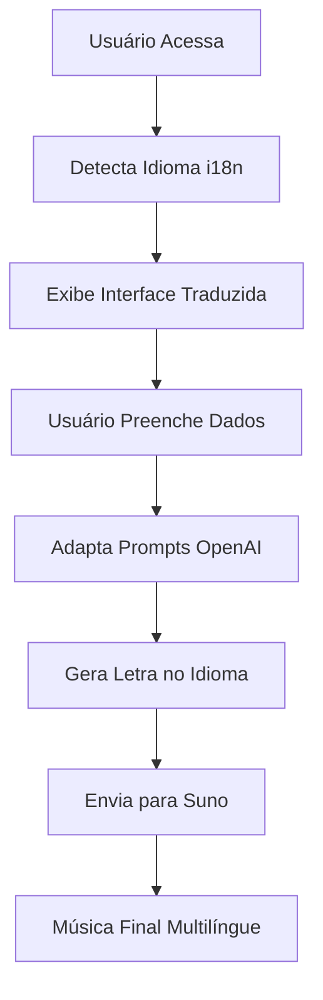
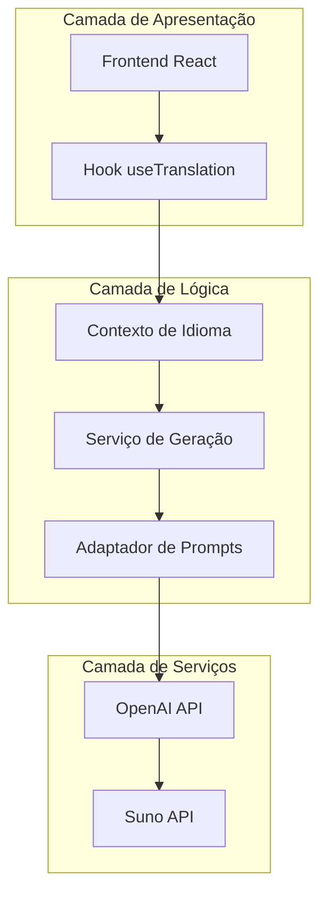
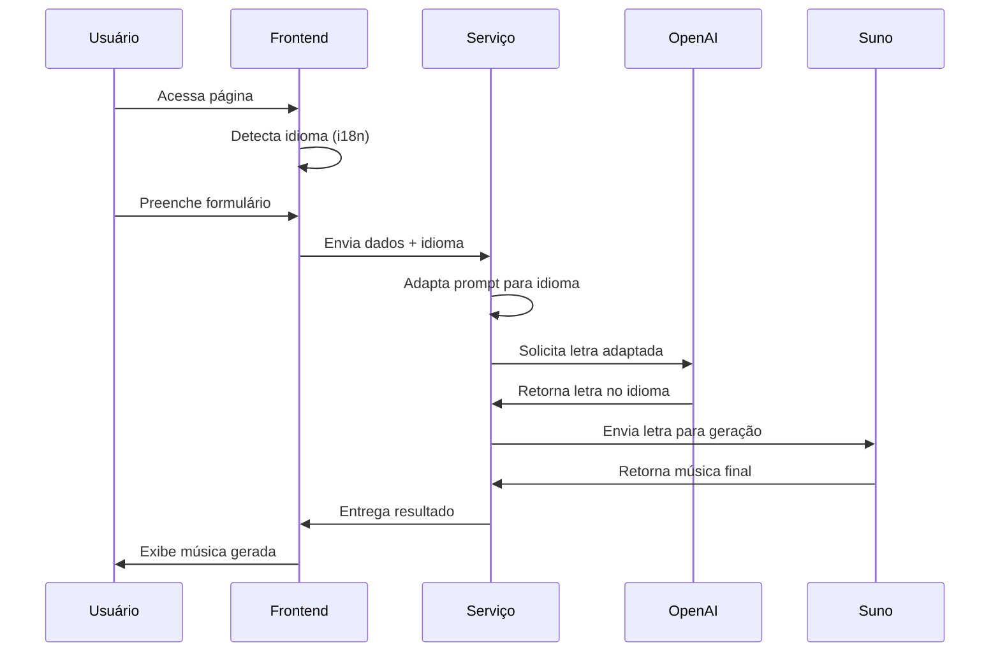
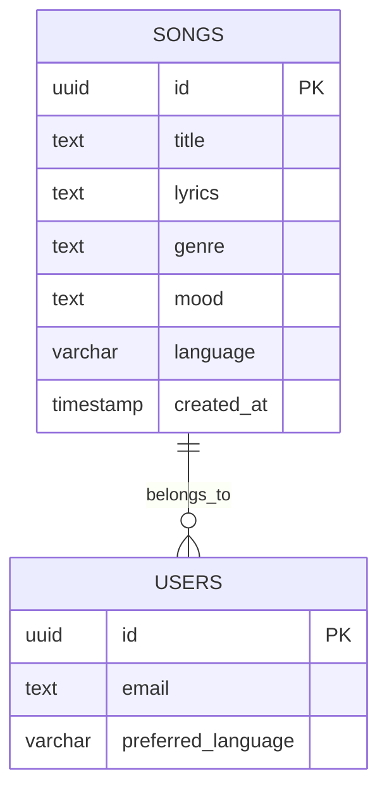

# Plano de Internacionalização Musical - Memora Music

## 1. Visão Geral do Projeto

Implementação simplificada de internacionalização para geração de músicas em múltiplos idiomas, aproveitando o sistema i18n existente e modificando apenas os prompts do OpenAI, mantendo toda a arquitetura atual.

## 2. Funcionalidades Principais

### 2.1 Detecção Automática de Idioma
- **Fonte**: Sistema i18n existente baseado no idioma do navegador
- **Idiomas suportados**: Português (pt-BR) e Inglês (en-US) inicialmente
- **Expansibilidade**: Arquitetura preparada para novos idiomas

### 2.2 Geração Multilíngue
- **Prompts OpenAI**: Adaptados dinamicamente conforme idioma detectado
- **Processamento Suno**: Recebe letras no idioma correto automaticamente
- **Qualidade**: Mantém a mesma qualidade em todos os idiomas

### 2.3 Fluxo Unificado
- **Interface**: Usa traduções existentes do sistema i18n
- **Backend**: Reutiliza toda a infraestrutura atual
- **APIs**: Nenhuma modificação nas rotas existentes

## 3. Detalhamento das Páginas

| Página | Módulo | Descrição da Funcionalidade |
|--------|--------|-----------------------------|
| Criar Música | Detector de Idioma | Captura idioma do contexto i18n atual |
| Criar Música | Gerador de Prompts | Adapta prompts OpenAI conforme idioma detectado |
| Criar Música | Processador de Letras | Envia letras no idioma correto para Suno |
| Criar Música | Validador de Qualidade | Verifica consistência linguística das letras |

## 4. Fluxo Principal

### Fluxo de Geração Multilíngue
1. **Usuário acessa página** → Sistema detecta idioma via i18n
2. **Usuário preenche formulário** → Interface exibida no idioma detectado
3. **Sistema processa dados** → Prompts adaptados para idioma específico
4. **OpenAI gera letra** → Conteúdo criado no idioma correto
5. **Suno processa música** → Recebe letra no idioma apropriado
6. **Resultado final** → Música gerada no idioma do usuário



## 5. Design da Interface

### 5.1 Estilo Visual
- **Cores**: Mantém paleta atual (primária e secundária)
- **Botões**: Estilo existente com textos traduzidos
- **Fontes**: Fontes atuais com suporte a caracteres especiais
- **Layout**: Layout atual sem modificações
- **Ícones**: Ícones universais, textos traduzidos

### 5.2 Elementos por Página

| Página | Módulo | Elementos da Interface |
|--------|--------|------------------------|
| Criar Música | Seletor de Gênero | Mantém interface atual, textos via i18n |
| Criar Música | Formulário Principal | Campos traduzidos, placeholders localizados |
| Criar Música | Botões de Ação | Textos "Gerar Música" traduzidos |
| Criar Música | Feedback Visual | Mensagens de status localizadas |

### 5.3 Responsividade
- **Abordagem**: Mantém responsividade atual
- **Dispositivos**: Desktop e mobile sem alterações
- **Interação**: Touch e teclado funcionam normalmente

## 6. Implementação Técnica

### 6.1 Arquitetura Simplificada



### 6.2 Stack Tecnológica
- **Frontend**: React + i18next (existente)
- **Backend**: Node.js + Express (existente)
- **Adaptação**: Apenas modificação de prompts
- **Banco**: Supabase (sem alterações)

### 6.3 Rotas da Aplicação

| Rota | Propósito |
|------|----------|
| /criar | Página de criação com detecção automática de idioma |
| /api/songs/generate | API existente com suporte a parâmetro de idioma |
| /api/songs/lyrics | Endpoint para geração de letras multilíngues |

## 7. APIs e Integrações

### 7.1 Modificações Mínimas

**Serviço de Geração de Letras**
```typescript
interface GenerateLyricsRequest {
  prompt: string;
  genre: string;
  mood: string;
  language: 'pt-BR' | 'en-US'; // Novo parâmetro
}
```

**Adaptador de Prompts**
```typescript
class PromptAdapter {
  adaptForLanguage(prompt: string, language: string): string {
    const templates = {
      'pt-BR': 'Crie uma letra de música em português sobre: {prompt}',
      'en-US': 'Create song lyrics in English about: {prompt}'
    };
    return templates[language].replace('{prompt}', prompt);
  }
}
```

### 7.2 Fluxo de Dados



## 8. Modelo de Dados

### 8.1 Extensões Mínimas

```sql
-- Adicionar coluna de idioma à tabela songs (opcional)
ALTER TABLE songs ADD COLUMN language VARCHAR(10) DEFAULT 'pt-BR';

-- Índice para consultas por idioma
CREATE INDEX idx_songs_language ON songs(language);
```

### 8.2 Estrutura de Dados



## 9. Plano de Implementação

### Fase 1: Preparação (1 semana)
- ✅ Análise do sistema i18n existente
- ✅ Identificação dos pontos de modificação
- ✅ Criação de testes de viabilidade
- ✅ Definição de templates de prompts

### Fase 2: Implementação Core (2 semanas)
- 🔄 Criação do adaptador de prompts
- 🔄 Modificação do serviço de geração
- 🔄 Integração com contexto i18n
- 🔄 Testes unitários dos componentes

### Fase 3: Integração (1 semana)
- ⏳ Integração frontend-backend
- ⏳ Testes de fluxo completo
- ⏳ Validação de qualidade por idioma
- ⏳ Ajustes de performance

### Fase 4: Validação (1 semana)
- ⏳ Testes com usuários reais
- ⏳ Monitoramento de qualidade
- ⏳ Correções finais
- ⏳ Deploy em produção

## 10. Testes e Validação

### 10.1 Estratégia de Testes
- **Unitários**: Adaptador de prompts e detecção de idioma
- **Integração**: Fluxo completo OpenAI → Suno
- **E2E**: Geração de músicas em ambos os idiomas
- **Qualidade**: Validação manual das letras geradas

### 10.2 Critérios de Aceitação
- ✅ Detecção automática do idioma funciona
- ✅ Letras geradas estão no idioma correto
- ✅ Qualidade musical mantida em ambos idiomas
- ✅ Interface traduzida corretamente
- ✅ Performance não degradada

### 10.3 Métricas de Sucesso
- **Precisão de idioma**: 100% das letras no idioma correto
- **Qualidade musical**: Mantém score atual (>4.0/5.0)
- **Performance**: Tempo de geração <30s
- **Satisfação**: >90% aprovação dos usuários

## 11. Riscos e Mitigações

### 11.1 Riscos Técnicos
- **Qualidade das letras**: Testes extensivos por idioma
- **Performance OpenAI**: Cache de prompts frequentes
- **Detecção de idioma**: Fallback para português

### 11.2 Riscos de Negócio
- **Aceitação dos usuários**: Testes A/B graduais
- **Custos OpenAI**: Monitoramento de uso por idioma
- **Manutenção**: Documentação completa dos prompts

## 12. Próximos Passos

### 12.1 Expansão Futura
- **Novos idiomas**: Espanhol, Francês, Alemão
- **Personalização**: Dialetos e variações regionais
- **IA avançada**: Modelos especializados por idioma

### 12.2 Melhorias Incrementais
- **Cache inteligente**: Otimização de prompts similares
- **Feedback de qualidade**: Sistema de avaliação por idioma
- **Analytics**: Métricas de uso por idioma e região

---

**Conclusão**: Este plano simplificado aproveita toda a infraestrutura existente, requer modificações mínimas e garante a internacionalização eficiente da geração musical na Memora Music, mantendo a qualidade e expandindo o alcance global da plataforma.