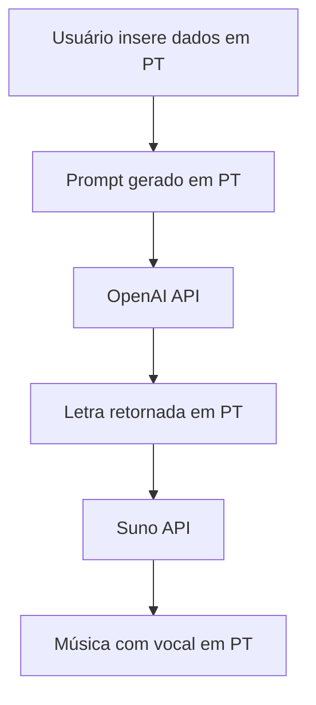
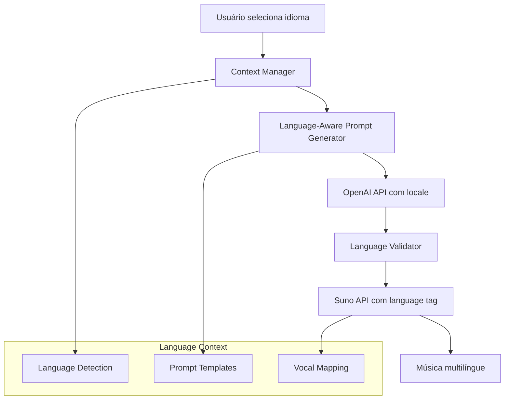

# Plano de Internacionalização do Fluxo de Geração de Música - Memora Music

## 1. Análise do Fluxo Atual

### 1.1 Arquitetura Existente
O fluxo atual da plataforma Memora Music opera exclusivamente em português:



### 1.2 Componentes Afetados
- **Frontend**: Interface de usuário com i18n já implementado
- **Backend**: Serviços de geração de prompt e integração com APIs
- **OpenAI Integration**: Prompts e respostas em português
- **Suno Integration**: Processamento de letras em português
- **Database**: Armazenamento de músicas e metadados

### 1.3 Limitações Identificadas
- Prompts hardcoded em português
- Ausência de detecção/especificação de idioma nas APIs
- Falta de mapeamento de idiomas para vocais
- Metadados de música sem informação de idioma

## 2. Arquitetura Proposta para Suporte Multilíngue

### 2.1 Visão Geral da Nova Arquitetura



### 2.2 Componentes da Nova Arquitetura

#### 2.2.1 Language Context Manager
```typescript
interface LanguageContext {
  locale: string; // 'pt-BR', 'en-US', 'es-ES'
  displayName: string;
  openaiPromptSuffix: string;
  sunoLanguageTag: string;
  vocalStyle: string;
}
```

#### 2.2.2 Multilingual Prompt Generator
```typescript
class MultilingualPromptGenerator {
  generatePrompt(briefing: Briefing, context: LanguageContext): string {
    const basePrompt = this.getLocalizedTemplate(context.locale);
    return `${basePrompt} ${context.openaiPromptSuffix}`;
  }
}
```

#### 2.2.3 Language-Aware Music Service
```typescript
class MusicGenerationService {
  async generateMusic(lyrics: string, context: LanguageContext) {
    const sunoPayload = {
      lyrics,
      language: context.sunoLanguageTag,
      vocal_style: context.vocalStyle
    };
    return await this.sunoClient.generate(sunoPayload);
  }
}
```

## 3. Modificações Necessárias nas Integrações de API

### 3.1 OpenAI API - Adaptações

#### 3.1.1 Prompt Templates Localizados
```typescript
const PROMPT_TEMPLATES = {
  'pt-BR': {
    base: "Crie uma letra de música em português brasileiro sobre...",
    suffix: "A letra deve ser em português brasileiro, com rimas naturais e vocabulário brasileiro."
  },
  'en-US': {
    base: "Create song lyrics in English about...",
    suffix: "The lyrics should be in English, with natural rhymes and American vocabulary."
  },
  'es-ES': {
    base: "Crea una letra de canción en español sobre...",
    suffix: "La letra debe estar en español, con rimas naturales y vocabulario español."
  }
};
```

#### 3.1.2 Response Validation
```typescript
class LyricsValidator {
  validateLanguage(lyrics: string, expectedLocale: string): boolean {
    // Implementar detecção de idioma usando bibliotecas como franc ou langdetect
    const detectedLanguage = this.detectLanguage(lyrics);
    return this.isCompatibleLanguage(detectedLanguage, expectedLocale);
  }
}
```

### 3.2 Suno API - Adaptações

#### 3.2.1 Language Tags Mapping
```typescript
const SUNO_LANGUAGE_MAPPING = {
  'pt-BR': 'portuguese',
  'en-US': 'english',
  'es-ES': 'spanish',
  'fr-FR': 'french',
  'it-IT': 'italian'
};
```

#### 3.2.2 Vocal Style Configuration
```typescript
const VOCAL_STYLES_BY_LANGUAGE = {
  'pt-BR': ['brazilian-male', 'brazilian-female', 'sertanejo', 'bossa-nova'],
  'en-US': ['american-male', 'american-female', 'country', 'pop'],
  'es-ES': ['spanish-male', 'spanish-female', 'flamenco', 'latin-pop']
};
```

## 4. Estratégia de Implementação por Fases

### 4.1 Fase 1: Infraestrutura Base (2-3 semanas)

#### Objetivos
- Implementar Language Context Manager
- Criar sistema de templates de prompt
- Estabelecer mapeamentos de idioma

#### Tarefas Técnicas
1. **Backend Infrastructure**
   ```typescript
   // src/services/language/LanguageContextManager.ts
   export class LanguageContextManager {
     getContext(locale: string): LanguageContext;
     getSupportedLanguages(): LanguageContext[];
   }
   ```

2. **Database Schema Updates**
   ```sql
   ALTER TABLE songs ADD COLUMN language VARCHAR(10) DEFAULT 'pt-BR';
   ALTER TABLE songs ADD COLUMN vocal_style VARCHAR(50);
   
   CREATE TABLE language_contexts (
     locale VARCHAR(10) PRIMARY KEY,
     display_name VARCHAR(100),
     openai_prompt_suffix TEXT,
     suno_language_tag VARCHAR(50),
     default_vocal_style VARCHAR(50)
   );
   ```

3. **Frontend Language Detection**
   ```typescript
   // src/hooks/useLanguageContext.ts
   export const useLanguageContext = () => {
     const { i18n } = useTranslation();
     return useMemo(() => 
       getLanguageContext(i18n.language), [i18n.language]
     );
   };
   ```

### 4.2 Fase 2: Integração OpenAI Multilíngue (2 semanas)

#### Objetivos
- Adaptar geração de prompts para múltiplos idiomas
- Implementar validação de idioma nas respostas
- Testes com português e inglês

#### Tarefas Técnicas
1. **Prompt Generation Service**
   ```typescript
   // src/services/ai/MultilingualPromptService.ts
   export class MultilingualPromptService {
     async generateLyrics(briefing: Briefing, context: LanguageContext) {
       const prompt = this.buildLocalizedPrompt(briefing, context);
       const response = await this.openaiClient.complete(prompt);
       
       if (!this.validator.validateLanguage(response, context.locale)) {
         throw new LanguageMismatchError();
       }
       
       return response;
     }
   }
   ```

2. **Language Detection Integration**
   ```bash
   npm install franc langdetect
   ```

### 4.3 Fase 3: Integração Suno Multilíngue (2 semanas)

#### Objetivos
- Adaptar chamadas para Suno API com tags de idioma
- Implementar seleção de estilos vocais por idioma
- Testes de qualidade vocal

#### Tarefas Técnicas
1. **Suno Service Enhancement**
   ```typescript
   // src/services/music/MultilingualSunoService.ts
   export class MultilingualSunoService {
     async generateMusic(lyrics: string, genre: string, context: LanguageContext) {
       const payload = {
         lyrics,
         genre,
         language: SUNO_LANGUAGE_MAPPING[context.locale],
         vocal_style: this.selectVocalStyle(genre, context)
       };
       
       return await this.sunoClient.generate(payload);
     }
   }
   ```

### 4.4 Fase 4: Testes e Otimização (1-2 semanas)

#### Objetivos
- Testes end-to-end com múltiplos idiomas
- Otimização de qualidade das gerações
- Ajustes de UX

## 5. Considerações Técnicas para Expansão Futura

### 5.1 Arquitetura Escalável

#### 5.1.1 Plugin System para Idiomas
```typescript
interface LanguagePlugin {
  locale: string;
  promptTemplates: PromptTemplateSet;
  vocalStyles: VocalStyleSet;
  culturalAdaptations: CulturalAdaptationSet;
}

class LanguagePluginManager {
  registerLanguage(plugin: LanguagePlugin): void;
  getAvailableLanguages(): string[];
}
```

#### 5.1.2 Configuration-Driven Approach
```yaml
# config/languages/pt-BR.yml
locale: pt-BR
displayName: "Português (Brasil)"
openai:
  promptSuffix: "A letra deve ser em português brasileiro"
  culturalContext: "brasileiro"
suno:
  languageTag: "portuguese"
  defaultVocalStyles:
    - "brazilian-male"
    - "brazilian-female"
genres:
  sertanejo:
    vocalStyle: "sertanejo"
    culturalNotes: "Estilo tipicamente brasileiro"
```

### 5.2 Qualidade e Consistência

#### 5.2.1 Quality Assurance Pipeline
```typescript
class MusicQualityAssurance {
  async validateGeneration(music: GeneratedMusic, context: LanguageContext) {
    const checks = [
      this.validateLanguageConsistency(music.lyrics, context.locale),
      this.validateVocalQuality(music.audio, context.vocalStyle),
      this.validateCulturalAppropriatenss(music, context)
    ];
    
    return Promise.all(checks);
  }
}
```

#### 5.2.2 Feedback Loop System
```typescript
interface LanguageFeedback {
  musicId: string;
  locale: string;
  qualityScore: number;
  issues: QualityIssue[];
  suggestions: string[];
}
```

### 5.3 Performance Considerations

#### 5.3.1 Caching Strategy
```typescript
class MultilingualCacheManager {
  private cacheKey(briefing: Briefing, context: LanguageContext): string {
    return `${briefing.hash}-${context.locale}`;
  }
  
  async getCachedLyrics(briefing: Briefing, context: LanguageContext) {
    return this.cache.get(this.cacheKey(briefing, context));
  }
}
```

#### 5.3.2 Parallel Processing
```typescript
class ParallelMusicGeneration {
  async generateMultipleLanguages(briefing: Briefing, locales: string[]) {
    const contexts = locales.map(locale => this.getContext(locale));
    
    return Promise.allSettled(
      contexts.map(context => this.generateMusic(briefing, context))
    );
  }
}
```

## 6. Plano de Testes e Validação

### 6.1 Testes Unitários

#### 6.1.1 Language Context Manager
```typescript
describe('LanguageContextManager', () => {
  it('should return correct context for supported languages', () => {
    const context = manager.getContext('pt-BR');
    expect(context.locale).toBe('pt-BR');
    expect(context.sunoLanguageTag).toBe('portuguese');
  });
  
  it('should throw error for unsupported languages', () => {
    expect(() => manager.getContext('zh-CN')).toThrow();
  });
});
```

#### 6.1.2 Prompt Generation
```typescript
describe('MultilingualPromptService', () => {
  it('should generate Portuguese prompts correctly', async () => {
    const briefing = createTestBriefing();
    const context = getPortugueseContext();
    
    const prompt = service.buildPrompt(briefing, context);
    expect(prompt).toContain('português brasileiro');
  });
});
```

### 6.2 Testes de Integração

#### 6.2.1 End-to-End Language Flow
```typescript
describe('Multilingual Music Generation', () => {
  it('should generate English music when English is selected', async () => {
    const briefing = createEnglishBriefing();
    const result = await musicService.generateMusic(briefing, 'en-US');
    
    expect(result.language).toBe('en-US');
    expect(await detectLanguage(result.lyrics)).toBe('english');
  });
});
```

### 6.3 Testes de Qualidade

#### 6.3.1 Language Detection Accuracy
```typescript
const QUALITY_BENCHMARKS = {
  languageDetectionAccuracy: 0.95,
  vocalQualityScore: 0.85,
  culturalAppropriatenessScore: 0.90
};
```

#### 6.3.2 User Acceptance Testing
- Testes com usuários nativos de cada idioma
- Avaliação de qualidade vocal e naturalidade
- Feedback sobre adequação cultural

### 6.4 Performance Testing

#### 6.4.1 Load Testing
```typescript
describe('Performance Tests', () => {
  it('should handle concurrent multilingual requests', async () => {
    const requests = Array(100).fill(null).map(() => 
      generateMusic(briefing, randomLanguage())
    );
    
    const results = await Promise.allSettled(requests);
    const successRate = results.filter(r => r.status === 'fulfilled').length / 100;
    
    expect(successRate).toBeGreaterThan(0.95);
  });
});
```

## 7. Cronograma de Implementação

### 7.1 Timeline Detalhado

| Fase | Duração | Marcos Principais |
|------|---------|-------------------|
| **Fase 1** | 3 semanas | Infrastructure multilíngue completa |
| **Fase 2** | 2 semanas | OpenAI integration funcionando |
| **Fase 3** | 2 semanas | Suno integration funcionando |
| **Fase 4** | 2 semanas | Testes e otimização completos |
| **Total** | **9 semanas** | Sistema multilíngue em produção |

### 7.2 Critérios de Aceite por Fase

#### Fase 1 - Infraestrutura
- [ ] Language Context Manager implementado
- [ ] Database schema atualizado
- [ ] Templates de prompt criados para PT e EN
- [ ] Testes unitários passando

#### Fase 2 - OpenAI Integration
- [ ] Prompts gerados corretamente em múltiplos idiomas
- [ ] Validação de idioma funcionando
- [ ] Fallback para português em caso de erro
- [ ] Testes de integração passando

#### Fase 3 - Suno Integration
- [ ] Músicas geradas com vocal no idioma correto
- [ ] Estilos vocais mapeados por idioma
- [ ] Qualidade vocal validada
- [ ] Performance dentro dos SLAs

#### Fase 4 - Validação Final
- [ ] Testes end-to-end passando
- [ ] Performance benchmarks atingidos
- [ ] User acceptance tests aprovados
- [ ] Documentação completa

## 8. Riscos e Mitigações

### 8.1 Riscos Técnicos

| Risco | Probabilidade | Impacto | Mitigação |
|-------|---------------|---------|----------|
| Qualidade vocal inferior em outros idiomas | Média | Alto | Testes extensivos, ajuste de parâmetros |
| Latência aumentada | Baixa | Médio | Caching, otimização de requests |
| Inconsistência de idioma | Média | Alto | Validação robusta, fallbacks |

### 8.2 Riscos de Negócio

| Risco | Probabilidade | Impacto | Mitigação |
|-------|---------------|---------|----------|
| Custos de API aumentados | Alta | Médio | Monitoramento, otimização de uso |
| Complexidade de manutenção | Média | Médio | Arquitetura modular, documentação |
| Experiência do usuário degradada | Baixa | Alto | Testes de usabilidade, rollback plan |

## 9. Métricas de Sucesso

### 9.1 Métricas Técnicas
- **Accuracy de detecção de idioma**: > 95%
- **Tempo de resposta**: < 30s (mesmo que versão atual)
- **Taxa de erro**: < 2%
- **Uptime**: > 99.5%

### 9.2 Métricas de Qualidade
- **Qualidade vocal por idioma**: Score > 4.0/5.0
- **Satisfação do usuário**: > 85%
- **Taxa de rejeição por idioma**: < 10%

### 9.3 Métricas de Negócio
- **Adoção de idiomas não-PT**: > 20% em 3 meses
- **Retenção de usuários multilíngues**: > 70%
- **Crescimento de mercados internacionais**: > 15%

## 10. Conclusão

Este plano estabelece uma roadmap clara para a internacionalização do fluxo de geração de música da Memora Music. A abordagem por fases garante:

1. **Compatibilidade**: Funcionalidades existentes mantidas
2. **Escalabilidade**: Arquitetura preparada para novos idiomas
3. **Qualidade**: Validação rigorosa em cada etapa
4. **Performance**: Otimizações para manter SLAs

A implementação seguindo este plano permitirá à Memora Music expandir para mercados internacionais mantendo a qualidade e experiência que caracterizam a plataforma.