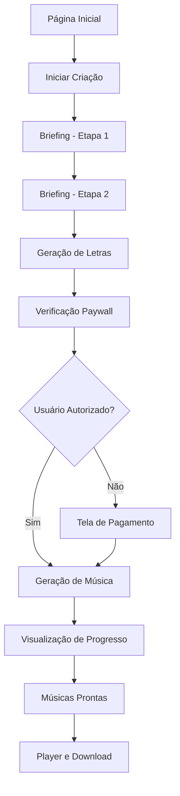
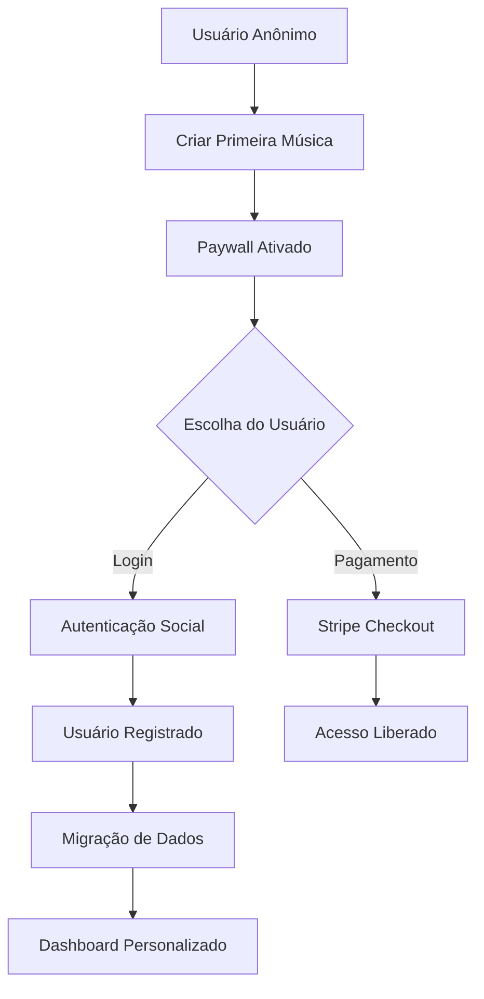

# PRD - Memora Music: Plataforma de Geração de Música Personalizada com IA

## 1. Visão Geral do Produto

**Memora Music** é uma plataforma inovadora que utiliza inteligência artificial para criar músicas personalizadas e únicas baseadas em memórias, ocasiões especiais e relacionamentos pessoais. A plataforma permite que usuários criem composições musicais originais de forma rápida e intuitiva, transformando histórias pessoais em experiências musicais memoráveis.

**Proposta de Valor**: Democratizar a criação musical através de IA, permitindo que qualquer pessoa crie uma música personalizada sem conhecimento técnico musical, conectando emoções e memórias através da música.

**Mercado-Alvo**: Pessoas que desejam criar presentes únicos, celebrar ocasiões especiais ou preservar memórias através da música.

## 2. Objetivos e Metas

### Objetivos Primários
- Facilitar a criação de músicas personalizadas para usuários sem conhecimento musical
- Oferecer uma experiência intuitiva e emocional na criação musical
- Monetizar através de modelo freemium com assinaturas

### Metas Mensuráveis
- **Conversão**: 15% dos usuários gratuitos para planos pagos
- **Retenção**: 70% dos usuários retornam em 30 dias
- **Satisfação**: NPS acima de 50
- **Performance**: Geração de música em menos de 3 minutos

## 3. Público-Alvo

### Usuário Primário
- **Demografia**: Adultos de 25-55 anos
- **Comportamento**: Valorizam experiências personalizadas e presentes únicos
- **Necessidades**: Criar presentes memoráveis, celebrar ocasiões especiais
- **Tecnologia**: Confortáveis com aplicações web modernas

### Casos de Uso Principais
1. **Presentes Personalizados**: Aniversários, casamentos, formaturas
2. **Celebrações**: Datas comemorativas, conquistas pessoais
3. **Memórias**: Preservação de momentos especiais em formato musical
4. **Expressão Criativa**: Transformar sentimentos em música

## 4. Funcionalidades Principais

### 4.1 Geração de Música com IA
- **Integração Suno API**: Geração de música de alta qualidade
- **Personalização Avançada**: Baseada em briefing detalhado do usuário
- **Múltiplas Opções**: Geração de 2 versões por criação
- **Qualidade Profissional**: Músicas com até 1 minuto de duração

### 4.2 Sistema de Briefing Inteligente
- **Wizard em Etapas**: Coleta progressiva de informações
- **Campos Personalizáveis**: Ocasião, relacionamento, memórias, características
- **Geração de Letras**: IA cria letras baseadas no briefing
- **Estilos Musicais**: Seleção de gêneros e preferências vocais

### 4.3 Autenticação e Gestão de Usuários
- **NextAuth Integration**: Login social (Google, GitHub)
- **Usuários Convidados**: Experiência sem cadastro obrigatório
- **Migração de Dados**: Conversão de guest para usuário registrado
- **Gestão de Identidade**: Sistema robusto de device_id e user_id

### 4.4 Sistema de Monetização (Paywall)
- **Modelo Freemium**: 1 música gratuita para usuários anônimos
- **Planos de Assinatura**: Pro ($19/mês) com músicas ilimitadas
- **Pagamento Individual**: Opção de compra por música
- **Integração Stripe**: Processamento seguro de pagamentos

### 4.5 Interface Multilíngue
- **Suporte i18n**: Português e Inglês
- **Localização Completa**: Interface, mensagens e validações
- **Detecção Automática**: Idioma baseado no navegador

### 4.6 Design Responsivo
- **Mobile-First**: Otimizado para dispositivos móveis
- **Acessibilidade**: Conformidade WCAG AA
- **Performance**: Carregamento otimizado e experiência fluida

## 5. Fluxo do Usuário

### Fluxo Principal - Criação de Música

### Fluxo de Autenticação

## 6. Requisitos Técnicos

### 6.1 Frontend
- **Framework**: React 18 com TypeScript
- **Build Tool**: Vite
- **Styling**: Tailwind CSS
- **Estado**: Zustand para gerenciamento de estado
- **Roteamento**: React Router
- **Internacionalização**: react-i18next

### 6.2 Backend
- **Runtime**: Node.js com Express
- **Linguagem**: TypeScript
- **Validação**: Zod schemas
- **Autenticação**: NextAuth.js
- **APIs Externas**: Suno API, OpenAI API

### 6.3 Banco de Dados
- **Plataforma**: Supabase (PostgreSQL)
- **ORM**: Supabase Client SDK
- **Segurança**: Row Level Security (RLS)
- **Backup**: Automático via Supabase

### 6.4 Infraestrutura
- **Deploy**: Render.com
- **CDN**: Integrado ao Render
- **Monitoramento**: Logs estruturados
- **SSL**: Certificados automáticos

## 7. Critérios de Sucesso

### 7.1 Métricas de Produto
- **Taxa de Conversão**: 15% de usuários gratuitos para pagos
- **Tempo de Geração**: < 3 minutos por música
- **Taxa de Conclusão**: 80% dos usuários completam o fluxo
- **Satisfação**: NPS > 50

### 7.2 Métricas Técnicas
- **Performance**: Lighthouse Score > 90
- **Disponibilidade**: 99.5% uptime
- **Tempo de Resposta**: < 2s para páginas principais
- **Erro Rate**: < 1% nas APIs críticas

### 7.3 Métricas de Negócio
- **MRR Growth**: 20% crescimento mensal
- **CAC Payback**: < 6 meses
- **Churn Rate**: < 5% mensal
- **LTV/CAC Ratio**: > 3:1

## 8. Roadmap de Desenvolvimento

### Fase 1 - MVP (Concluída)
- [x] Geração básica de música
- [x] Sistema de briefing
- [x] Autenticação social
- [x] Paywall básico
- [x] Interface responsiva

### Fase 2 - Otimização (Em Andamento)
- [x] Melhorias no paywall
- [x] Sistema de pagamento individual
- [x] Internacionalização
- [ ] Otimizações de performance
- [ ] Testes automatizados

### Fase 3 - Expansão (Planejado)
- [ ] Novos estilos musicais
- [ ] Colaboração em músicas
- [ ] Marketplace de templates
- [ ] API pública
- [ ] Aplicativo mobile

## 9. Riscos e Mitigações

### 9.1 Riscos Técnicos
- **Dependência Suno API**: Mitigação através de fallbacks e monitoramento
- **Performance**: Otimização contínua e CDN
- **Escalabilidade**: Arquitetura preparada para crescimento

### 9.2 Riscos de Negócio
- **Concorrência**: Foco na experiência única e personalização
- **Custos de IA**: Otimização de prompts e caching inteligente
- **Adoção**: Marketing focado em casos de uso específicos

## 10. Considerações de Compliance

### 10.1 Privacidade
- **LGPD/GDPR**: Conformidade com regulamentações de privacidade
- **Dados Pessoais**: Minimização e proteção de dados sensíveis
- **Consentimento**: Coleta explícita de consentimento

### 10.2 Propriedade Intelectual
- **Músicas Geradas**: Direitos claros sobre criações
- **Conteúdo Original**: Garantia de originalidade via IA
- **Licenciamento**: Termos claros de uso comercial

---

**Versão**: 1.0  
**Data**: Janeiro 2025  
**Responsável**: Equipe Memora Music  
**Próxima Revisão**: Março 2025