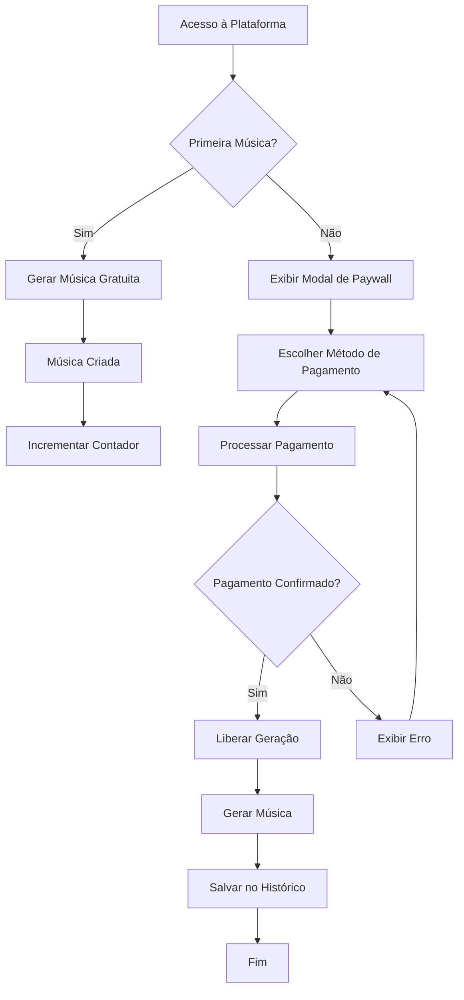

# Documento de Requisitos do Produto - Sistema de Pagamento Individual por Música

## 1. Visão Geral do Produto

Modificação do sistema de monetização da Memora Music para eliminar o conceito de usuário premium com acesso ilimitado, implementando um modelo de pagamento individual por música após o consumo da cota gratuita de 1 música.

O objetivo é criar um modelo de receita mais previsível e acessível, onde cada usuário paga apenas pelas músicas que deseja gerar, removendo a barreira de entrada de uma assinatura premium mensal.

## 2. Funcionalidades Principais

### 2.1 Papéis de Usuário

| Papel | Método de Registro | Permissões Principais |
|-------|-------------------|----------------------|
| Usuário Anônimo | Acesso direto via dispositivo | Pode gerar 1 música gratuita, depois precisa pagar individualmente |
| Usuário Registrado | Email + senha ou OAuth | Pode gerar 1 música gratuita, depois precisa pagar individualmente, histórico sincronizado |

### 2.2 Módulos de Funcionalidade

Nossa plataforma de pagamento individual consiste nas seguintes páginas principais:

1. **Página de Geração**: interface de criação de música, modal de paywall para pagamento individual.
2. **Modal de Pagamento**: formulário de pagamento via Stripe para música específica.
3. **Página de Histórico**: lista de músicas criadas com status de pagamento.
4. **Página de Configurações**: gerenciamento de conta e preferências de pagamento.

### 2.3 Detalhes das Páginas

| Nome da Página | Nome do Módulo | Descrição da Funcionalidade |
|----------------|----------------|-----------------------------|
| Página de Geração | Interface de Criação | Formulário para inserir prompt, gênero musical, configurações. Validação de entrada e preview |
| Página de Geração | Modal de Paywall | Detectar quando usuário excede cota gratuita. Exibir modal com opções de pagamento individual |
| Modal de Pagamento | Formulário Stripe | Processar pagamento via PIX, cartão ou boleto. Validação de dados e confirmação |
| Modal de Pagamento | Status de Pagamento | Exibir status em tempo real (processando, confirmado, falhou). Retry automático |
| Página de Histórico | Lista de Músicas | Mostrar todas as músicas criadas com título, data, status de pagamento, valor pago |
| Página de Histórico | Filtros e Busca | Filtrar por status de pagamento, data, valor. Busca por título ou letra |
| Página de Configurações | Métodos de Pagamento | Gerenciar cartões salvos, preferências de pagamento padrão |
| Página de Configurações | Histórico de Transações | Lista detalhada de todos os pagamentos realizados com recibos |

## 3. Processo Principal

### Fluxo do Usuário Anônimo
1. Usuário acessa a plataforma e cria sua primeira música gratuitamente
2. Sistema registra o uso da cota gratuita no dispositivo
3. Para a segunda música, sistema exibe modal de paywall
4. Usuário escolhe método de pagamento (PIX, cartão, boleto)
5. Após confirmação do pagamento, música é liberada para geração
6. Processo se repete para cada nova música

### Fluxo do Usuário Registrado
1. Usuário faz login e cria sua primeira música gratuitamente
2. Sistema registra o uso da cota gratuita na conta
3. Para músicas subsequentes, sistema exibe modal de paywall
4. Usuário pode usar métodos de pagamento salvos ou adicionar novos
5. Histórico de músicas e pagamentos fica sincronizado na conta
6. Usuário pode acessar histórico completo e baixar recibos

## 4. Design da Interface do Usuário

### 4.1 Estilo de Design

- **Cores Primárias**: #6366f1 (índigo), #8b5cf6 (roxo)
- **Cores Secundárias**: #f3f4f6 (cinza claro), #1f2937 (cinza escuro)
- **Estilo de Botões**: Arredondados com gradiente sutil, hover com elevação
- **Fonte**: Inter, tamanhos 14px (corpo), 16px (botões), 24px (títulos)
- **Layout**: Card-based com espaçamento generoso, navegação top-bar
- **Ícones**: Lucide React com estilo outline, tamanho 20px padrão

### 4.2 Visão Geral do Design das Páginas

| Nome da Página | Nome do Módulo | Elementos da UI |
|----------------|----------------|----------------|
| Página de Geração | Interface de Criação | Card principal centralizado, campos de input com labels flutuantes, botão CTA destacado |
| Página de Geração | Modal de Paywall | Overlay escuro, modal centralizado, ícone de música, texto explicativo, botões de ação coloridos |
| Modal de Pagamento | Formulário Stripe | Design responsivo, campos validados em tempo real, indicadores de segurança, logos dos métodos |
| Modal de Pagamento | Status de Pagamento | Spinner animado, ícones de status coloridos, mensagens claras, botão de retry |
| Página de Histórico | Lista de Músicas | Cards em grid responsivo, badges de status coloridos, botões de ação secundários |
| Página de Histórico | Filtros e Busca | Barra de busca com ícone, dropdowns estilizados, chips de filtro removíveis |
| Página de Configurações | Métodos de Pagamento | Lista de cartões com ícones de bandeira, botões de edição/remoção, formulário de adição |
| Página de Configurações | Histórico de Transações | Tabela responsiva, paginação, botões de download de recibo |

### 4.3 Responsividade

A aplicação é mobile-first com breakpoints em 768px (tablet) e 1024px (desktop). Otimizada para touch em dispositivos móveis com botões de tamanho adequado (44px mínimo) e navegação por gestos.

## 5. Especificações Técnicas

### 5.1 Regras de Negócio

- **Cota Gratuita**: 1 música por usuário/dispositivo
- **Preço por Música**: R$ 5,00 (500 centavos)
- **Métodos de Pagamento**: PIX (1h expiração), Cartão (instantâneo), Boleto (5 dias)
- **Validade do Pagamento**: 24 horas para completar após iniciar
- **Reembolso**: Não permitido após geração da música

### 5.2 Validações

- Verificar cota gratuita antes de cada geração
- Validar pagamento antes de liberar geração
- Confirmar unicidade de pagamento por música
- Verificar expiração de Payment Intents

### 5.3 Integrações

- **Stripe**: Processamento de pagamentos
- **Supabase**: Banco de dados e autenticação
- **Email**: Notificações de pagamento (opcional)

### 5.4 Métricas de Sucesso

- Taxa de conversão de usuários gratuitos para pagantes
- Valor médio por usuário (ARPU)
- Taxa de abandono no fluxo de pagamento
- Tempo médio entre criação de músicas
- Satisfação do usuário com o novo modelo

### 5.5 Critérios de Aceite

**Funcionalidade Principal:**
- ✅ Usuário pode gerar 1 música gratuita
- ✅ Modal de paywall aparece na segunda tentativa
- ✅ Pagamento via PIX, cartão e boleto funciona
- ✅ Música é liberada após confirmação do pagamento
- ✅ Histórico mostra status correto de cada música

**Performance:**
- ✅ Modal de paywall carrega em < 500ms
- ✅ Processamento de pagamento em < 3s
- ✅ API de verificação responde em < 200ms

**Segurança:**
- ✅ Dados de pagamento não são armazenados localmente
- ✅ Validação server-side de todos os pagamentos
- ✅ Rate limiting nas APIs de pagamento

**UX/UI:**
- ✅ Interface responsiva em todos os dispositivos
- ✅ Mensagens de erro claras e acionáveis
- ✅ Feedback visual durante processamento
- ✅ Acessibilidade (WCAG 2.1 AA)

## 6. Plano de Implementação

### Fase 1: Infraestrutura (Semana 1-2)
- Criar tabelas de banco de dados
- Implementar APIs básicas
- Configurar integração Stripe

### Fase 2: Lógica de Paywall (Semana 3-4)
- Modificar verificação de cota
- Implementar modal de paywall
- Criar fluxo de pagamento individual

### Fase 3: Interface e UX (Semana 5-6)
- Desenvolver componentes de UI
- Implementar página de histórico
- Testes de usabilidade

### Fase 4: Testes e Deploy (Semana 7-8)
- Testes automatizados
- Testes de carga
- Deploy gradual com feature flag

## 7. Riscos e Mitigações

| Risco | Impacto | Probabilidade | Mitigação |
|-------|---------|---------------|----------|
| Queda na receita inicial | Alto | Médio | Monitorar métricas e ajustar preço se necessário |
| Resistência dos usuários | Médio | Alto | Comunicação clara dos benefícios, período de transição |
| Problemas técnicos no Stripe | Alto | Baixo | Testes extensivos, fallback para métodos alternativos |
| Fraudes em pagamento | Médio | Médio | Validações rigorosas, monitoramento de padrões |

## 8. Próximos Passos

1. Validação do modelo de negócio com stakeholders
2. Aprovação do orçamento para desenvolvimento
3. Definição da equipe de implementação
4. Criação do cronograma detalhado
5. Início do desenvolvimento da Fase 1

Este documento serve como base para a implementação do novo sistema de pagamento individual por música, garantindo uma transição suave do modelo atual para o novo modelo