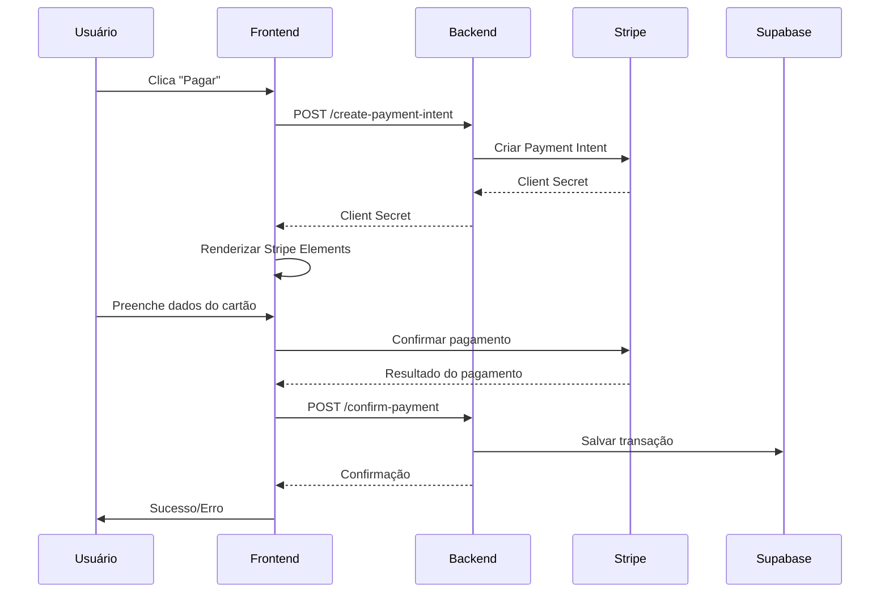

# Plano Técnico: Implementação do Gateway de Pagamento Stripe

## 1. Resumo Executivo

Este documento apresenta um plano técnico simplificado para implementar o gateway de pagamento Stripe na plataforma Memora.Music, substituindo o sistema de pagamentos simulados atual por transações reais. A implementação será focada na simplicidade, segurança e facilidade de manutenção.

**Objetivo**: Integrar pagamentos reais via Stripe mantendo a experiência do usuário atual e garantindo segurança nas transações.

## 2. Análise da Infraestrutura Atual

### 2.1 Estado Atual
- ✅ Modal de paywall implementado (`PaymentModal.tsx`)
- ✅ Rota de pagamento simulado (`/api/confirm-mock-payment`)
- ✅ Sistema de autenticação com Supabase
- ✅ Controle de cotas por usuário (`freesongsused`)
- ✅ Chaves do Stripe configuradas

### 2.2 Componentes Afetados
- `api/routes/paywall.ts` - Adicionar endpoints Stripe
- `src/components/PaymentModal.tsx` - Integrar Stripe Elements
- `package.json` - Adicionar dependências Stripe
- Supabase - Nova tabela de transações reais

## 3. Plano de Implementação

### Milestone 1: Configuração Base do Stripe (2-3 horas)

#### 3.1 Instalação de Dependências
```bash
npm install stripe @stripe/stripe-js @stripe/react-stripe-js
```

#### 3.2 Configuração do Cliente Stripe
**Arquivo**: `src/lib/stripe-client.ts`
```typescript
import { loadStripe } from '@stripe/stripe-js';

const stripePromise = loadStripe(process.env.NEXT_PUBLIC_STRIPE_PUBLISHABLE_KEY!);

export { stripePromise };
```

#### 3.3 Configuração do Servidor Stripe
**Arquivo**: `api/lib/stripe-server.ts`
```typescript
import Stripe from 'stripe';

const stripe = new Stripe(process.env.STRIPE_SECRET_KEY!, {
  apiVersion: '2023-10-16',
});

export { stripe };
```

#### 3.4 Variáveis de Ambiente
**Adicionar ao `.env`**:
```env
# Stripe Configuration
STRIPE_SECRET_KEY=sk_test_...
NEXT_PUBLIC_STRIPE_PUBLISHABLE_KEY=pk_test_...
STRIPE_WEBHOOK_SECRET=whsec_...
```

**Critérios de Aceite**:
- [ ] Dependências instaladas sem conflitos
- [ ] Clientes Stripe configurados (frontend e backend)
- [ ] Variáveis de ambiente definidas
- [ ] Conexão com Stripe API funcionando

---

### Milestone 2: Endpoints de Pagamento (3-4 horas)

#### 3.1 Criar Payment Intent
**Endpoint**: `POST /api/stripe/create-payment-intent`

```typescript
// api/routes/stripe.ts
import { Router } from 'express';
import { stripe } from '../lib/stripe-server.js';
import { optionalAuthMiddleware } from '../middleware/optionalAuth.js';

const router = Router();

router.post('/create-payment-intent', optionalAuthMiddleware, async (req, res) => {
  try {
    const { amount, currency = 'brl' } = req.body;
    const userId = req.user?.id;
    
    // Validação
    if (!amount || amount < 50) { // Mínimo R$ 0,50
      return res.status(400).json({ error: 'Valor mínimo não atingido' });
    }
    
    // Criar Payment Intent
    const paymentIntent = await stripe.paymentIntents.create({
      amount: Math.round(amount * 100), // Converter para centavos
      currency,
      metadata: {
        userId: userId || 'guest',
        platform: 'memora-music'
      }
    });
    
    res.json({
      clientSecret: paymentIntent.client_secret,
      paymentIntentId: paymentIntent.id
    });
    
  } catch (error) {
    console.error('Erro ao criar Payment Intent:', error);
    res.status(500).json({ error: 'Erro interno do servidor' });
  }
});

export default router;
```

#### 3.2 Confirmar Pagamento
**Endpoint**: `POST /api/stripe/confirm-payment`

```typescript
router.post('/confirm-payment', optionalAuthMiddleware, async (req, res) => {
  try {
    const { paymentIntentId } = req.body;
    const userId = req.user?.id;
    
    // Recuperar Payment Intent
    const paymentIntent = await stripe.paymentIntents.retrieve(paymentIntentId);
    
    if (paymentIntent.status === 'succeeded') {
      // Salvar transação no banco
      const supabase = getSupabaseClient();
      const { error } = await supabase.from('stripe_transactions').insert({
        user_id: userId,
        payment_intent_id: paymentIntentId,
        amount: paymentIntent.amount,
        currency: paymentIntent.currency,
        status: 'completed',
        created_at: new Date().toISOString()
      });
      
      if (error) {
        console.error('Erro ao salvar transação:', error);
      }
      
      res.json({ success: true, transactionId: paymentIntentId });
    } else {
      res.status(400).json({ error: 'Pagamento não confirmado' });
    }
    
  } catch (error) {
    console.error('Erro ao confirmar pagamento:', error);
    res.status(500).json({ error: 'Erro interno do servidor' });
  }
});
```

#### 3.3 Webhook para Eventos Stripe
**Endpoint**: `POST /api/stripe/webhook`

```typescript
router.post('/webhook', express.raw({ type: 'application/json' }), async (req, res) => {
  const sig = req.headers['stripe-signature'];
  let event;
  
  try {
    event = stripe.webhooks.constructEvent(req.body, sig, process.env.STRIPE_WEBHOOK_SECRET!);
  } catch (err) {
    console.error('Webhook signature verification failed:', err);
    return res.status(400).send(`Webhook Error: ${err.message}`);
  }
  
  // Processar eventos
  switch (event.type) {
    case 'payment_intent.succeeded':
      const paymentIntent = event.data.object;
      console.log('Pagamento confirmado:', paymentIntent.id);
      // Atualizar status no banco se necessário
      break;
    
    case 'payment_intent.payment_failed':
      console.log('Pagamento falhou:', event.data.object.id);
      break;
    
    default:
      console.log(`Evento não tratado: ${event.type}`);
  }
  
  res.json({ received: true });
});
```

**Critérios de Aceite**:
- [ ] Endpoint de criação de Payment Intent funcionando
- [ ] Endpoint de confirmação de pagamento implementado
- [ ] Webhook configurado e testado
- [ ] Validações de segurança implementadas
- [ ] Logs estruturados adicionados

---

### Milestone 3: Integração Frontend (4-5 horas)

#### 3.1 Wrapper do Stripe Provider
**Arquivo**: `src/components/StripeProvider.tsx`

```typescript
import { Elements } from '@stripe/react-stripe-js';
import { stripePromise } from '../lib/stripe-client';

interface StripeProviderProps {
  children: React.ReactNode;
  clientSecret?: string;
}

export function StripeProvider({ children, clientSecret }: StripeProviderProps) {
  const options = {
    clientSecret,
    appearance: {
      theme: 'stripe' as const,
      variables: {
        colorPrimary: '#0570de',
        colorBackground: '#ffffff',
        colorText: '#30313d',
        colorDanger: '#df1b41',
        fontFamily: 'Inter, system-ui, sans-serif',
        spacingUnit: '4px',
        borderRadius: '8px'
      }
    }
  };
  
  return (
    <Elements stripe={stripePromise} options={options}>
      {children}
    </Elements>
  );
}
```

#### 3.2 Componente de Pagamento
**Arquivo**: `src/components/StripePaymentForm.tsx`

```typescript
import { useState } from 'react';
import { PaymentElement, useStripe, useElements } from '@stripe/react-stripe-js';
import { Button } from './ui/button';

interface StripePaymentFormProps {
  onSuccess: (paymentIntentId: string) => void;
  onError: (error: string) => void;
  amount: number;
}

export function StripePaymentForm({ onSuccess, onError, amount }: StripePaymentFormProps) {
  const stripe = useStripe();
  const elements = useElements();
  const [isLoading, setIsLoading] = useState(false);
  
  const handleSubmit = async (event: React.FormEvent) => {
    event.preventDefault();
    
    if (!stripe || !elements) {
      return;
    }
    
    setIsLoading(true);
    
    try {
      const { error, paymentIntent } = await stripe.confirmPayment({
        elements,
        redirect: 'if_required'
      });
      
      if (error) {
        onError(error.message || 'Erro no pagamento');
      } else if (paymentIntent && paymentIntent.status === 'succeeded') {
        onSuccess(paymentIntent.id);
      }
    } catch (err) {
      onError('Erro inesperado no pagamento');
    } finally {
      setIsLoading(false);
    }
  };
  
  return (
    <form onSubmit={handleSubmit} className="space-y-4">
      <div className="p-4 border rounded-lg">
        <PaymentElement />
      </div>
      
      <div className="flex justify-between items-center">
        <span className="text-lg font-semibold">
          Total: R$ {(amount / 100).toFixed(2)}
        </span>
        
        <Button 
          type="submit" 
          disabled={!stripe || isLoading}
          className="min-w-[120px]"
        >
          {isLoading ? 'Processando...' : 'Pagar Agora'}
        </Button>
      </div>
    </form>
  );
}
```

#### 3.3 Atualização do Modal de Pagamento
**Arquivo**: `src/components/PaymentModal.tsx` (modificações)

```typescript
// Adicionar imports
import { StripeProvider } from './StripeProvider';
import { StripePaymentForm } from './StripePaymentForm';

// Adicionar estado para Payment Intent
const [clientSecret, setClientSecret] = useState<string | null>(null);
const [paymentMode, setPaymentMode] = useState<'mock' | 'stripe'>('stripe');

// Função para criar Payment Intent
const createPaymentIntent = async (amount: number) => {
  try {
    const response = await fetch('/api/stripe/create-payment-intent', {
      method: 'POST',
      headers: {
        'Content-Type': 'application/json',
        'Authorization': `Bearer ${token}`
      },
      body: JSON.stringify({ amount })
    });
    
    const data = await response.json();
    setClientSecret(data.clientSecret);
  } catch (error) {
    console.error('Erro ao criar Payment Intent:', error);
    // Fallback para modo simulado
    setPaymentMode('mock');
  }
};

// Renderização condicional
{paymentMode === 'stripe' && clientSecret ? (
  <StripeProvider clientSecret={clientSecret}>
    <StripePaymentForm
      amount={selectedPlan.price * 100}
      onSuccess={handleStripeSuccess}
      onError={handleStripeError}
    />
  </StripeProvider>
) : (
  // Manter formulário de pagamento simulado como fallback
  <MockPaymentForm />
)}
```

**Critérios de Aceite**:
- [ ] Stripe Elements integrado ao modal
- [ ] Formulário de pagamento funcional
- [ ] Fallback para pagamento simulado
- [ ] Experiência do usuário mantida
- [ ] Validações de frontend implementadas

---

### Milestone 4: Banco de Dados e Segurança (2-3 horas)

#### 4.1 Nova Tabela de Transações Stripe
**Arquivo**: `supabase/migrations/create_stripe_transactions.sql`

```sql
-- Criar tabela de transações Stripe
CREATE TABLE stripe_transactions (
  id UUID PRIMARY KEY DEFAULT gen_random_uuid(),
  user_id UUID REFERENCES auth.users(id),
  payment_intent_id VARCHAR(255) UNIQUE NOT NULL,
  amount INTEGER NOT NULL, -- em centavos
  currency VARCHAR(3) DEFAULT 'brl',
  status VARCHAR(50) NOT NULL,
  metadata JSONB,
  created_at TIMESTAMP WITH TIME ZONE DEFAULT NOW(),
  updated_at TIMESTAMP WITH TIME ZONE DEFAULT NOW()
);

-- Índices para performance
CREATE INDEX idx_stripe_transactions_user_id ON stripe_transactions(user_id);
CREATE INDEX idx_stripe_transactions_payment_intent ON stripe_transactions(payment_intent_id);
CREATE INDEX idx_stripe_transactions_status ON stripe_transactions(status);
CREATE INDEX idx_stripe_transactions_created_at ON stripe_transactions(created_at DESC);

-- RLS (Row Level Security)
ALTER TABLE stripe_transactions ENABLE ROW LEVEL SECURITY;

-- Política: usuários só veem suas próprias transações
CREATE POLICY "Users can view own transactions" ON stripe_transactions
  FOR SELECT USING (auth.uid() = user_id);

-- Política: apenas backend pode inserir
CREATE POLICY "Service role can insert transactions" ON stripe_transactions
  FOR INSERT WITH CHECK (auth.role() = 'service_role');
```

#### 4.2 Validações de Segurança

**Rate Limiting** (adicionar ao middleware):
```typescript
// api/middleware/rateLimiting.ts
import rateLimit from 'express-rate-limit';

export const paymentRateLimit = rateLimit({
  windowMs: 15 * 60 * 1000, // 15 minutos
  max: 5, // máximo 5 tentativas por IP
  message: 'Muitas tentativas de pagamento. Tente novamente em 15 minutos.',
  standardHeaders: true,
  legacyHeaders: false
});
```

**Validação de Valores**:
```typescript
// Esquema Zod para validação
const paymentSchema = z.object({
  amount: z.number().min(50).max(100000), // R$ 0,50 a R$ 1.000,00
  currency: z.string().length(3).default('brl')
});
```

**Critérios de Aceite**:
- [ ] Tabela de transações criada
- [ ] Políticas RLS configuradas
- [ ] Rate limiting implementado
- [ ] Validações de entrada robustas
- [ ] Logs de segurança adicionados

---

### Milestone 5: Testes e Documentação (2-3 horas)

#### 5.1 Testes de Integração
**Arquivo**: `tests/stripe-integration.test.ts`

```typescript
import { describe, it, expect } from 'vitest';
import request from 'supertest';
import app from '../api/app';

describe('Stripe Integration', () => {
  it('should create payment intent', async () => {
    const response = await request(app)
      .post('/api/stripe/create-payment-intent')
      .send({ amount: 500 }) // R$ 5,00
      .expect(200);
    
    expect(response.body).toHaveProperty('clientSecret');
    expect(response.body).toHaveProperty('paymentIntentId');
  });
  
  it('should validate minimum amount', async () => {
    await request(app)
      .post('/api/stripe/create-payment-intent')
      .send({ amount: 10 }) // Abaixo do mínimo
      .expect(400);
  });
});
```

#### 5.2 Documentação da API
**Arquivo**: `docs/stripe-api.md`

```markdown
# API de Pagamentos Stripe

## Endpoints

### POST /api/stripe/create-payment-intent
Cria um Payment Intent para processamento de pagamento.

**Request:**
```json
{
  "amount": 500,
  "currency": "brl"
}
```

**Response:**
```json
{
  "clientSecret": "pi_xxx_secret_xxx",
  "paymentIntentId": "pi_xxx"
}
```

### POST /api/stripe/confirm-payment
Confirma um pagamento processado.

**Request:**
```json
{
  "paymentIntentId": "pi_xxx"
}
```

**Response:**
```json
{
  "success": true,
  "transactionId": "pi_xxx"
}
```
```

**Critérios de Aceite**:
- [ ] Testes de integração passando
- [ ] Documentação da API completa
- [ ] Guia de troubleshooting criado
- [ ] Checklist de deploy preparado

## 4. Fluxo de Pagamento



## 5. Tratamento de Erros

### 5.1 Erros Comuns e Soluções

| Erro | Causa | Solução |
|------|-------|----------|
| `card_declined` | Cartão recusado | Solicitar outro método de pagamento |
| `insufficient_funds` | Saldo insuficiente | Informar usuário sobre o problema |
| `invalid_cvc` | CVC inválido | Solicitar correção do código |
| `expired_card` | Cartão expirado | Solicitar cartão válido |
| `processing_error` | Erro no processamento | Tentar novamente em alguns minutos |

### 5.2 Fallback Strategy

1. **Erro na criação do Payment Intent**: Fallback para pagamento simulado
2. **Stripe indisponível**: Mostrar mensagem de manutenção
3. **Erro de rede**: Retry automático com backoff exponencial
4. **Webhook falha**: Sistema de retry com dead letter queue

## 6. Segurança e Compliance

### 6.1 Medidas de Segurança Implementadas

- ✅ **PCI Compliance**: Stripe Elements (sem dados de cartão no servidor)
- ✅ **Rate Limiting**: 5 tentativas por 15 minutos
- ✅ **Validação de entrada**: Zod schemas
- ✅ **Webhook verification**: Assinatura Stripe verificada
- ✅ **RLS**: Row Level Security no Supabase
- ✅ **Logs estruturados**: Sem dados sensíveis

### 6.2 Variáveis de Ambiente Obrigatórias

```env
# Stripe (Obrigatório)
STRIPE_SECRET_KEY=sk_test_...
NEXT_PUBLIC_STRIPE_PUBLISHABLE_KEY=pk_test_...
STRIPE_WEBHOOK_SECRET=whsec_...

# Supabase (Já configurado)
SUPABASE_URL=https://xxx.supabase.co
SUPABASE_ANON_KEY=eyJ...
SUPABASE_SERVICE_ROLE_KEY=eyJ...
```

## 7. Checklist de Deploy

### 7.1 Pré-Deploy
- [ ] Variáveis de ambiente configuradas
- [ ] Testes de integração passando
- [ ] Webhook endpoint configurado no Stripe Dashboard
- [ ] Tabela `stripe_transactions` criada
- [ ] Rate limiting testado

### 7.2 Deploy
- [ ] Deploy da aplicação
- [ ] Verificar logs de inicialização
- [ ] Testar criação de Payment Intent
- [ ] Testar pagamento completo (modo test)
- [ ] Verificar webhook funcionando

### 7.3 Pós-Deploy
- [ ] Monitorar logs por 24h
- [ ] Verificar métricas de erro
- [ ] Testar fallback para pagamento simulado
- [ ] Documentar problemas encontrados

## 8. Monitoramento e Métricas

### 8.1 Métricas Importantes
- Taxa de sucesso de pagamentos
- Tempo médio de processamento
- Erros por tipo
- Volume de transações por hora

### 8.2 Alertas Recomendados
- Taxa de erro > 5%
- Webhook com delay > 30s
- Falha na conexão com Stripe
- Rate limiting ativado frequentemente

## 9. Próximos Passos

### 9.1 Melhorias Futuras
1. **Assinaturas recorrentes** para planos premium
2. **Múltiplos métodos de pagamento** (PIX, boleto)
3. **Relatórios financeiros** detalhados
4. **Reembolsos automatizados**
5. **Integração com sistema de cupons**

### 9.2 Otimizações
1. **Cache de Payment Intents** para reduzir chamadas à API
2. **Retry inteligente** com backoff exponencial
3. **Pré-carregamento** do Stripe Elements
4. **Análise de fraude** com Stripe Radar

---

**Estimativa Total**: 13-18 horas de desenvolvimento
**Complexidade**: Média
**Risco**: Baixo (com fallback implementado)
**Impacto**: Alto (monetização real da plataforma)

**Responsável pela Implementação**: Equipe de Desenvolvimento
**Revisão de Segurança**: Obrigatória antes do deploy em produção
**Testes em Produção**: Usar modo test do Stripe inicialmente