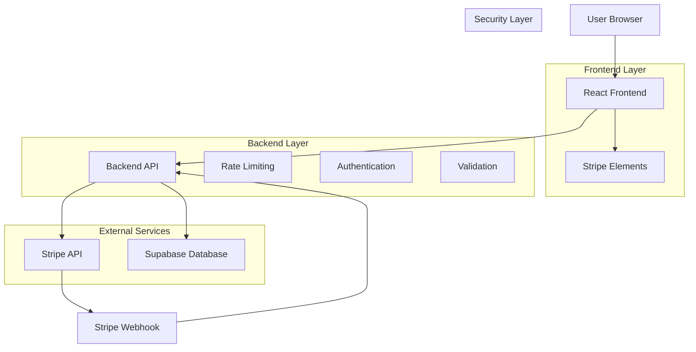
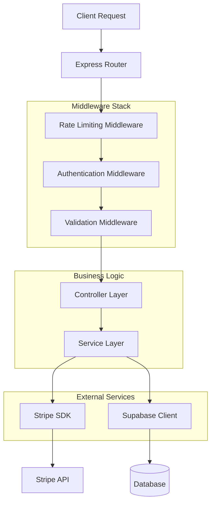
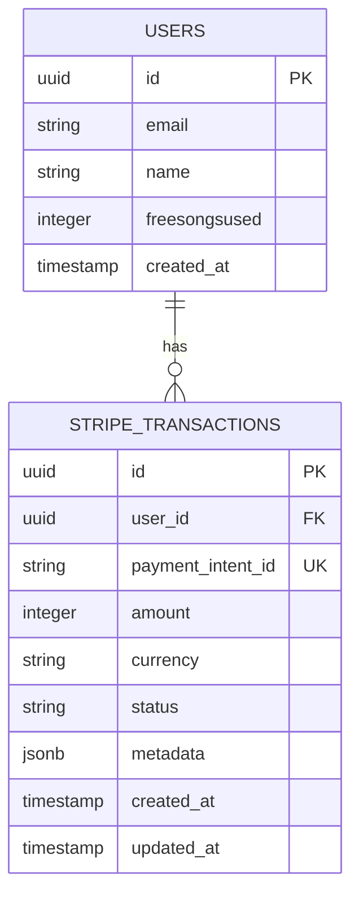

# Arquitetura Técnica: Gateway de Pagamento Stripe

## 1. Arquitetura Geral



## 2. Stack Tecnológico

### Frontend
- **React 18** com TypeScript
- **@stripe/stripe-js** - Cliente Stripe para browser
- **@stripe/react-stripe-js** - Componentes React do Stripe
- **Tailwind CSS** - Estilização
- **Zod** - Validação de schemas

### Backend
- **Express.js** - API REST
- **stripe** - SDK oficial do Stripe para Node.js
- **express-rate-limit** - Rate limiting
- **Supabase Client** - Banco de dados

### Banco de Dados
- **Supabase (PostgreSQL)** - Armazenamento de transações
- **Row Level Security (RLS)** - Segurança de dados

### Infraestrutura
- **Stripe API** - Processamento de pagamentos
- **Stripe Webhooks** - Eventos assíncronos

## 3. Definição de Rotas

| Rota | Método | Propósito | Autenticação |
|------|--------|-----------|-------------|
| `/api/stripe/create-payment-intent` | POST | Criar intenção de pagamento | Opcional |
| `/api/stripe/confirm-payment` | POST | Confirmar pagamento processado | Opcional |
| `/api/stripe/webhook` | POST | Receber eventos do Stripe | Webhook Secret |
| `/api/stripe/transaction-history` | GET | Histórico de transações do usuário | Obrigatória |

## 4. Definições de API

### 4.1 Core API

#### Criar Payment Intent
```
POST /api/stripe/create-payment-intent
```

**Request:**
| Param Name | Param Type | isRequired | Description |
|------------|------------|------------|-------------|
| amount | number | true | Valor em centavos (mínimo 50) |
| currency | string | false | Moeda (padrão: 'brl') |
| metadata | object | false | Dados adicionais |

**Response:**
| Param Name | Param Type | Description |
|------------|------------|-------------|
| clientSecret | string | Secret para confirmar pagamento |
| paymentIntentId | string | ID único do Payment Intent |

**Exemplo Request:**
```json
{
  "amount": 500,
  "currency": "brl",
  "metadata": {
    "planType": "premium",
    "userId": "user_123"
  }
}
```

**Exemplo Response:**
```json
{
  "clientSecret": "pi_3ABC123_secret_DEF456",
  "paymentIntentId": "pi_3ABC123DEF456GHI789"
}
```

#### Confirmar Pagamento
```
POST /api/stripe/confirm-payment
```

**Request:**
| Param Name | Param Type | isRequired | Description |
|------------|------------|------------|-------------|
| paymentIntentId | string | true | ID do Payment Intent |

**Response:**
| Param Name | Param Type | Description |
|------------|------------|-------------|
| success | boolean | Status da confirmação |
| transactionId | string | ID da transação salva |
| status | string | Status do pagamento |

#### Webhook Events
```
POST /api/stripe/webhook
```

**Headers:**
| Header Name | Description |
|-------------|-------------|
| stripe-signature | Assinatura do webhook |

**Eventos Processados:**
- `payment_intent.succeeded`
- `payment_intent.payment_failed`
- `payment_intent.canceled`

## 5. Arquitetura do Servidor



## 6. Modelo de Dados

### 6.1 Diagrama ER



### 6.2 DDL (Data Definition Language)

#### Tabela de Transações Stripe
```sql
-- Criar tabela de transações
CREATE TABLE stripe_transactions (
    id UUID PRIMARY KEY DEFAULT gen_random_uuid(),
    user_id UUID REFERENCES auth.users(id) ON DELETE SET NULL,
    payment_intent_id VARCHAR(255) UNIQUE NOT NULL,
    amount INTEGER NOT NULL CHECK (amount >= 50),
    currency VARCHAR(3) DEFAULT 'brl' CHECK (currency IN ('brl', 'usd', 'eur')),
    status VARCHAR(50) NOT NULL CHECK (status IN ('pending', 'completed', 'failed', 'canceled')),
    metadata JSONB DEFAULT '{}',
    created_at TIMESTAMP WITH TIME ZONE DEFAULT NOW(),
    updated_at TIMESTAMP WITH TIME ZONE DEFAULT NOW()
);

-- Índices para performance
CREATE INDEX idx_stripe_transactions_user_id ON stripe_transactions(user_id);
CREATE INDEX idx_stripe_transactions_payment_intent ON stripe_transactions(payment_intent_id);
CREATE INDEX idx_stripe_transactions_status ON stripe_transactions(status);
CREATE INDEX idx_stripe_transactions_created_at ON stripe_transactions(created_at DESC);
CREATE INDEX idx_stripe_transactions_amount ON stripe_transactions(amount);

-- Trigger para updated_at
CREATE OR REPLACE FUNCTION update_updated_at_column()
RETURNS TRIGGER AS $$
BEGIN
    NEW.updated_at = NOW();
    RETURN NEW;
END;
$$ language 'plpgsql';

CREATE TRIGGER update_stripe_transactions_updated_at
    BEFORE UPDATE ON stripe_transactions
    FOR EACH ROW
    EXECUTE FUNCTION update_updated_at_column();

-- Row Level Security
ALTER TABLE stripe_transactions ENABLE ROW LEVEL SECURITY;

-- Políticas RLS
CREATE POLICY "Users can view own transactions" ON stripe_transactions
    FOR SELECT USING (auth.uid() = user_id);

CREATE POLICY "Service role can manage all transactions" ON stripe_transactions
    FOR ALL USING (auth.role() = 'service_role');

CREATE POLICY "Authenticated users can insert own transactions" ON stripe_transactions
    FOR INSERT WITH CHECK (auth.uid() = user_id);

-- Grants de permissão
GRANT SELECT ON stripe_transactions TO authenticated;
GRANT INSERT ON stripe_transactions TO authenticated;
GRANT ALL PRIVILEGES ON stripe_transactions TO service_role;

-- Dados iniciais (se necessário)
-- INSERT INTO stripe_transactions (user_id, payment_intent_id, amount, status)
-- VALUES ('00000000-0000-0000-0000-000000000000', 'pi_test_example', 500, 'completed');
```

#### Função RPC para Estatísticas
```sql
-- Função para obter estatísticas de pagamento do usuário
CREATE OR REPLACE FUNCTION get_user_payment_stats(target_user_id UUID)
RETURNS TABLE(
    total_transactions BIGINT,
    total_amount BIGINT,
    successful_payments BIGINT,
    failed_payments BIGINT,
    last_payment_date TIMESTAMP WITH TIME ZONE
) AS $$
BEGIN
    RETURN QUERY
    SELECT 
        COUNT(*) as total_transactions,
        COALESCE(SUM(amount), 0) as total_amount,
        COUNT(*) FILTER (WHERE status = 'completed') as successful_payments,
        COUNT(*) FILTER (WHERE status = 'failed') as failed_payments,
        MAX(created_at) as last_payment_date
    FROM stripe_transactions 
    WHERE user_id = target_user_id;
END;
$$ LANGUAGE plpgsql SECURITY DEFINER;

-- Grant para função RPC
GRANT EXECUTE ON FUNCTION get_user_payment_stats(UUID) TO authenticated;
```

## 7. Configuração de Segurança

### 7.1 Variáveis de Ambiente

```env
# Stripe Configuration (Obrigatório)
STRIPE_SECRET_KEY=sk_test_51ABC123...
NEXT_PUBLIC_STRIPE_PUBLISHABLE_KEY=pk_test_51ABC123...
STRIPE_WEBHOOK_SECRET=whsec_1ABC123...

# Rate Limiting
RATE_LIMIT_WINDOW_MS=900000
RATE_LIMIT_MAX_REQUESTS=5

# Security
CORS_ORIGIN=http://localhost:3000,https://memora.music
TRUST_PROXY=true

# Supabase (Já configurado)
SUPABASE_URL=https://xxx.supabase.co
SUPABASE_ANON_KEY=eyJ...
SUPABASE_SERVICE_ROLE_KEY=eyJ...

# Logging
LOG_LEVEL=info
LOG_STRIPE_EVENTS=true
```

### 7.2 Middleware de Segurança

```typescript
// Rate Limiting específico para pagamentos
export const paymentRateLimit = rateLimit({
  windowMs: parseInt(process.env.RATE_LIMIT_WINDOW_MS || '900000'),
  max: parseInt(process.env.RATE_LIMIT_MAX_REQUESTS || '5'),
  message: {
    error: 'Muitas tentativas de pagamento',
    retryAfter: '15 minutos'
  },
  standardHeaders: true,
  legacyHeaders: false,
  keyGenerator: (req) => {
    // Combinar IP + user ID se autenticado
    const userId = req.user?.id || 'anonymous';
    return `${req.ip}-${userId}`;
  }
});

// Validação de webhook Stripe
export const validateStripeWebhook = (req: Request, res: Response, next: NextFunction) => {
  const sig = req.headers['stripe-signature'];
  const webhookSecret = process.env.STRIPE_WEBHOOK_SECRET;
  
  if (!sig || !webhookSecret) {
    return res.status(400).json({ error: 'Missing webhook signature' });
  }
  
  try {
    const event = stripe.webhooks.constructEvent(req.body, sig, webhookSecret);
    req.stripeEvent = event;
    next();
  } catch (err) {
    console.error('Webhook signature verification failed:', err);
    return res.status(400).json({ error: 'Invalid webhook signature' });
  }
};
```

## 8. Monitoramento e Observabilidade

### 8.1 Logs Estruturados

```typescript
// Logger configurado para Stripe
const stripeLogger = {
  paymentIntent: (action: string, paymentIntentId: string, metadata?: any) => {
    console.log(JSON.stringify({
      timestamp: new Date().toISOString(),
      service: 'stripe-payment',
      action,
      paymentIntentId,
      metadata: metadata || {},
      level: 'info'
    }));
  },
  
  error: (action: string, error: any, context?: any) => {
    console.error(JSON.stringify({
      timestamp: new Date().toISOString(),
      service: 'stripe-payment',
      action,
      error: {
        message: error.message,
        code: error.code,
        type: error.type
      },
      context: context || {},
      level: 'error'
    }));
  }
};
```

### 8.2 Métricas de Performance

```typescript
// Middleware para métricas de tempo de resposta
export const metricsMiddleware = (req: Request, res: Response, next: NextFunction) => {
  const startTime = Date.now();
  
  res.on('finish', () => {
    const duration = Date.now() - startTime;
    const route = req.route?.path || req.path;
    
    console.log(JSON.stringify({
      timestamp: new Date().toISOString(),
      service: 'stripe-api',
      route,
      method: req.method,
      statusCode: res.statusCode,
      duration,
      userAgent: req.get('User-Agent'),
      level: 'info'
    }));
  });
  
  next();
};
```

## 9. Testes e Validação

### 9.1 Estratégia de Testes

```typescript
// Configuração de testes com Stripe Test Mode
const testStripe = new Stripe(process.env.STRIPE_TEST_SECRET_KEY!, {
  apiVersion: '2023-10-16'
});

// Mock para testes unitários
const mockStripe = {
  paymentIntents: {
    create: jest.fn(),
    retrieve: jest.fn()
  },
  webhooks: {
    constructEvent: jest.fn()
  }
};
```

### 9.2 Cenários de Teste

1. **Testes Unitários**:
   - Validação de entrada
   - Lógica de negócio
   - Tratamento de erros

2. **Testes de Integração**:
   - Criação de Payment Intent
   - Confirmação de pagamento
   - Processamento de webhooks

3. **Testes E2E**:
   - Fluxo completo de pagamento
   - Fallback para modo simulado
   - Tratamento de erros de rede

## 10. Deployment e Rollback

### 10.1 Checklist de Deploy

- [ ] **Pré-Deploy**:
  - Variáveis de ambiente configuradas
  - Migrações de banco executadas
  - Testes passando
  - Webhook endpoint configurado no Stripe

- [ ] **Deploy**:
  - Build da aplicação
  - Deploy incremental
  - Verificação de saúde dos endpoints
  - Teste de pagamento em modo test

- [ ] **Pós-Deploy**:
  - Monitoramento de logs
  - Verificação de métricas
  - Teste de webhook
  - Documentação atualizada

### 10.2 Plano de Rollback

1. **Rollback de Código**: Reverter para versão anterior
2. **Rollback de Banco**: Executar migration de rollback
3. **Rollback de Configuração**: Restaurar variáveis de ambiente
4. **Fallback**: Ativar modo de pagamento simulado

---

**Complexidade Técnica**: Média
**Tempo de Implementação**: 13-18 horas
**Dependências Críticas**: Stripe API, Supabase
**Pontos de Falha**: Conectividade de rede, Webhook delivery
**Estratégia de Mitigação**: Fallback para pagamento simulado + Retry com backoff exponencial