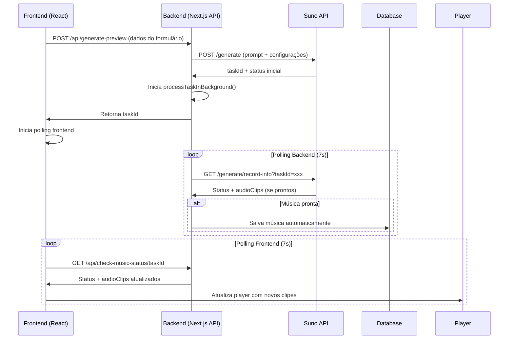
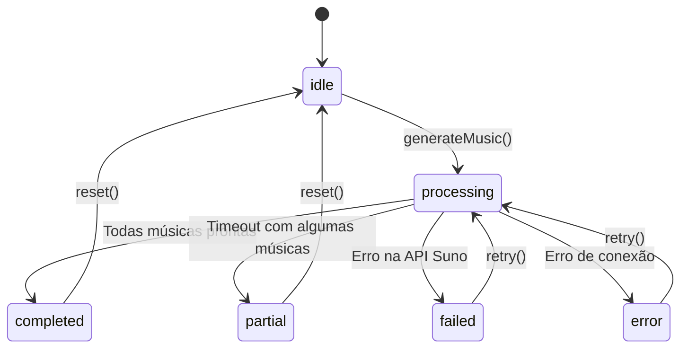

# Documentação Técnica - Integração API Suno

## 1. Visão Geral do Fluxo

A integração com a API Suno no projeto Memora Music implementa um sistema de geração de música assíncrona com polling progressivo. O fluxo completo envolve:

1. **Frontend** → Envia dados do formulário para o backend
2. **Backend** → Processa dados e faz chamada para API Suno
3. **API Suno** → Retorna taskId para monitoramento
4. **Backend** → Inicia processo de polling em background
5. **Frontend** → Faz polling do status via endpoint dedicado
6. **Player** → É atualizado progressivamente conforme músicas ficam prontas

## 2. Arquitetura de Componentes



## 3. Implementação Backend

### 3.1 Endpoint Principal - `/api/generate-preview`

```typescript
// api/routes/generate-preview.ts
export default async function handler(req: Request, res: Response) {
  try {
    // 1. Validação dos dados de entrada
    const validatedData = generatePreviewSchema.parse(req.body);
    
    // 2. Geração da letra (se necessário)
    const lyrics = await generateLyricsWithOpenAI(validatedData);
    
    // 3. Preparação do payload para Suno
    const sunoPayload = {
      prompt: createSunoMusicPrompt(validatedData, lyrics),
      customMode: false,
      style: `${validatedData.genre}, ${validatedData.mood}, ${validatedData.tempo}`,
      title: validatedData.songTitle
    };
    
    // 4. Chamada para API Suno
    const generateResponse = await fetchWithRetry(`${SUNO_API_BASE}/generate`, {
      method: 'POST',
      headers: {
        'Authorization': `Bearer ${process.env.SUNO_API_KEY}`,
        'Content-Type': 'application/json'
      },
      body: JSON.stringify(sunoPayload)
    });
    
    const generateData = await generateResponse.json();
    const taskId = generateData.data?.taskId;
    
    // 5. Armazenamento da tarefa em memória global
    if (!global.musicTasks) {
      global.musicTasks = new Map();
    }
    
    const task = {
      taskId,
      idsString: taskId,
      status: 'PROCESSING',
      audioClips: [],
      completedClips: 0,
      totalExpected: 2,
      metadata: {
        songTitle: validatedData.songTitle,
        userId: userId || null,
        guestId: guestId || null
      },
      createdAt: Date.now(),
      lastUpdate: Date.now()
    };
    
    global.musicTasks.set(taskId, task);
    
    // 6. Inicia processamento em background
    processTaskInBackground(taskId);
    
    // 7. Retorna taskId para o frontend
    return res.status(200).json({
      success: true,
      taskId: taskId,
      message: 'Geração iniciada com sucesso'
    });
    
  } catch (error) {
    console.error('Erro na geração:', error);
    return res.status(500).json({
      success: false,
      error: error.message
    });
  }
}
```

### 3.2 Função de Polling em Background

```typescript
// api/generate-preview.ts
async function processTaskInBackground(taskId: string) {
  console.log(`🎵 Iniciando processamento em background para taskId: ${taskId}`);
  
  const task = global.musicTasks?.get(taskId);
  if (!task) {
    console.log(`❌ Tarefa ${taskId} não encontrada`);
    return;
  }
  
  const maxAttempts = 45;
  const initialWait = 10000; // 10 segundos
  const pollInterval = 7000; // 7 segundos entre tentativas
  
  try {
    // Espera inicial antes da primeira verificação
    await new Promise(resolve => setTimeout(resolve, initialWait));
    
    let attempts = 0;
    
    while (attempts < maxAttempts && task.status === 'PROCESSING') {
      attempts++;
      
      try {
        // Consulta status na API Suno
        const statusResponse = await fetchWithRetry(
          `${SUNO_API_BASE}/generate/record-info?taskId=${task.idsString}`,
          {
            method: 'GET',
            headers: {
              'Authorization': `Bearer ${process.env.SUNO_API_KEY}`,
              'Content-Type': 'application/json'
            }
          },
          2
        );
        
        const statusData = await statusResponse.json();
        const jobData = statusData.data;
        
        // Verifica se o job está completo
        if ((jobData.status === 'SUCCESS' || jobData.status === 'FIRST_SUCCESS') && jobData.response) {
          // Processa novos clipes de áudio
          const jobsArray = Array.isArray(jobData.response) ? jobData.response : [jobData.response];
          const newAudioClips = [];
          
          jobsArray.forEach((job, jobIndex) => {
            if (job.sunoData && Array.isArray(job.sunoData)) {
              job.sunoData.forEach((clip, clipIndex) => {
                if (clip.audioUrl || clip.sourceAudioUrl) {
                  const clipId = clip.id || `clip_${jobIndex}_${clipIndex}`;
                  
                  // Verifica se este clipe já foi processado
                  const existingClip = task.audioClips.find((existing) => existing.id === clipId);
                  if (!existingClip) {
                    const newClip = {
                      id: clipId,
                      title: clip.title || `${task.metadata.songTitle} - Opção ${task.audioClips.length + newAudioClips.length + 1}`,
                      audio_url: clip.audioUrl || clip.sourceAudioUrl,
                      image_url: clip.imageUrl || clip.sourceImageUrl
                    };
                    newAudioClips.push(newClip);
                  }
                }
              });
            }
          });
          
          // Atualiza tarefa com novos clipes
          if (newAudioClips.length > 0) {
            task.audioClips.push(...newAudioClips);
            task.completedClips = task.audioClips.length;
            task.lastUpdate = Date.now();
          }
          
          // Verifica se todas as músicas estão prontas
          if (task.audioClips.length >= task.totalExpected) {
            task.status = 'COMPLETED';
            task.metadata.totalClips = task.audioClips.length;
            task.metadata.processingTime = `${attempts} tentativas`;
            
            // Auto-salva no banco de dados
            await autoSaveSongToDatabase(task, task.metadata.userId, task.metadata.guestId);
            break;
          }
        }
        
      } catch (error) {
        console.log(`❌ [${taskId}] Erro na tentativa ${attempts}:`, error.message);
      }
      
      // Aguarda antes da próxima tentativa
      if (attempts < maxAttempts && task.status === 'PROCESSING') {
        await new Promise(resolve => setTimeout(resolve, pollInterval));
      }
    }
    
    // Tratamento de timeout
    if (task.status === 'PROCESSING') {
      if (task.audioClips.length > 0) {
        task.status = 'PARTIAL';
        task.metadata.totalClips = task.audioClips.length;
        await autoSaveSongToDatabase(task, task.metadata.userId, task.metadata.guestId);
      } else {
        task.status = 'FAILED';
        task.error = 'Timeout: A geração da música está demorando mais que o esperado.';
      }
    }
    
  } catch (error) {
    console.log(`❌ [${taskId}] Erro no processamento em background:`, error.message);
    task.status = 'FAILED';
    task.error = error.message;
  }
}
```

### 3.3 Endpoint de Verificação de Status

```typescript
// api/check-music-status.ts
export default async function handler(req: Request, res: Response) {
  // Configurar CORS
  res.setHeader('Access-Control-Allow-Origin', '*');
  res.setHeader('Access-Control-Allow-Methods', 'GET, OPTIONS');
  
  if (req.method === 'OPTIONS') {
    return res.status(200).end();
  }
  
  if (req.method !== 'GET') {
    return res.status(405).json({ success: false, error: 'Método não permitido' });
  }
  
  try {
    const { taskId } = req.query;
    
    if (!taskId || typeof taskId !== 'string') {
      return res.status(400).json({
        success: false,
        error: 'taskId é obrigatório'
      });
    }
    
    // Buscar tarefa no armazenamento global
    const task = global.musicTasks?.get(taskId);
    
    if (!task) {
      return res.status(404).json({
        success: false,
        error: 'Tarefa não encontrada',
        status: 'NOT_FOUND'
      });
    }
    
    // Calcular tempo decorrido
    const elapsedTime = Date.now() - task.createdAt;
    const elapsedMinutes = Math.floor(elapsedTime / 60000);
    const elapsedSeconds = Math.floor((elapsedTime % 60000) / 1000);
    
    // Retornar status atual
    return res.status(200).json({
      success: true,
      data: {
        taskId: task.taskId,
        status: task.status,
        audioClips: task.audioClips,
        completedClips: task.completedClips,
        totalExpected: task.totalExpected,
        error: task.error,
        elapsedTime: `${elapsedMinutes}:${elapsedSeconds.toString().padStart(2, '0')}`,
        lastUpdate: task.lastUpdate
      }
    });
    
  } catch (error) {
    console.error('Erro ao verificar status:', error);
    return res.status(500).json({
      success: false,
      error: 'Erro interno do servidor'
    });
  }
}
```

## 4. Implementação Frontend

### 4.1 Store de Estado (Zustand)

```typescript
// src/store/musicStore.ts
interface MusicStore {
  // Estados para polling progressivo
  currentTaskId: string | null;
  isPolling: boolean;
  musicGenerationStatus: 'idle' | 'processing' | 'completed' | 'failed' | 'error';
  completedClips: number;
  totalExpected: number;
  pollingInterval: NodeJS.Timeout | null;
  audioClips: AudioClip[];
  
  // Funções de controle
  generateMusic: () => Promise<void>;
  checkMusicStatus: () => Promise<void>;
  startPolling: () => void;
  stopPolling: () => void;
}

export const useMusicStore = create<MusicStore>()(
  persist(
    (set, get) => ({
      // Estados iniciais
      currentTaskId: null,
      isPolling: false,
      musicGenerationStatus: 'idle',
      completedClips: 0,
      totalExpected: 2,
      pollingInterval: null,
      audioClips: [],
      
      // Função principal de geração
      generateMusic: async () => {
        const { formData } = get();
        
        set({ 
          isLoading: true, 
          isPreviewLoading: true,
          musicGenerationStatus: 'processing',
          error: null 
        });
        
        try {
          const result = await apiRequest(API_ENDPOINTS.GENERATE_PREVIEW, {
            method: 'POST',
            body: JSON.stringify(formData)
          });
          
          if (result.success && result.taskId) {
            // Sistema progressivo - recebeu taskId
            const expectedClips = 2;
            
            // Criar clipes esqueleto para UI reagir
            const skeletonClips = Array.from({ length: expectedClips }, (_, index) => ({
              id: `skeleton_${index}`,
              status: 'processing' as const,
              title: `${formData.songTitle} - Opção ${index + 1}`,
              audio_url: undefined
            }));
            
            set({
              currentTaskId: result.taskId,
              totalExpected: expectedClips,
              audioClips: skeletonClips,
              musicGenerationStatus: 'processing'
            });
            
            // Inicia polling
            get().startPolling();
            
            toast.success('Geração de música iniciada! Aguarde enquanto processamos...');
          }
          
        } catch (error) {
          const errorMsg = error instanceof Error ? 
            error.message : 
            'Erro de conexão. Verifique sua internet e tente novamente.';
          set({ 
            error: errorMsg, 
            isPreviewLoading: false,
            isLoading: false,
            musicGenerationStatus: 'failed'
          });
        }
      },
      
      // Função de verificação de status
      checkMusicStatus: async () => {
        const { currentTaskId } = get();
        
        if (!currentTaskId) {
          console.warn('Nenhum taskId ativo para verificar status');
          return;
        }
        
        try {
          const result = await apiRequest(`${API_ENDPOINTS.CHECK_MUSIC_STATUS}/${currentTaskId}`, {
            method: 'GET',
          });
          
          if (!result.success || typeof result.data !== 'object') {
            console.error('Resposta de status inválida.');
            return;
          }
          
          const statusData = result.data;
          const completeCount = statusData.completedClips || 0;
          const totalExpected = statusData.totalExpected || get().totalExpected || 0;
          const clips = Array.isArray(statusData.audioClips) ? statusData.audioClips : [];
          
          // Atualização progressiva do estado
          set({ audioClips: clips, completedClips: completeCount });
          
          // Condição de parada
          if (totalExpected > 0 && completeCount >= totalExpected) {
            set({ 
              isLoading: false,
              isPreviewLoading: false,
              isPolling: false,
              musicGenerationStatus: 'completed',
              currentTaskId: null
            });
            
            get().stopPolling();
            toast.success('🎉 Todas as músicas foram geradas com sucesso!');
          }
          
        } catch (error) {
          console.error('Erro ao verificar status:', error);
          get().stopPolling();
          
          set({
            isPolling: false,
            musicGenerationStatus: 'error',
            isLoading: false
          });
        }
      },
      
      // Inicia o polling
      startPolling: () => {
        const { currentTaskId } = get();
        
        get().stopPolling(); // Garante que não haja loops duplicados
        
        if (!currentTaskId) {
          console.warn('Não é possível iniciar polling sem taskId');
          return;
        }
        
        console.log('Iniciando polling de status...');
        
        const newInterval = setInterval(async () => {
          await get().checkMusicStatus();
        }, 7000); // Verifica a cada 7 segundos
        
        set({ pollingInterval: newInterval });
      },
      
      // Para o polling
      stopPolling: () => {
        const { pollingInterval: currentInterval } = get();
        
        if (currentInterval) {
          console.log('Parando polling...');
          clearInterval(currentInterval);
          set({ pollingInterval: null });
        }
      }
    }),
    {
      name: 'music-store',
      partialize: (state) => ({
        formData: state.formData,
        currentStep: state.currentStep,
        audioClips: state.audioClips,
        currentTaskId: state.currentTaskId
      })
    }
  )
);
```

### 4.2 Componente do Player

```typescript
// src/components/MusicPlayer.tsx
import { useMusicStore } from '../store/musicStore';

export function MusicPlayer() {
  const { 
    audioClips, 
    musicGenerationStatus, 
    completedClips, 
    totalExpected,
    isPolling 
  } = useMusicStore();
  
  return (
    <div className="music-player">
      {/* Indicador de progresso */}
      {musicGenerationStatus === 'processing' && (
        <div className="progress-indicator">
          <div className="flex items-center gap-2">
            <div className="animate-spin rounded-full h-4 w-4 border-b-2 border-blue-600"></div>
            <span>Gerando música... {completedClips}/{totalExpected}</span>
          </div>
          
          <div className="w-full bg-gray-200 rounded-full h-2 mt-2">
            <div 
              className="bg-blue-600 h-2 rounded-full transition-all duration-300"
              style={{ width: `${(completedClips / totalExpected) * 100}%` }}
            ></div>
          </div>
        </div>
      )}
      
      {/* Lista de clipes de áudio */}
      <div className="audio-clips-list">
        {audioClips.map((clip, index) => (
          <div key={clip.id} className="audio-clip-item">
            <h3>{clip.title}</h3>
            
            {clip.audio_url ? (
              // Clipe pronto - mostrar player
              <audio controls className="w-full">
                <source src={clip.audio_url} type="audio/mpeg" />
                Seu navegador não suporta o elemento de áudio.
              </audio>
            ) : (
              // Clipe em processamento - mostrar skeleton
              <div className="audio-skeleton">
                <div className="flex items-center gap-2">
                  <div className="animate-pulse bg-gray-300 rounded h-8 w-8"></div>
                  <div className="animate-pulse bg-gray-300 rounded h-4 flex-1"></div>
                  <div className="animate-pulse bg-gray-300 rounded h-4 w-16"></div>
                </div>
              </div>
            )}
          </div>
        ))}
      </div>
      
      {/* Status de conclusão */}
      {musicGenerationStatus === 'completed' && (
        <div className="completion-message">
          <div className="text-green-600 font-semibold">
            ✅ Todas as músicas foram geradas com sucesso!
          </div>
        </div>
      )}
      
      {/* Status de erro */}
      {musicGenerationStatus === 'failed' && (
        <div className="error-message">
          <div className="text-red-600 font-semibold">
            ❌ Erro na geração das músicas. Tente novamente.
          </div>
        </div>
      )}
    </div>
  );
}
```

## 5. Estrutura de Dados

### 5.1 Requisição para API Suno

```typescript
interface SunoGenerateRequest {
  prompt: string;           // Prompt descritivo da música
  customMode: boolean;      // false para modo automático
  style: string;           // "pop, alegre, moderado"
  title: string;           // Título da música
}

// Exemplo:
{
  "prompt": "Uma música pop alegre e emotiva para João, celebrando sua dedicação ao trabalho e amor pela família, com instrumentos como violão e piano",
  "customMode": false,
  "style": "pop, alegre, moderado",
  "title": "Canção para João"
}
```

### 5.2 Resposta da API Suno

```typescript
interface SunoGenerateResponse {
  success: boolean;
  data: {
    taskId: string;         // ID para monitoramento
    status: string;         // Status inicial
  };
}

// Exemplo:
{
  "success": true,
  "data": {
    "taskId": "task_1703123456789_abc123def",
    "status": "PENDING"
  }
}
```

### 5.3 Resposta de Status

```typescript
interface SunoStatusResponse {
  success: boolean;
  data: {
    status: 'PENDING' | 'PROCESSING' | 'SUCCESS' | 'FIRST_SUCCESS' | 'FAILED';
    response?: {
      sunoData: Array<{
        id: string;
        title: string;
        audioUrl?: string;
        sourceAudioUrl?: string;
        imageUrl?: string;
        sourceImageUrl?: string;
      }>;
    }[];
  };
}
```

### 5.4 Estrutura da Tarefa em Memória

```typescript
interface MusicTaskStatus {
  taskId: string;
  idsString: string;
  status: 'PROCESSING' | 'COMPLETED' | 'PARTIAL' | 'FAILED';
  audioClips: AudioClip[];
  completedClips: number;
  totalExpected: number;
  metadata: {
    songTitle: string;
    userId?: string;
    guestId?: string;
    totalClips?: number;
    processingTime?: string;
  };
  createdAt: number;
  lastUpdate: number;
  error?: string;
}
```

## 6. Tratamento de Estados

### 6.1 Estados do Sistema

| Estado | Descrição | Ações do Frontend |
|--------|-----------|-------------------|
| `idle` | Estado inicial | Mostrar botão "Gerar Música" |
| `processing` | Música sendo gerada | Mostrar progress bar e skeletons |
| `completed` | Todas as músicas prontas | Mostrar players de áudio |
| `partial` | Algumas músicas prontas (timeout) | Mostrar players disponíveis + aviso |
| `failed` | Erro na geração | Mostrar mensagem de erro + botão retry |
| `error` | Erro de comunicação | Mostrar erro de conexão |

### 6.2 Fluxo de Estados



## 7. Callbacks e Atualização do Player

### 7.1 Sistema de Callbacks

O sistema não usa callbacks tradicionais, mas sim um padrão de **polling progressivo**:

1. **Backend Polling**: Função `processTaskInBackground()` faz polling da API Suno a cada 7 segundos
2. **Frontend Polling**: Store faz polling do endpoint `/api/check-music-status` a cada 7 segundos
3. **Atualização Reativa**: Player é atualizado automaticamente via Zustand store

### 7.2 Fluxo de Atualização do Player

```typescript
// 1. Backend detecta nova música pronta
if (newAudioClips.length > 0) {
  task.audioClips.push(...newAudioClips);
  task.completedClips = task.audioClips.length;
  task.lastUpdate = Date.now();
}

// 2. Frontend recebe atualização via polling
const clips = Array.isArray(statusData.audioClips) ? statusData.audioClips : [];
set({ audioClips: clips, completedClips: completeCount });

// 3. Player reage automaticamente à mudança de estado
{audioClips.map((clip, index) => (
  <div key={clip.id}>
    {clip.audio_url ? (
      <audio controls src={clip.audio_url} />
    ) : (
      <SkeletonLoader />
    )}
  </div>
))}
```

### 7.3 Otimizações de Performance

- **Skeleton Loading**: UI mostra placeholders enquanto músicas são geradas
- **Polling Inteligente**: Para automaticamente quando todas as músicas estão prontas
- **Cleanup**: Limpa intervalos ao desmontar componentes
- **Persistência**: Estado é persistido no localStorage via Zustand persist

## 8. Tratamento de Erros

### 8.1 Tipos de Erro

```typescript
// Erro de validação
if (!validatedData.songTitle) {
  throw new Error('Título da música é obrigatório');
}

// Erro de API Suno
if (!generateResponse.ok) {
  const errorText = await generateResponse.text();
  throw new Error(`Erro na API Suno: ${generateResponse.status} - ${errorText}`);
}

// Erro de timeout
if (attempts >= maxAttempts && task.status === 'PROCESSING') {
  if (task.audioClips.length > 0) {
    task.status = 'PARTIAL';
  } else {
    task.status = 'FAILED';
    task.error = 'Timeout: A geração está demorando mais que o esperado.';
  }
}

// Erro de conexão
catch (error) {
  const errorMsg = error instanceof Error ? 
    error.message : 
    'Erro de conexão. Verifique sua internet e tente novamente.';
  set({ error: errorMsg, musicGenerationStatus: 'failed' });
}
```

### 8.2 Estratégias de Recuperação

- **Retry com Backoff**: `fetchWithRetry()` tenta novamente com delay crescente
- **Graceful Degradation**: Aceita resultados parciais em caso de timeout
- **Auto-save**: Salva músicas prontas mesmo em caso de erro parcial
- **User Feedback**: Mostra mensagens claras sobre o status e próximos passos

## 9. Configurações e Variáveis

### 9.1 Variáveis de Ambiente

```bash
# .env.local
SUNO_API_KEY=your_suno_api_key_here
OPENAI_API_KEY=your_openai_api_key_here
NEXT_PUBLIC_API_URL=http://localhost:3000
```

### 9.2 Configurações de Polling

```typescript
// Configurações ajustáveis
const POLLING_CONFIG = {
  maxAttempts: 45,        // Máximo 45 tentativas (5.25 minutos)
  initialWait: 10000,     // Espera 10s antes da primeira verificação
  pollInterval: 7000,     // Verifica a cada 7 segundos
  frontendPollInterval: 7000  // Frontend polling a cada 7 segundos
};
```

## 10. Monitoramento e Logs

### 10.1 Logs Estruturados

```typescript
// Logs de debug com contexto
console.log(`🎵 [${taskId}] Tentativa ${attempts}/${maxAttempts} - Verificando status...`);
console.log(`✅ [${taskId}] ${newAudioClips.length} novos clipes adicionados. Total: ${task.audioClips.length}`);
console.log(`🎉 [${taskId}] Todas as músicas foram processadas!`);
console.log(`❌ [${taskId}] Erro na tentativa ${attempts}:`, error.message);
```

### 10.2 Métricas de Performance

- **Tempo de Processamento**: Rastreado em `task.metadata.processingTime`
- **Taxa de Sucesso**: Monitorado via status final das tarefas
- **Tempo de Resposta**: Calculado entre criação e conclusão
- **Uso de Recursos**: Monitoramento de memória global das tarefas

---

## Conclusão

Esta implementação fornece um sistema robusto e escalável para integração com a API Suno, com:

- ✅ **Polling Progressivo**: Atualização em tempo real do progresso
- ✅ **Tratamento de Erros**: Recuperação graceful e feedback claro
- ✅ **Performance**: Otimizações de UI e cleanup automático
- ✅ **Persistência**: Estado mantido entre sessões
- ✅ **Monitoramento**: Logs detalhados para debugging

O sistema está preparado para produção e pode ser facilmente estendido para suportar mais funcionalidades da API Suno.